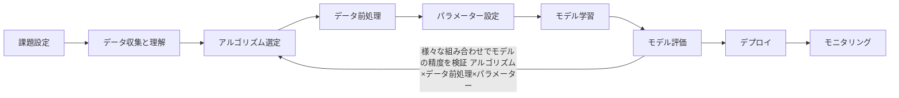
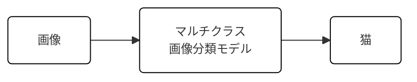
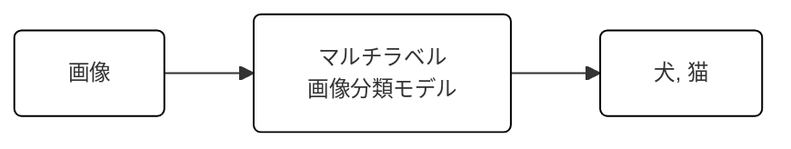
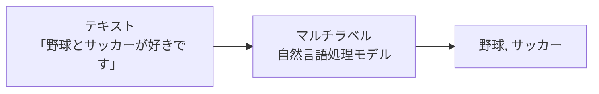

# はじめに

本記事は、機械学習のモデルを構築する方法をハンズオン形式で紹介します。
機械学習という名前はよく聞くし、これからキャッチアップしていきたいが何から初めて良いのかわからない方に向けてハンズオン形式で手を動かしながら理解出来る内容となっています。

それでは進めていきましょう。

---

# この記事の目標

以下３点が本記事の目標です。

- 機会学習モデルの開発プロセスを理解する
- Azure Machine Learning (以下 Azure ML) 上で "最初のモデル" を動かすまでの手順を追体験する
- Azure ML を触ってみる

# AutoML (自動機会学習) とは？

自動機械学習とは、機械学習モデルの開発プロセスを自動化する技術です。
機械学習モデルの開発プロセスにはパターン化出来るものが多く、質の良いデータを用意すれば非専門家でも高品質のモデルを作成できます。

# AutoML／MLOps プロセス全体図

機械学習モデルの構築は以下のフローで進められます。



アルゴリズム選定からモデル評価までを自動で行ってくれるのが AutoML の機能です。

# AutoML で出来る機械学習

Azure Machine Learning の AutoML は様々な機械学習のタスクに対応しています。

## 分類

分類タスクは、数値データからカテゴリを予測したい場合に利用します。たとえばローン審査において、顧客の年収や借入金額などのデータから **顧客の信用度（低・中・高）** を予測したい場合に分類モデルが有効です

#### 分類タスクの例

```mermaid
flowchart LR
    A[数値データ<br/>(年収, 借入額 など)] --> B[分類モデル]
    B --> C[顧客の信用度<br/>高信用<br/>中信用<br/>低信用]
```

## 回帰

回帰タスクは、数値データから 連続値 を予測したい場合に利用します。たとえば不動産の物件価格に関して、築年数や駅からの距離などの数値データから価格を予測したい場合、回帰モデルが有効です。

```mermaid
flowchart LR
    A[物件データ<br/>(築年数, 駅からの距離 など)] --> B[回帰モデル]
    B --> C[6,800万円]
```

## 時系列予測

時系列予測は、過去の時系列データに基づいて 未来の値 を予測します。たとえば過去の株価情報をもとに未来の株価を予測したい場合、時系列予測モデルが有効です。


## 画像

画像関連のタスクでは 画像分類・物体検出・セグメント化 をサポートしています。画像分類のタスクでは、1  枚の画像に対して  1  つのラベルを推論する マルチクラス分類 と、1  枚の画像に対して複数のラベルを推論する マルチラベル分類 をサポートしています。

(a) マルチクラス画像分類



(b) マルチラベル画像分類



## 自然言語処理(NLP)

自然言語処理タスクでは テキスト分類 と 固有表現認識（NER） がサポートされています。

テキスト分類では、事前にラベルを学習させたモデルにテキストを入力し、マルチクラス（単一ラベル） と マルチラベル（複数ラベル） の両方を推論できます

(a) マルチクラス分類


(b) マルチラベル分類



# ハンズオン

> 書籍サンプルをクラウドへ持ち上げ、**実験 → 登録 → 推論サービス公開** までを 30 分で体験します。

### 0. 事前準備

```bash
# 1. CLI 拡張
az extension add -n ml -y

# 2. リソース準備 (1 回だけ)
az group create -n ml-demo-rg -l japaneast
az ml workspace create -g ml-demo-rg -w ml-demo-ws
```

### 1. データの登録

```bash
az ml data create \
  --name titanic-dataset \
  --path ./data/titanic.csv \
  --type uri_file
```

### 2. 実験スクリプトの実行

```yaml:src/jobs/train-titanic.yml
$schema: https://azuremlschemas.azureedge.net/latest/commandJob.schema.json
command: >-
  python train.py --input_data ${{inputs.input_data}}
inputs:
  input_data:
    type: uri_file
    path: azureml:titanic-dataset@latest
code: .
environment: azureml://registries/azureml/environments/sklearn-1.4/versions/1
compute: azureml:cpu-cluster
experiment_name: titanic-demo
```

```bash
az ml job create -f src/jobs/train-titanic.yml --stream
```

### 3. モデル登録 & デプロイ

```bash
# モデル登録
az ml model register \
  --name titanic-model \
  --path ./outputs/model.pkl

# 推論エンドポイント
az ml online-endpoint create -f src/endpoints/endpoint.yml
az ml online-deployment create -f src/endpoints/deployment.yml \
  --all-traffic --overwrite
```

推論テスト:

```bash
curl -X POST $ENDPOINT_URL -H "Authorization: Bearer $TOKEN" \
  -H "Content-Type: application/json" \
  -d '{"data": [{"Age": 22, "Pclass": 3, "Sex": "male"}]}'
```

:::details Azure ML YAML サンプルを見る

<details>
<summary>endpoint.yml</summary>

```yaml
$schema: https://azuremlschemas.azureedge.net/latest/managedOnlineEndpoint.schema.json
name: titanic-endpoint
auth_mode: key
```

</details>
</details>
:::

---

## 書籍で学べたこと + クラウドで拡張するポイント

| 書籍                                       | Azure ML での追加価値                                    |
| ------------------------------------------ | -------------------------------------------------------- |
| ローカルで試行錯誤しながらモデル精度を改善 | **HyperDrive** によりパラメータサーチを並列・効率化      |
| モデルファイル (`.pkl`) を手動保存         | **mlflow autolog()/モデルレジストリ** で自動トラッキング |
| Flask で推論 API を自作                    | **Managed Endpoint** で HTTPS スケールアウト             |
| Git 管理は任意                             | **GitHub Actions + az ml** でフル CI/CD (Azure MLOps)    |

---

## こんな人におすすめ

1. Jupyter ベースでサクッと動かしながら学びたい初学者
2. でも「ローカルの環境汚染や GPU 依存」は避けたい人
3. 最終的には MLOps パイプラインを組み、組織で再利用したい人

:::message
**結論**: 本書で _基礎_ を学び、Azure ML で _拡張_ することで「最初のモデル」から「実戦投入」までのギャップを最小化できます。
:::

---

## 今後のステップ

1. **AutoML** で複数アルゴリズムを自動比較 → 精度の底上げ
2. **Responsible AI dashboard** を有効化 → 解釈性・バイアス確認
3. **Prompt Flow** を組み込み → 生成 AI ワークフローへの発展

---

## まとめ


Amazon の購入リンクは以下に記載しておりますので、ご興味がある方は是非読んでみてください。

https://www.amazon.co.jp/Azure-Machine-Learning%E3%81%A7%E3%81%AF%E3%81%98%E3%82%81%E3%82%8B%E6%A9%9F%E6%A2%B0%E5%AD%A6%E7%BF%92-LLM%E6%B4%BB%E7%94%A8%E5%85%A5%E9%96%80-%E6%B0%B8%E7%94%B0/dp/4297148463

### 参考文献

https://learn.microsoft.com/ja-jp/azure/machine-learning/?view=azureml-api-2

# スタートアップ企業様向けのお知らせ

日本マイクロソフトでは、スタートアップ企業様向けに、ビジネスを支援するプログラムをご提供しています。
Azure の無料クレジットが`最大$150,000`もらえるので、是非チェックしてみてください。

https://speakerdeck.com/satakeyusuke19920527/microsoft-for-startups-founders-hub
