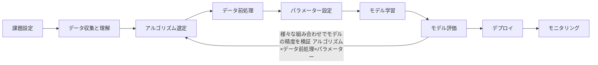
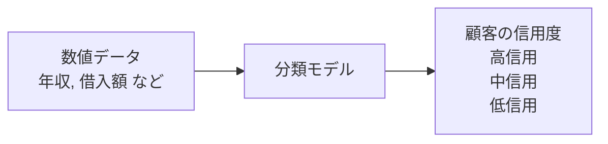
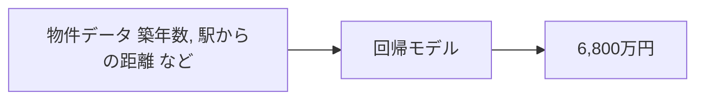
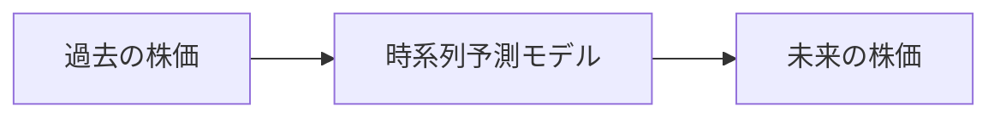
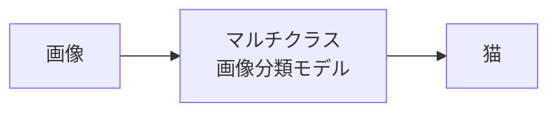
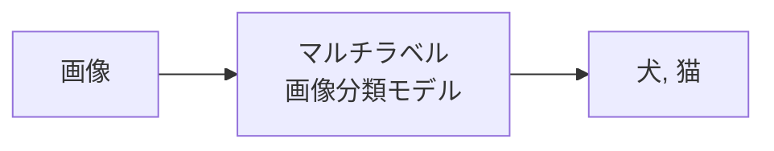
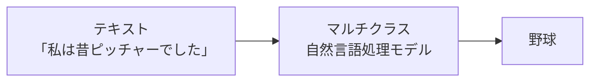
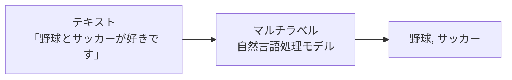

# はじめに

本記事は、機械学習のモデルを構築する方法をハンズオン形式で紹介します。
機械学習という名前はよく聞くし、これからキャッチアップしていきたいが何から初めて良いのかわからない方に向けてハンズオン形式で手を動かしながら理解出来る内容となっています。

それでは進めていきましょう。

# この記事の目標

以下３点が本記事の目標です。

- 機会学習モデルの開発プロセスを理解する
- Azure Machine Learning (以下 Azure ML) 上で "最初のモデル" を動かすまでの手順を追体験する
- Azure ML を触ってみる

# AutoML (自動機会学習) とは？

自動機械学習とは、機械学習モデルの開発プロセスを自動化する技術です。
機械学習モデルの開発プロセスにはパターン化出来るものが多く、質の良いデータを用意すれば非専門家でも高品質のモデルを作成できます。

# AutoML／MLOps プロセス全体図

機械学習モデルの構築は以下のフローで進められます。

アルゴリズム選定からモデル評価までを自動で行ってくれるのが AutoML の機能です。

# AutoML で出来る機械学習

Azure Machine Learning の AutoML は様々な機械学習のタスクに対応しています。

## 分類

分類タスクは、数値データからカテゴリを予測したい場合に利用します。たとえばローン審査において、顧客の年収や借入金額などのデータから **顧客の信用度（低・中・高）** を予測したい場合に分類モデルが有効です

#### 分類タスクの例

## 回帰

回帰タスクは、数値データから 連続値 を予測したい場合に利用します。たとえば不動産の物件価格に関して、築年数や駅からの距離などの数値データから価格を予測したい場合、回帰モデルが有効です。

## 時系列予測

時系列予測は、過去の時系列データに基づいて 未来の値 を予測します。たとえば過去の株価情報をもとに未来の株価を予測したい場合、時系列予測モデルが有効です。

## 画像

画像関連のタスクでは 画像分類・物体検出・セグメント化 をサポートしています。画像分類のタスクでは、1  枚の画像に対して  1  つのラベルを推論する マルチクラス分類 と、1  枚の画像に対して複数のラベルを推論する マルチラベル分類 をサポートしています。

(a) マルチクラス画像分類

(b) マルチラベル画像分類

## 自然言語処理(NLP)

自然言語処理タスクでは テキスト分類 と 固有表現認識（NER） がサポートされています。

テキスト分類では、事前にラベルを学習させたモデルにテキストを入力し、マルチクラス（単一ラベル） と マルチラベル（複数ラベル） の両方を推論できます

(a) マルチクラス分類

(b) マルチラベル分類

# 初めての機械学習ハンズオン

ここからのハンズオンでは、米国の小売店として有名な **ウォルマート** の売り上げ予測を題材とします。  
データセットには、ウォルマートの  45  店舗に関する情報が含まれており、各店舗の週ごとの売り上げや関連データが格納されています。

- **店舗 (Store)**：店舗番号
- **日付 (Date)**：売り上げの週
- **週ごとの売り上げ (Weekly_Sales)**：特定の店舗の売り上げ
- **祝日フラグ (Holiday_Flag)**：その週が特別な休日であるかどうか（平日  = 0、休日  = 1）
- **気温 (Temperature)**：販売当日の気温
- **地域の燃料費 (Fuel_Price)**：この地域の燃料料金
- **消費者物価指数 (CPI)**：消費者物価指数
- **失業率 (Unemployment)**：失業率

本ハンズオンでは **「週ごとの売り上げ」** を、その他のデータを用いて予測するモデルを構築します。  
売り上げ予測には時系列予測の手法もありますが、本ハンズオンでは **回帰タスク** として扱います。

機械学習において、予測対象となるデータは **目的変数**、予測のために利用するデータは **説明変数** と呼ばれます。  
今回のケースでは「週ごとの売り上げ」が目的変数、それ以外のデータが説明変数となります。

利用するデータセットは、Kaggle 上で **CC0（パブリックドメイン）ライセンス** のもとで提供されています。  
本書籍の GitHub リポジトリからもダウンロードでき、用途別に下記の期間で分割されています。

| データ種別   | ファイル名          | 期間                     |
| ------------ | ------------------- | ------------------------ |
| 学習データ   | `Walmart_train.csv` | 2010‑02‑05 〜 2011‑10‑31 |
| 検証データ   | `Walmart_valid.csv` | 2011‑11‑01 〜 2012‑04‑30 |
| テストデータ | `Walmart_test.csv`  | 2012‑05‑01 〜 2012‑11‑01 |

- **学習データ** はモデルの学習に利用します。
- **検証データ** はモデルの精度を確認し、パラメータ調整に使用します。
- **テストデータ** は、学習済みモデルの最終的な精度を評価するために使用します。

こちらのデータは後続のハンズオンで利用するので、ダウンロードしておいてください。

**注  4.5**  “Walmart Dataset” <https://www.kaggle.com/datasets/yasserh/walmart-dataset/data>  
**注  4.6**  <https://github.com/shohei/029/book-azureml-sample/tree/main/data>

## データの登録

まずは Azure ML Studio にログインし、データを登録します。

https://ml.azure.com/

データの箇所をクリックして作成を選択

トレーニング用の学習データをセットします。

ローカルファイルからを選択

データストアを選択して...

先ほどダウンロードしておいた**学習データ**を選択します。

表形式で学習データが確認できます。

スキーマは holiday_flag を文字列へ変更しておいてください。

一通りのデータの設定が完了したので、作成をクリックで学習データのセットが完了です。

この作業を検証データとテストデータも行います。

## 学習ジョブの作成と実行

画面左側のメニューから自動 ML を選択し、新規の自動作成ジョブをクリックします。

ML ジョブの設定を進めていきます。

タスクの種類は回帰を選択し、トレーニングデータを選択してください。

ターゲット列を Wrrkly_Sales に設定して、特徴量化設定の表示をクリック

特徴量化の設定は Holiday_flag をカテゴリ別に設定します。

検証データとテストデータも先ほどダウンロードしてデータ登録したものを使用します。

次にコンピューティングの設定です。
学習が実行される計算環境を選択します。
今回はそこまでデータ量が多いわけではないので、CPU 且つ Standard_DS3_v2 を選択します。

最後にトレーニングジョブの送信をします。

これで設定は完了です。

## 実行結果の確認

以下のようにモデルの学習が開始されます。

様々なモデルを検証し、最も精度の高いモデルを選定してくれます。

最も精度の高いモデルのメトリックを確認すると、説明分散が 0.96722 である為、目的変数が説明変数によって十分に説明されているモデルであることがわかります。

また、メトリックの箇所を確認すると、ウォルマートの売り上げ予測もビジュアル的に確認することが出来ます。

右肩上がりでいいですね。

これからも小売の業界を引っ張っていって欲しいものです。

また、作成したモデルを API のエンドポイントとしても簡単にデプロイすることが出来ます。

データセットの作成 → モデルの学習 → モデルのデプロイ → アプリケーションへ組み込み までの流れを簡単に実行することが出来ます。

みなさまも是非試してみてください。

ハンズオンお疲れ様でした 👍

# まとめ

初めての機械学習はいかがでしたでしょうか。
Azure Machine Learning を使用することで、機械学習のモデルを簡単に構築することが出来ます。
今回のハンズオンは以下の本から抜粋して実施しました。
Amazon の購入リンクは以下に記載しておりますので、ご興味がある方は是非読んでみてください。

https://www.amazon.co.jp/Azure-Machine-Learning%E3%81%A7%E3%81%AF%E3%81%98%E3%82%81%E3%82%8B%E6%A9%9F%E6%A2%B0%E5%AD%A6%E7%BF%92-LLM%E6%B4%BB%E7%94%A8%E5%85%A5%E9%96%80-%E6%B0%B8%E7%94%B0/dp/4297148463

それでは 🖐️

### 参考文献

https://learn.microsoft.com/ja-jp/azure/machine-learning/?view=azureml-api-2

# スタートアップ企業様向けのお知らせ

日本マイクロソフトでは、スタートアップ企業様向けに、ビジネスを支援するプログラムをご提供しています。
Azure の無料クレジットが`最大$150,000`もらえるので、是非チェックしてみてください。

https://speakerdeck.com/satakeyusuke19920527/microsoft-for-startups-founders-hub
