# はじめに

本記事は、Azure Machine Learning で始める機械学習/LLM 活用入門 という本に記載されている自動機械学習のモデル構築方法より、Azure Machine Learning を用いて機械学習のモデルを構築する方法を紹介します。
機械学習という名前はよく聞くし、これからキャッチアップしていきたいが何から初めて良いのかわからない方に向けてハンズオン形式で手を動かしながら理解出来る内容となっています。


Amazon の購入リンクは記事最下部に記載しておりますので、ご興味がある方は是非読んでみてください。

それでは進めていきたいと思います。

---

# この記事の目標

以下３点が本記事の目標です。

- 機会学習モデルの開発プロセスを理解する
- Azure Machine Learning (以下 Azure ML) 上で "最初のモデル" を動かすまでの手順を追体験する
- Azure ML を触ってみる

:::message
この記事は **書評 + ハンズオン** のハイブリッド形式です。すでに書籍を読了した方にも、Azure ML で本格的な MLOps を始めたい方にも役立つよう構成しています。
:::

---

# AutoML (自動機会学習) とは？

自動機械学習とは、機械学習モデルの開発プロセスを自動化する技術です。
機械学習モデルの開発プロセスにはパターン化出来るものが多く、質の良いデータを用意すれば非専門家でも高品質のモデルを作成できます。

### AutoML／MLOps プロセス全体図

機械学習モデルの構築は以下のフローで進められます。

```mermaid
flowchart LR
  A["課題設定\nProblem Definition"] --> B["データ収集と理解\nData Collection & Understanding"]
  B --> C["データ前処理と特徴量エンジニアリング"]
  C --> D["AutoMLトレーニング\nモデル探索 & パラメータ最適化"]
  D --> E["モデル評価＆バリデーション"]
  E --> F["モデル登録\nModel Registry"]
  F --> G["デプロイ\nDeployment (オンライン／バッチ)"]
  G --> H["モニタリング & ドリフト検知"]
  H -->|フィードバック| C
  H -->|再学習トリガー| D
```



アルゴリズム選定からモデル評価までを自動で行ってくれるのが AutoML の機能です。

### 1. なぜ Azure ML なのか？

- GPU/CPU クラスタをマネージドで使えるため **ローカル PC のスペックに依存しない**
- **mlflow が標準連携** → 実験ログ・モデルアーティファクトの一元管理
- Azure CLI / SDK / YAML が揃っているので **Infrastructure as Code** と相性抜群
- GitHub Actions との統合がシンプル (service principal だけで OK)

---

## ハンズオン: _Titanic_ 予測モデルを Azure ML で再現

> 書籍サンプルをクラウドへ持ち上げ、**実験 → 登録 → 推論サービス公開** までを 30 分で体験します。

### 0. 事前準備

```bash
# 1. CLI 拡張
az extension add -n ml -y

# 2. リソース準備 (1 回だけ)
az group create -n ml-demo-rg -l japaneast
az ml workspace create -g ml-demo-rg -w ml-demo-ws
```

### 1. データの登録

```bash
az ml data create \
  --name titanic-dataset \
  --path ./data/titanic.csv \
  --type uri_file
```

### 2. 実験スクリプトの実行

```yaml:src/jobs/train-titanic.yml
$schema: https://azuremlschemas.azureedge.net/latest/commandJob.schema.json
command: >-
  python train.py --input_data ${{inputs.input_data}}
inputs:
  input_data:
    type: uri_file
    path: azureml:titanic-dataset@latest
code: .
environment: azureml://registries/azureml/environments/sklearn-1.4/versions/1
compute: azureml:cpu-cluster
experiment_name: titanic-demo
```

```bash
az ml job create -f src/jobs/train-titanic.yml --stream
```

### 3. モデル登録 & デプロイ

```bash
# モデル登録
az ml model register \
  --name titanic-model \
  --path ./outputs/model.pkl

# 推論エンドポイント
az ml online-endpoint create -f src/endpoints/endpoint.yml
az ml online-deployment create -f src/endpoints/deployment.yml \
  --all-traffic --overwrite
```

推論テスト:

```bash
curl -X POST $ENDPOINT_URL -H "Authorization: Bearer $TOKEN" \
  -H "Content-Type: application/json" \
  -d '{"data": [{"Age": 22, "Pclass": 3, "Sex": "male"}]}'
```

:::details Azure ML YAML サンプルを見る

<details>
<summary>endpoint.yml</summary>

```yaml
$schema: https://azuremlschemas.azureedge.net/latest/managedOnlineEndpoint.schema.json
name: titanic-endpoint
auth_mode: key
```

</details>
</details>
:::

---

## 書籍で学べたこと + クラウドで拡張するポイント

| 書籍                                       | Azure ML での追加価値                                    |
| ------------------------------------------ | -------------------------------------------------------- |
| ローカルで試行錯誤しながらモデル精度を改善 | **HyperDrive** によりパラメータサーチを並列・効率化      |
| モデルファイル (`.pkl`) を手動保存         | **mlflow autolog()/モデルレジストリ** で自動トラッキング |
| Flask で推論 API を自作                    | **Managed Endpoint** で HTTPS スケールアウト             |
| Git 管理は任意                             | **GitHub Actions + az ml** でフル CI/CD (Azure MLOps)    |

---

## こんな人におすすめ

1. Jupyter ベースでサクッと動かしながら学びたい初学者
2. でも「ローカルの環境汚染や GPU 依存」は避けたい人
3. 最終的には MLOps パイプラインを組み、組織で再利用したい人

:::message
**結論**: 本書で _基礎_ を学び、Azure ML で _拡張_ することで「最初のモデル」から「実戦投入」までのギャップを最小化できます。
:::

---

## 今後のステップ

1. **AutoML** で複数アルゴリズムを自動比較 → 精度の底上げ
2. **Responsible AI dashboard** を有効化 → 解釈性・バイアス確認
3. **Prompt Flow** を組み込み → 生成 AI ワークフローへの発展

---

## まとめ

- 本書は _理論より実装_ を重視する人に最適なスターターキット
- Azure ML に移行することで **再現性・拡張性・運用性** が一気に向上
- MLOps まで踏み込めば **チーム開発 / 本番運用** への道筋が見える

---

### 参考リンク

- [Azure Machine Learning ドキュメント](https://learn.microsoft.com/azure/machine-learning/)
- [Azure ML CLI (v2) リファレンス](https://learn.microsoft.com/azure/machine-learning/reference-azure-machine-learning-cli)
- [GitHub Actions 用 Azure ML サンプル](https://github.com/Azure/azureml-examples/tree/main/.github/workflows)

https://www.amazon.co.jp/Azure-Machine-Learning%E3%81%A7%E3%81%AF%E3%81%98%E3%82%81%E3%82%8B%E6%A9%9F%E6%A2%B0%E5%AD%A6%E7%BF%92-LLM%E6%B4%BB%E7%94%A8%E5%85%A5%E9%96%80-%E6%B0%B8%E7%94%B0/dp/4297148463

---

📚 **あなたも本書 + Azure ML で "最初のモデル" をクラウドに飛ばしてみませんか？**
