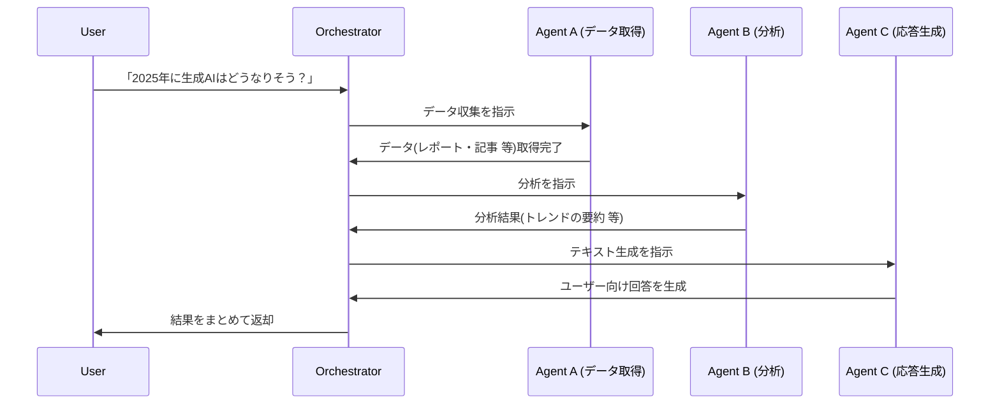

## はじめに

今回は Microsoft が公開している「[Multi-Agent-Custom-Automation-Engine-Solution-Accelerator](https://github.com/microsoft/Multi-Agent-Custom-Automation-Engine-Solution-Accelerator)」というリポジトリを動かして Multi-Agent について理解を深めていく会となります。

上記リポジトリを Deploy すると、以下のようなアプリケーションが Deploy されます。

https://youtu.be/ZKMgTrxuHdU

このリポジトリでは、Multi-Agent を MVP という最小単位で動かせるサンプルが提供されています。  
**Multi-Agent** という言葉を初めて聞いたり、なんとなく聞いたことがあるけどイメージが湧きにくい方もいるかもしれません。

そこでこの記事では、まず Multi-Agent の基本的な概念から順を追って説明しつつ、本リポジトリの内容を DeepDive していきたいと思います。

---

## Agent の基礎

- **Agent** とは、ある特定の目的やタスクを能動的に遂行する「ソフトウェア上の自律的な存在」を指すことが多いです。人の代わりに自動的に判断・行動(処理)してくれる存在とイメージするとわかりやすいです。
- 最近の生成 AI ブームで、**LLM(大規模言語モデル)をバックエンドにもつエージェント** が増えています。これらは事前に学習した「知識」を用いて「推論」をして、ユーザーの指示を柔軟に解釈して実行できます。

## Multi-Agent の基礎

- Multi-Agent とは、**複数のエージェントを連携させ、より複雑なタスクを Agent 分担して行う仕組み** のことを指します。
- それぞれのエージェントが **「自分の得意分野の処理を担当」** し、それらを調整役(オーケストレーター)が組み合わせることで、単独のエージェントでは難しい大きなタスクを分割・再合成して処理できます。
- 例えば、
  - 「データ収集エージェント」: Web スクレイピングや API 呼び出し
  - 「分析エージェント」: データ解析、統計処理
  - 「テキスト生成エージェント」: レポート作成やチャット応答
  - などのように **各専門エージェント** を組み合わせ、全体としてより賢い動作を行う、という活用方法が考えられます。

---

## Multi-Agent ソリューションのイメージ図

ここでは、Multi-Agent を使う場合の一例として、**ユーザーが「ある要求」を投げかけると、複数エージェントが連携して結果を返す** 流れを簡単に図示します。  
以下は、mermaid を使ったシーケンス図の一例です。（実際のリポジトリと異なる単純化した例です。）

このように、１つの大きなタスクを複数エージェントが分担し、最後にオーケストレーターが結果を集約するという形が Multi-Agent の典型的なフローです。

それぞれが専門性を持ち、独自にタスク解決に向けて動いているイメージです。

わかりやすいですね( ͡° ͜ʖ ͡°)

## リポジトリ概要 ~ Microsoft Multi-Agent Custom Automation Engine ~

Microsoft が公開しているリポジトリ「[Multi-Agent-Custom-Automation-Engine-Solution-Accelerator](https://github.com/microsoft/Multi-Agent-Custom-Automation-Engine-Solution-Accelerator)」は、Multi-Agent のアプリケーションを最小単位で動かすためのテンプレートです。

Multi-Agent のアプリケーションはその特性上どうしても実装が難しくなり、簡単な PoC がしにくいという側面があります。

そこで本リポジトリは、MVP のベースとして、またはリファレンスとしてすぐに使用できるアプリケーションを提供し、すぐに作業を開始できるようにします。

本記事の DEMO では、今日の晩御飯について Multi-Agent がユーザーの好みを聞いて必要な材料を洗い出してくれる処理が行われます。

---

## Deploy 方法

以下の Deploy to Azure ボタンをぽちっとすると、Azure 上にリソースがデプロイされます。
https://github.com/microsoft/Multi-Agent-Custom-Automation-Engine-Solution-Accelerator?tab=readme-ov-file#quick-deploy

構成としては以下の構成が Deploy されます。

Deploy されたリソースの一覧は以下です。

認証のために EntraID Provider を Azure App Service へ追加が必要です。
https://github.com/microsoft/Multi-Agent-Custom-Automation-Engine-Solution-Accelerator?tab=readme-ov-file#add-the-entra-identity-provider-to-the-azure-web-app

また、CosmosDB へのデータプレーンの追加も必要です。

https://learn.microsoft.com/en-us/azure/cosmos-db/nosql/security/how-to-grant-data-plane-role-based-access?tabs=built-in-definition%2Cpython&pivots=azure-interface-cli

https://learn.microsoft.com/en-us/cli/azure/cosmosdb/sql/role/assignment?view=azure-cli-latest#az-cosmosdb-sql-role-assignment-create

無事 Deploy が完了したら以下のような画面が WebApp に Deploy されます。
http://localhost:3000/app.html?v=home

サーバサイドは FastAPI で実装されており、API の一覧が見れて便利です。

http://localhost:8000/docs

では、**Multi-Agent に「Please think today's dinner menu. I want to eat Japanese food.」と聞くデモ** をご覧ください。

https://youtu.be/ZKMgTrxuHdU

いい感じにメニューの選定と、そのメニューを作るための材料のリストを返してくれますね。
マルチエージェントは 2025 年に社会実装がより進んでいく概念だと思うので、ぜひ皆様も一度触ってみてください。

それでは 👋

---

# スタートアップ企業様向けのお知らせ

日本マイクロソフトでは、スタートアップ企業様向けに、ビジネスを支援するプログラムをご提供しています。
Azure の無料クレジットが`最大$150,000`もらえるので、是非チェックしてみてください。

https://speakerdeck.com/satakeyusuke19920527/microsoft-for-startups-founders-hub

---

### 参考リンク

- [**Multi-Agent-Custom-Automation-Engine-Solution-Accelerator GitHub リポジトリ**](https://github.com/microsoft/Multi-Agent-Custom-Automation-Engine-Solution-Accelerator)
- [**Azure OpenAI Service 公式ドキュメント**](https://learn.microsoft.com/azure/cognitive-services/openai/)
- [**Autogen の最新情報**](https://www.microsoft.com/en-us/research/lab/ai-frontiers/)

---
