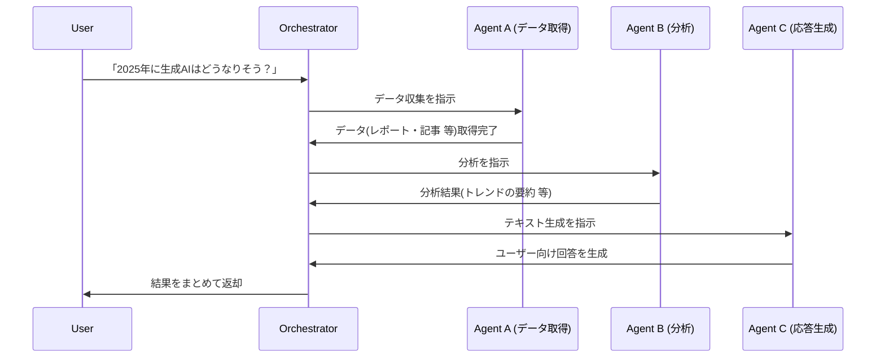

## はじめに

今回は Microsoft が公開している「[Multi-Agent-Custom-Automation-Engine-Solution-Accelerator](https://github.com/microsoft/Multi-Agent-Custom-Automation-Engine-Solution-Accelerator)」というリポジトリを動かして Multi-Agent について理解を深めていく会となります。

上記リポジトリを Deploy すると、以下のようなアプリケーションが Deploy されます。

https://youtu.be/ZKMgTrxuHdU

このリポジトリでは、Multi-Agent を MVP という最小単位で動かせるサンプルが提供されています。  
**Multi-Agent** という言葉を初めて聞いたり、なんとなく聞いたことがあるけどイメージが湧きにくい方もいるかもしれません。

そこでこの記事では、まず Multi-Agent の基本的な概念から順を追って説明しつつ、本リポジトリの内容を DeepDive していきたいと思います。

---

## Agent の基礎

- **Agent** とは、ある特定の目的やタスクを能動的に遂行する「ソフトウェア上の自律的な存在」を指すことが多いです。人の代わりに自動的に判断・行動(処理)してくれる存在とイメージするとわかりやすいです。
- 最近の生成 AI ブームで、**LLM(大規模言語モデル)をバックエンドにもつエージェント** が増えています。これらは事前に学習した「知識」を用いて「推論」をして、ユーザーの指示を柔軟に解釈して実行できます。

## Multi-Agent の基礎

- Multi-Agent とは、**複数のエージェントを連携させ、より複雑なタスクを Agent 分担して行う仕組み** のことを指します。
- それぞれのエージェントが **「自分の得意分野の処理を担当」** し、それらを調整役(オーケストレーター)が組み合わせることで、単独のエージェントでは難しい大きなタスクを分割・再合成して処理できます。
- 例えば、
  - 「データ収集エージェント」: Web スクレイピングや API 呼び出し
  - 「分析エージェント」: データ解析、統計処理
  - 「テキスト生成エージェント」: レポート作成やチャット応答
  - などのように **各専門エージェント** を組み合わせ、全体としてより賢い動作を行う、という活用方法が考えられます。

---

## Microsoft Multi-Agent Custom Automation Engine とは？

### リポジトリ概要

Microsoft が公開しているリポジトリ「[Multi-Agent-Custom-Automation-Engine-Solution-Accelerator](https://github.com/microsoft/Multi-Agent-Custom-Automation-Engine-Solution-Accelerator)」は、**Multi-Agent を活用した業務自動化のためのサンプル(ソリューション アクセラレータ)** です。以下のような特徴があります。

1. **複数の専門エージェント** を連携させる設計を示す。
2. それらのエージェントをどのように**オーケストレーション**(統制)するかのサンプル実装がある。
3. **Azure OpenAI やその他のサービスとの連携** サンプルが含まれる。

例えば、ドキュメント処理・分析タスクを複数エージェントで手分けし、それらの結果をまとめてレポートする、といったケースを想定したフレームワークのベースを提供してくれます。

---

## Multi-Agent ソリューションのイメージ図

ここでは、Multi-Agent を使う場合の一例として、**ユーザーが「ある要求」を投げかけると、複数エージェントが連携して結果を返す** 流れを簡単に図示します。  
以下は、mermaid を使ったシーケンス図の一例です。（実際のリポジトリと異なる単純化した例です。）

このように、１つの大きなタスクを複数エージェントが分担し、最後にオーケストレーターが結果を集約するという形が Multi-Agent の典型的なフローです。

## リポジトリの主要コンポーネント

実際のリポジトリ内では、以下のようなフォルダ・ファイル構成になっています。（一部抜粋）

- **/agents** … 各エージェントの役割・ロジックがまとめられている
- **/orchestrator** … エージェント同士の連携を管理する調整ロジック
- **/pipelines** … Azure Pipelines などのデプロイ周りを扱う
- **/docs** … ドキュメント関連

_(※ 実際の内容はリポジトリをご確認ください)_

---

## 使い方のざっくりイメージ

1. **リポジトリをクローン** し、ローカル/クラウド環境にセットアップ
2. **Azure OpenAI など LLM API の設定** を行う
3. **エージェント定義の調整** (必要な役割・タスクをカスタマイズ)
4. **オーケストレーター (もしくはメインの実行ファイル)** を起動してタスクを実行
5. **実際の業務フローに組み込む** (アプリや Web サービスと連携する、など)

---

## 今晩の晩御飯を聞いてみる DEMO

本記事の最後には、**Multi-Agent に「今晩の晩御飯、何がいい？」と聞くデモ** を予定しています（動画でアップロード予定）。

こちらではあくまでイメージですが、以下のような手順になります。

1. **ユーザーが「今晩の晩御飯は何にすればいい？」と入力**
2. **レシピ提案エージェント** が食材やレシピ情報を取得
3. **栄養分析エージェント** がバランスなどを検討
4. **最終エージェント** がユーザーへの返信文を生成して提案
5. **ユーザーが確認** (実際に作るか判断)

これら一連の流れを Multi-Agent で自動化できれば、非常に便利ですよね。

---

## まとめ

本記事では、Microsoft が提供する「**Multi-Agent-Custom-Automation-Engine-Solution-Accelerator**」について、Multi-Agent の概念や使用イメージを交えつつ解説しました。

- **Multi-Agent** は **複数のエージェントが専門タスクを連携して実行する仕組み**
- Microsoft のリポジトリでは、**複雑な業務自動化** を Multi-Agent で実現するためのテンプレート(アクセラレータ)が用意されている
- これを参考に **自分の使いたいエージェント構成** を自由に作れる

今後も生成 AI やエージェントの進化により、このような **「複数の AI を組み合わせる」** スタイルの実装が広がっていくと思われます。ぜひリポジトリを活用してみてください。

最後に、「**今晩の晩御飯を聞いてみる**」DEMO 動画 も併せてご覧いただければ幸いです。Multi-Agent の魅力が、さらに実感していただけると思います。

この記事がみなさんの Multi-Agent 活用のヒントになれば幸いです！

---

### 参考リンク

- [**Multi-Agent-Custom-Automation-Engine-Solution-Accelerator GitHub リポジトリ**](https://github.com/microsoft/Multi-Agent-Custom-Automation-Engine-Solution-Accelerator)
- [**Azure OpenAI Service 公式ドキュメント**](https://learn.microsoft.com/azure/cognitive-services/openai/)

---
