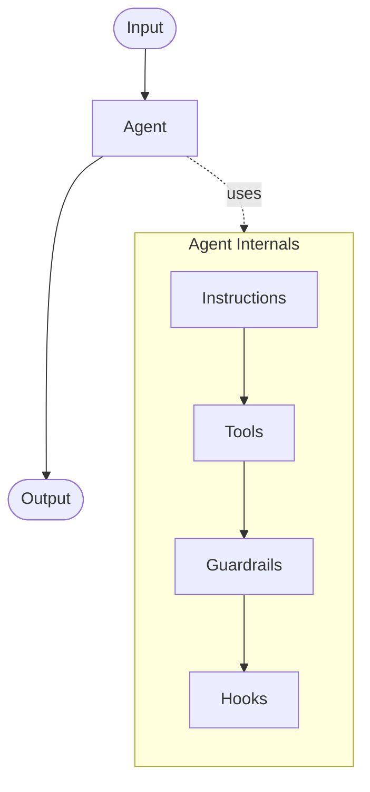
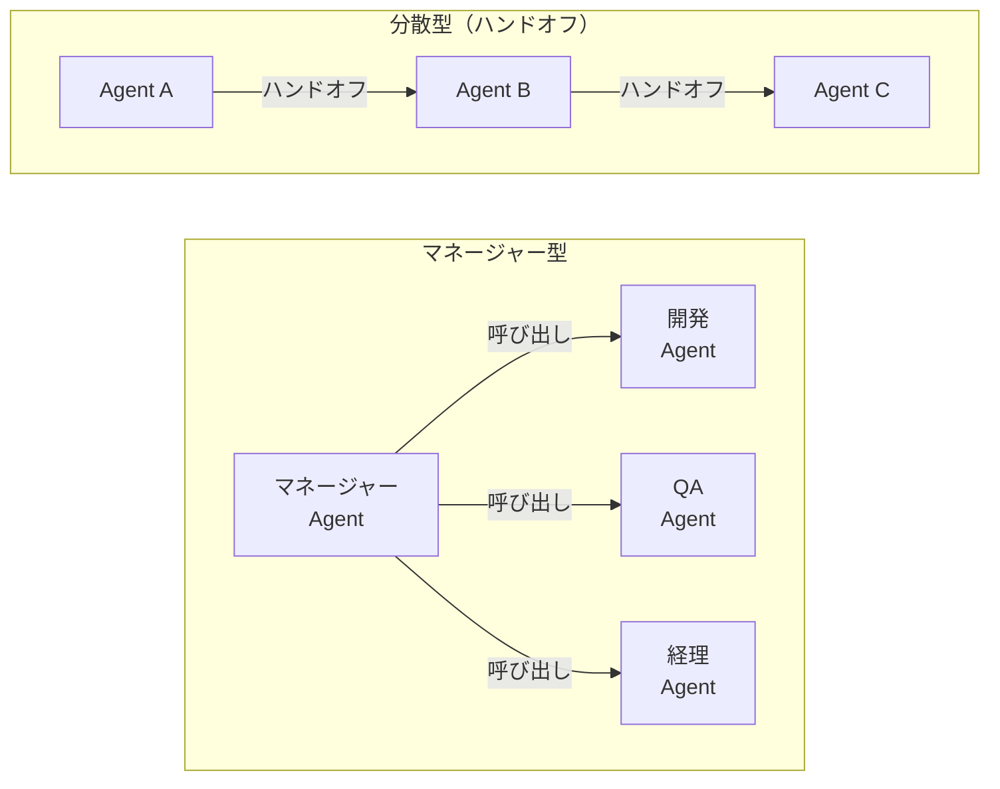
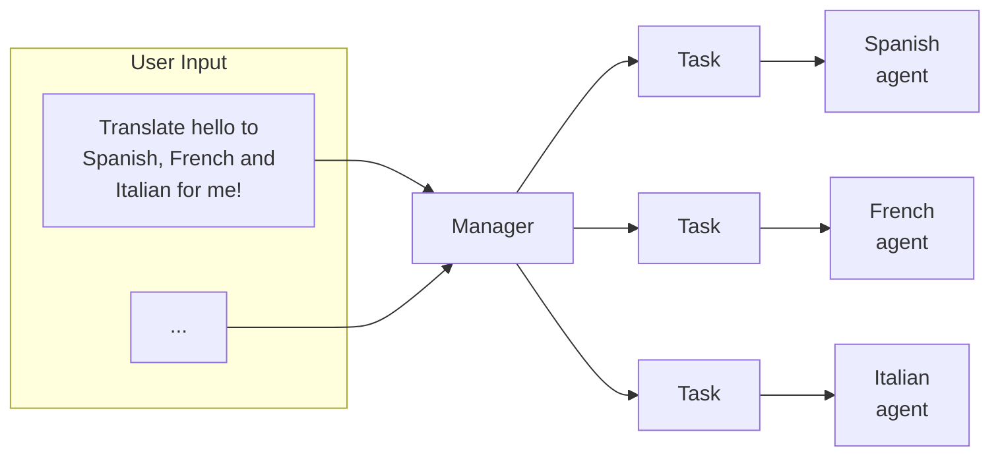
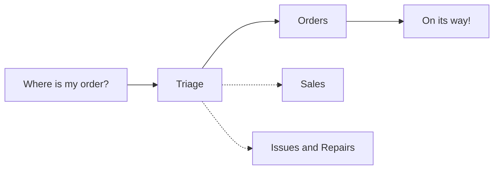

# はじめに

本記事では、昨今話題の AI エージェントサービスをこれから作る方へ、AI エージェントシステムを作る上での抑えるべきポイントと実践的なハンズオンにて DeepDive していきたいと思います。

本記事は 2 部構成になっており、第１部では AI Agent の基本的な概念を理解します。

第２部では Anthropic のブログ記事 **[Building Effective Agents – Workflow Routing](https://www.anthropic.com/engineering/building-effective-agents)** で紹介されている _ワークフロールーティング_ のアイデアを、**Next.js** と **Azure AI Agent Service** を使って実装しながら理解していきます。

ハンズオンは以下の構成を取り扱います。
非常にシンプルな物になっているので、ぜひ手を動かしながらアプリケーションを動作させて catch up してみてください。


ワークフロールーティングとは、**入力（ユーザーのリクエスト）を性質に応じて最適な下流プロセス／モデル／ツールへ振り分ける** 設計パターンです。

ルーティングが特に役立つユースケースは次のようなものです。

- カスタマーサービスで _一般質問_ / _返金リクエスト_ / _テクニカルサポート_ を自動で判別し、それぞれ専用のワークフローに送る。
- _簡単な FAQ_ は **gpt-4o-mini** など低コストモデルへ、_難解な質問_ は **o3, o3-pro** へ送って **速度とコスト** を最適化する。

ハンズオンでは、Next.js API Route で **Router Agent** を構築し、その配下に **FAQ Agent** 、 **Expert Agent** と **General Agent** をぶら下げる 4 体構成のマルチエージェントを例に解説します。

流れを図にするとこんな感じのアプリケーションを作っていきます。


本記事は以下の構成となります。
AI エージェントの設計から深く学びたい方は第１部から、とにかく動かして理解したい方は第２部から始めていただければ OK です。

それでは、AI エージェントの世界へ Deep Dive していきましょう 🚀

# 第 1 部: AI エージェント の基本概念とエージェントシステム構築のガイド

# AI Agent とは？

前提として、AI Agent についてざっとおさらいです。

従来のソフトウェアでもワークフローを効率化・自動化することは可能ですが、エージェントはユーザーの代わりに**高い独立性**を持って同じワークフローを実行することができます。

> **エージェントとは、ユーザーに代わってタスクを自律的に遂行するシステムのこと**

ワークフローとは、ユーザーの目的を達成するために実行すべき一連のステップを指し、たとえばカスタマーサービスの問題解決、レストラン予約、コード変更のコミット、レポート生成などがあります。

LLM を統合していても、それをワークフローの実行側に利用しないアプリケーション（例：単純なチャットボット、単一ターンの LLM、感情分類器など）はエージェントとはみなされません。

より具体的には、エージェントはユーザーの代理として安定的かつ一貫してタスクを実行するために、次のような特性を持ちます。

具体的には、以下のような例です。

1. **ワークフローの実行を管理し、意思決定を行うために LLM を活用する**

   - ワークフローが完了したかどうかを認識し、必要に応じて自らの行動を積極的に修正する。
   - 失敗した場合には、実行を停止し、制御をユーザーに戻す。

2. **外部システムとやり取りするためのさまざまなツールにアクセスできる**
   - コンテキストを収集したりアクションを実行したりする。
   - ワークフローの現状に応じて適切なツールを動的に選択し、常に明確に定義されたガードレール内で動作する。

# Agent 利用のユースケース

エージェントを構築するには、システムの意思決定方法や複雑さへの対応方法を見直す必要があります。従来の自動化とは異なり、エージェントは**決定論的でルールベースの手法では対応できないワークフロー**において特に効果を発揮します。

具体的には、支払い不正の分析を考えてみましょう。
従来のルールエンジンはチェックリストのように機能し、あらかじめ設定された基準に基づいて取引を識別します。これに対して **AI エージェント** は、経験豊富な調査員のようにコンテキストを評価し微妙なパターンを考慮するため、明確なルール違反がない場合でも疑わしい活動を特定できます。

この高度な思考能力があるからこそ、エージェントは複雑で不明瞭な状況にも対応できるのです。

## エージェントが価値を提供できるユースケース

エージェントを検討する際は、従来の自動化が困難だったワークフロー、特に下記のような領域に注目してください。

1. **複雑な意思決定**

   - 綿密な判断や例外処理、文脈に応じた対応が必要なワークフロー
     - ex.) カスタマーサービスワークフローにおける返金承認

2. **運用が煩雑なルール**

   - 膨大かつ複雑なルールにより更新が困難になり、変更のたびにコストやエラーが発生しやすくなっているシステム
     - ex.) ベンダーのセキュリティレビューの実施

3. **非構造化データへの強い依存**
   - 自然言語の解釈や文書から情報を抽出する処理、あるいはユーザーとの会話を通じたやり取りが必要な場面
     - ex.) 住宅保険の請求処理

エージェントの開発を決定する前に、そのユースケースがこれらの条件を明確に満たしているか確認してください。満たしていない場合、従来の決定論的アプローチでも十分な可能性があります。

改めてになりますが、エージェントが効力を発揮するのは、**決定論的でルールベースの手法では対応できないワークフロー**です。
それ以外だと、従来の自動化手法で十分対応可能な場合が多いです。

## エージェント設計の基本

エージェントは、以下の **3 つの主要な構成要素** から成り立っています。

| #   | 要素                    | 役割割                                                         |
| --- | ----------------------- | -------------------------------------------------------------- |
| 01  | **モデル (Model)**      | エージェントの推論および意思決定を支える LLM                   |
| 02  | **ツール (Tools)**      | エージェントがアクションを実行するために使用する外部関数や API |
| 03  | **指示 (Instructions)** | エージェントの振る舞いを定める明確なガイドラインとガードレール |

python で OpenAI 社の Agent SDK を使う場合は以下のようなコードになります。

```python

weather_agent = Agent(
  name="Weather Agent",
  instructions="""You are a weather agent that provides accurate and up-to-date weather information.
Use the provided tools to fetch current weather data and respond to user queries.
""",
  tools=[get_weather]
)

```

## モデル(Model)の選択

モデルには、それぞれ **タスクの複雑さ・レイテンシ・コスト** に関する強みとトレードオフがあります。  
本記事の「オーケストレーション」セクションでは、ワークフロー内のさまざまなタスクに応じて複数のモデルを使い分ける方法を紹介します。

すべてのタスクに最高性能のモデルが必要なわけではありません。

- **単純な情報取得や分類** には、小型で高速なモデルで十分対応できます。
- **返金の可否判断のような複雑なタスク** には、より能力の高いモデルが適しています。

効果的なアプローチは以下の通りです。

1. **まず最高性能モデルでプロトタイプを構築**し、性能の基準線を確立する。
2. その後 **小型モデルに置き換え** ても許容できる結果が得られるかを確認する。
3. こうしてエージェントの能力を制限しすぎることなく、小型モデルで成功するタスクと失敗するタスクを把握できる。

モデル選択の原則は以下になります。

1. **評価基準を設定し、パフォーマンスの基準を確立する**
2. **最高性能のモデルを用いて、精度目標を達成することに注力する**
3. **コストとレイテンシを最適化** するために、可能な限り小型のモデルに置き換える

OpenAI 社 が提供するモデル選択に関する包括的なガイドは 以下 で確認できます。

https://platform.openai.com/docs/guides/model-selection

## ツール(Tools)の定義

ツールは、対象のアプリケーションやシステムが提供する **API** を利用することで、エージェントの能力を拡張します。  
API が存在しないレガシーシステムでは、コンピュータ操作モデルを用いて人間と同様に Web やアプリケーションの UI を介して直接やり取りを行います。

各ツールは標準化された定義に従い、ツールとエージェントの間に柔軟な多対多の関係を実現できます。適切にドキュメント化され、十分にテストされ、再利用可能なツールは**発見性を高め、バージョン管理を簡易化し、冗長な定義を防止**します。

エージェントが必要とするツールは、主に以下の **3 種類** です。

| 種類                     | 説明                                                                                                                     | 例                                                                                     |
| ------------------------ | ------------------------------------------------------------------------------------------------------------------------ | -------------------------------------------------------------------------------------- |
| **データ**               | エージェントがワークフローを実行するために必要なコンテキストや情報を取得するツール                                       | 取引データベースや CRM の検索、PDF ドキュメントの読み込み、Web 検索の実行              |
| **アクション**           | エージェントがシステムと対話し、データベースに新情報を追加・更新したり、メッセージを送信したりするツール                 | メール／テキストの送信、CRM レコードの更新、人間へのカスタマーサービスチケット引き継ぎ |
| **オーケストレーション** | エージェント自体が他のエージェントのツールとして機能するもの（オーケストレーションセクションのマネージャーパターン参照） | 返金エージェント、調査エージェント、ライティングエージェント                           |

## 指示 (Instructions) の設定

高品質な **指示 (Instructions)** は LLM を活用したアプリケーションにおいて不可欠ですが、特にエージェントではきわめて重要です。明確な指示は **曖昧さを減らし、エージェントの意思決定を改善し、ワークフローの円滑な実行とエラーの減少** につながります。

エージェント指示のベストプラクティスは以下になります。

### 既存のドキュメントを活用する

ルーチンを作成する際は、既存の業務手順書・サポート用スクリプト・ポリシードキュメントを活用し、LLM に適した形式へ落とし込みます。  
_例：カスタマーサービスでは、ルーチンがナレッジベース内の個々の記事に対応することが多い。_

### エージェントにタスクを細分化するよう指示する

密度の高いリソースから **小さく明確なステップ** を提供することで、曖昧さを最小限に抑え、モデルが指示を的確に理解できるようにします。

### 明確なアクションを定義する

ルーチン内の各ステップが **具体的なアクションや出力** に対応していることを確認します。  
_例：「ユーザーに注文番号を尋ねる」「API を呼び出してアカウント情報を取得する」など。_  
アクションを明確に示すことで（ユーザー向けメッセージ文言でも同様）、解釈の誤りを減らします。

### エッジケースを考慮する

現実のユーザー対応では、ユーザーが不完全な情報を提供したり、想定外の質問をするなど、判断が必要な場面が発生します。堅牢なルーチンでは、こうしたケースをあらかじめ想定し、**条件分岐や代替ステップ** を用意して対応します。

# オーケストレーション

基本となるコンポーネントが揃ったら、エージェントが効果的にワークフローを実行できるように、**オーケストレーションのパターン** を検討しましょう。

最初から複雑なアーキテクチャで完全自律型エージェントを作りたいという気持ちを抑えて、**少しずつ段階的なアプローチ** をとる方が成功する確率が高くなります。

一般的に、オーケストレーションのパターンは大きく **2 つのカテゴリー** に分類されます。

| #   | パターン                         | 説明                                                                                       |
| --- | -------------------------------- | ------------------------------------------------------------------------------------------ |
| 01  | **シングルエージェントシステム** | 単一のモデルが、必要なツールや指示を利用して、ループの中でワークフローを処理します。       |
| 02  | **マルチエージェントシステム**   | ワークフローの実行タスクを複数のエージェントに分散させ、それらを調整することで動作します。 |

それぞれのパターンについて詳しく見ていきましょう。

## シングルエージェントシステム

シングルエージェントは **ツールを段階的に増やす** ことで多様なタスクに適応できます。

この方式はシステムの複雑さを抑え、評価・保守を容易にします。  
また、新しいツールを追加するたびにエージェントの能力が拡張されるため、無理に複数エージェントを運用する必要がありません。

オーケストレーションのアプローチで **実行 (run)**という概念があります。これはループとして実装され、エージェントが何らかの修了条件を満たすまで継続的に動作します。終了条件はツールの呼び出しや structured output での出力、エラーの発生、または最大ターン数への到達などです。

- **実行ループ**: エージェントが連続的に動作し、タスク完了まで処理を続ける仕組み。
- **主な終了条件**
  1. ツール呼び出しの完了
  2. _structured output_ での出力完了
  3. エラーの発生
  4. 最大ターン数への到達



## いつマルチエージェントを構築すべきか？

私たちの一般的なアドバイスは、**まずシングルエージェントの能力を最大限に活用**することです。  
エージェントの数を増やすと、概念の重複や分離が難しくなる一方で、より複雑性が増してオーバーヘッドが発生します。多くの場合、ツールを活用したシングルエージェントだけで十分でしょう。

しかし **複雑なワークフロー** では、プロンプトやツールをマルチエージェントに分割することで **パフォーマンスやスケーラビリティ** を向上できる可能性があります。

- エージェントが複雑な指示に従うことができない
- 一貫して誤ったツールを選択してしまう

といった場合には、システム全体を分割して **より明確に定義されたエージェント** を導入する必要があるかもしれません。

実務で検討されるケースとしては以下となります。

| 判断基準                   | 説明                                                                                                   | 推奨アクション                                                                                                     |
| -------------------------- | ------------------------------------------------------------------------------------------------------ | ------------------------------------------------------------------------------------------------------------------ |
| **複雑なロジック**         | プロンプトに多くの条件分岐 _(if-then-else)_ が含まれ、テンプレートの拡張が困難                         | 各ロジックを別エージェントに割り当て、管理とデバッグを簡素化                                                       |
| **ツールのオーバーヘッド** | 15 個以上の明確に定義された異なるツールを効率的に管理できる実装は稀。10 個未満でも複雑化するケースあり | ツール名をわかりやすくし、パラメータを明確に記述。それでもパフォーマンスが向上しない場合はマルチエージェントを検討 |

---

シングル・マルチエージェント 判断フローは以下のように考えられます。


上記に沿って正しくシングル・マルチエージェントを選択することで、システムの複雑さを抑えつつ、エージェントのパフォーマンスとスケーラビリティを最大化できます。

## マルチエージェントシステム

マルチエージェントシステムは、特定のワークフローや要件に合わせて**様々な方法で設計**できますが、実務上広く適用可能な **2 つの主要パターン** が見えています。

| パターン                                                   | 役割・特徴                                                                                                                            | 典型的なユースケース                                                            |
| ---------------------------------------------------------- | ------------------------------------------------------------------------------------------------------------------------------------- | ------------------------------------------------------------------------------- |
| **マネージャー型<br>(ツールとしてのエージェント)**         | 中央の **マネージャー役** のエージェントがツール呼び出しとして複数の**専門エージェント**を調整し、それぞれが特定ドメイン/タスクを担当 | コールセンターの自動応答基盤、RAG パイプラインのサブタスク分割                  |
| **分散型<br>(エージェントからエージェントへのハンドオフ)** | 複数のエージェントが**対等な立場で協働**し、専門性に基づいてタスクを**次のエージェントへ引き継ぐ**                                    | 開発 → レビュー → テストの CI/CD ワークフロー、複合ドキュメント生成パイプライン |

モデル化イメージは以下になります。



どのパターンを採用する場合でも、基本原則は共通です。

- コンポーネントは柔軟かつ再利用可能なモジュールとして構成
- 明確かつ簡潔 なプロンプトで制御
- グラフ構造で依存関係とデータフローを可視化

これにより、複雑なタスクでもスケーラブルかつ保守しやすいアーキテクチャを実現できます。

### マネージャー型パターン

マネージャー型パターンでは、中央の **LLM（マネージャー）** がツール呼び出しを通じて、  
専門エージェントのネットワークを **シームレスにオーケストレーション** します。  
マネージャーはコンテキストや制約を考慮し、適切なタイミングで適切なエージェントへタスクを振り分け、  
結果を統合して **一貫した対話** を実現します。

それぞれ、特徴と利点は以下のようになります。

| 項目                       | 説明                                                                           |
| -------------------------- | ------------------------------------------------------------------------------ |
| **中央管理**               | 1 つのエージェント（マネージャー）がワークフロー全体を制御                     |
| **専門エージェントの活用** | ドメイン特化のエージェントをツールとして呼び出し、専門機能をオンデマンドで利用 |
| **スムーズな UX**          | ユーザーは単一エージェントと対話するだけで、多様な機能を享受できる             |
| **拡張性**                 | 専門エージェントを追加するだけで能力を拡張でき、マネージャー側の変更は最小限   |

フローの例は以下になります。



### 分散型パターン

分散型パターンでは、**エージェントがワークフローの実行権限を他のエージェントへ直接“引き継ぎ（ハンドオフ）”** できます。

- ハンドオフは _一方向_ の移譲で、Agents SDK では **ツール（関数）** の一種として実装。
- ハンドオフ関数が呼び出された瞬間、新しいエージェントが処理を開始し、**最新の会話状態** も継続されます。

この方式では **複数エージェントが対等** な立場で協働し、中央制御を持たずにタスクをリレー形式で完了させます。  
単一エージェントに集約しにくい複雑なワークフローや、専門ドメインが明確に分かれているシナリオに最適です。

特徴と利点は以下になります。

| 項目             | 説明                                                                              |
| ---------------- | --------------------------------------------------------------------------------- |
| **ハンドオフ**   | 一方向の移譲。呼び出し時に処理が即座に切り替わる                                  |
| **状態継承**     | 会話履歴やコンテキストを新エージェントへ引き継ぐ                                  |
| **平等な協働**   | 各エージェントが対等なノードとして連携し、中央管理を不要にする                    |
| **柔軟性**       | 必要に応じてエージェントを追加・差し替えできるため、スケールや保守が容易          |
| **ユースケース** | マルチドメインのカスタマーサポート、複合ドキュメント生成、CI/CD での役割分担 など |

フローの例は以下になります。



# ガードレールについて

AI エージェントにおける “ガードレール” とは、モデルの推論・ツール呼び出し・出力生成の各段階で 安全・適切・意図どおり に振る舞わせるために設ける “安全柵” や “制御ルール” の総称です。

イメージとしては、車線の外へ車が飛び出さないようにする道路脇のガードレールと同じで AI エージェントが 危険領域に逸脱しないよう囲い込む仕組み と考えると分かりやすいです。

具体的には以下の項目を保護するために設計されます。

| 保護対象               | 代表的なリスク                       | ガードレールの役割                             |
| ---------------------- | ------------------------------------ | ---------------------------------------------- |
| **ユーザー**           | 有害・差別的・不正確な出力           | 不適切表現のブロック、ファクトチェック         |
| **機密／個人情報**     | PII 漏えい、内部情報の暴露           | マスキング・出力除去                           |
| **システム**           | プロンプトインジェクション、権限昇格 | 入力検査、動的ポリシー適用                     |
| **ビジネス／ブランド** | ガイドライン違反、法令違反           | スタイル・トーン検証、コンプライアンスチェック |

上記のように、適切に設計された **ガードレール** は以下の２点を管理するうえで欠かせません。

- **データプライバシー上のリスク**（例：システムプロンプトの漏洩防止）
- **評判リスク**（例：ブランド方針に沿わない出力の抑制）

単一のガードレールだけでは十分な保護を提供できないため、**多層防御 (layered defense)** として複数のガードレールを組み合わせることが推奨されます。

ガードレールの主なレイヤーは以下になります。

| レイヤー               | 目的                               | 具体例                                                                     |
| ---------------------- | ---------------------------------- | -------------------------------------------------------------------------- |
| **LLM ベース**         | 入力の妥当性・安全性・関連性を推論 | _gpt-4o-mini_ でハルシネーション／関連度チェック、FT 版で safe/unsafe 判定 |
| **モデレーション API** | 有害・不適切コンテンツの検出       | OpenAI **Moderation API** を併用し “hate”, “self-harm” などをブロック      |
| **ルールベース**       | 明示的な禁止事項を高速フィルタ     | 文字数上限・ブラックリスト・正規表現マッチングなど                         |

ガードレールの考えを入れた AI エージェント サービスのフロー全体のイメージは以下になります。


参考: https://cdn.openai.com/business-guides-and-resources/a-practical-guide-to-building-agents.pdf

特に機密情報性の高いデータを取り扱うサービスでは、ガードレールの考えを入れることが非常に重要になってきます。

## ガードレールの種類

ガードレールの種類を以下にまとめます。

| ガードレール               | 英語名                  | 主な目的・機能                                                                                                                                                                                                |
| -------------------------- | ----------------------- | ------------------------------------------------------------------------------------------------------------------------------------------------------------------------------------------------------------- |
| **関連性分類器**           | Relevance classifier    | エージェントの応答が**話題に留まっているか**を判定し、トピック外のクエリを検出する。<br/>例：「エンパイアステートビルの高さは？」というユーザー入力は*金融の話題*では無関連と判断。                           |
| **安全性分類器**           | Safety classifier       | システムの**脆弱性を悪用しようとする不正入力**（ジェイルブレイクやプロンプトインジェクション）を検出しブロックする。                                                                                          |
| **個人識別情報フィルター** | PII filter              | モデル出力に**個人識別情報 (PII)** が含まれていないかを判定し、必要に応じてマスクまたは除去する。                                                                                                             |
| **モデレーション**         | Moderation              | 有害または不適切な入力（ヘイトスピーチ、ハラスメント、暴力など）を検出し、**安全かつ敬意ある対話**を維持。                                                                                                    |
| **ツール利用時の安全対策** | Tool safeguards         | エージェントが呼び出す **各ツールのリスクを評価** し、低リスク/中リスク/高リスクといったレーティングで制御。<br/>*高リスク*のアクションでは追加ガードレールを強制発動して誤操作や不正エスカレーションを防止。 |
| **ルールベースによる保護** | Rules-based protections | シンプルな**決定論的対策**として、入力文字数上限・正規表現フィルター・ブラックリストなどを適用し、禁止用語や SQL インジェクションを遮断。                                                                     |
| **出力の検証**             | Output validation       | ブランドガイドラインやコンプライアンスポリシーに合致しているかを**出力後に二次チェック**し、逸脱を修正またはブロック。                                                                                        |

## ガードレール構築の進め方

ガードレールを構築する上で重要なこちは、対象のユースケースにおいて特定されているリスクに対応するガードレールを設定し、その後新たに発見された脆弱性に応じて追加していく方法が効果的です。
最初から完璧を目指すのではなく、段階的に強化していくことが重要です。

1. データプライバシーとコンテンツの安全性を重視
2. 実際に遭遇したケースや失敗事例に基づいて新たなガードレールを整備
3. エージェントの進化に合わせてガードレールを調整

3 つめのエージェントの進化に合わせてガードレールを調整することが意外と見落としやすく、重要になってくると考えています。

# 第 1 部 まとめ

- エージェントシステムは、複雑な意思決定や非構造化データ、膨らむルールベースシステムを含むユースケースに適しています。

- **オーケストレーションパターン**については、まずはシングルエージェントの構成から始め、必要に応じてマルチエージェントへ進化させましょう。
- ガードレールは入力フィルタリングやツール利用から人間の介入に至るまで、あらゆる段階で重要。これにより、エージェントが本番環境でも**安全かつ予測可能**に動作することを保証します。

サービス構築成功までの道筋は、決して一度にすべてを実現ものではなく、まず**小規模**なシングルエージェント構成から始めて実際のユーザーと検証を行い、必要に応じてマルチエージェントの仕組みを取り込みながら徐々にエージェントの能力を拡張していきましょう。
正しい実装と反復的なアプローチがあれば、エージェントはタスクだけでなくワークフロー全体を知性と適応力を持って自動化し、**実際のビジネス価値**を提供できます。

これで、AI エージェントのサービス構築における基本的な考え方と実装方法についてキャッチアップ完了です。

お疲れ様でした 🖐️

# 第 2 部: Next.js と Azure AI Agent Service を使ったワークフロールーティングの実装

# ハンズオンの流れの全体像

改めて、今回実装する multi-agent application の全体像を確認します。
第１部で説明したマネージャー型のマルチエージェントシステムを Next.js と Azure AI Agent Service を使って実装します。


各エージェントの役割は次の通りです。

- **Router Agent**: gpt-4o を使う。ユーザーのリクエストを受け取り、適切なエージェントへ振り分ける。
- **FAQ Agent**: gpt-4o を使う。よくある質問に対して、AI Search を用いてデータソースを検索し回答する。
- **Expert Agent**: o3 を使う。より専門的な質問に対して、データソースを検索し得られた知見をもとに回答する。
- **General Agent**: gpt-4o-mini を使う。一般的な質問に回答する。(ex. 今日は暑いですね。とか。)

# Azure AI Foundry Agent Service 概要

Azure AI Foundry 内のサービスの一つで、マルチエージェントアプリケーションを簡単に構築・運用できるサービスです。

https://azure.microsoft.com/ja-jp/products/ai-agent-service

Azure AI Foundry の _モデル／ツール／フレームワーク_ を 1 つのマネージド・ランタイムに統合し**安全かつスケーラブルに AI エージェントを開発・運用** できるようにするサービス。

主要機能は以下になります。

1. **スレッド管理** – すべての対話を構造化データとして保持し、ポータルでデバッグ可能。
2. **ツール呼び出しの自動オーケストレーション** – JSON Schema で宣言した検索・DB・業務 API を安全に実行。
3. **コンテンツセーフティ & ガードレール** – 不適切入力の検出と修正をランタイム側で強制。
4. **統合運用** – Azure AD (RBAC)、VNet、監視 (App Insights) とそのまま連携。

# Let's ハンズオン

ハンズオンは以下の流れで進めます。

1. **環境セットアップ** – Next.js と Azure AI Agent Service の準備
2. **Azure AI Agent Service のセットアップ** – エージェントの作成と設定
3. **Next.js アプリケーションの実装** – エージェントとの連携
4. **動作検証** – エージェントの動作確認
5. **まとめ**

## 環境セットアップ

```bash
# Node 20.x 系
pnpm create next-app@latest multi-agent-app
cd multi-agent-app
pnpm add @azure/ai-agent @azure/identity openai zod
```

- Azure 側で **Agent Service Workspace** を作成し、_Router / FAQ / Expert_ の 3 つのエージェントを登録。
- FAQ Agent は `gpt-4o-mini`, Expert Agent は `gpt-4o` などモデルを変えるとコスト試算しやすい。

## Azure AI Agent Service のセットアップ


以下の記事を参照し、AI Agent を構築していく

https://learn.microsoft.com/ja-jp/azure/ai-services/agents/quickstart?view=azure-dotnet-preview&pivots=ai-foundry-portal

AI Foundry へアクセスし、新しいプロジェクトの作成を選択

https://ai.azure.com/


そのまま、プロジェクトの作成をクリック


プロジェクトを作成すると、以下のリソースが作成される


図解すると以下。Azure AI hub の下に AI project が作成され、その下に KeyVault や AI Search, AI Services, Storage Account が作成される。


Azure AI Agent Service にてリソースを選択し、作成を進めていく。


モデル を Deploy する


今回は GPT-4o を Deploy する


Agent が GUI 上で作成することが出来る。
これで AI Agent Service のセットアップは完了です。


今回は二人の AI Agent を作成しておきます。

- Knowledge-Agent
  - 独自のドキュメントをセットしておき、RAG のようにドキュメントに沿った返答を行います。
- Action-Agent
  - Function Calling を用いて２種類の Functions を呼び出します。
  - Azure Functions は今回はモックとして天気の情報とユーザー情報を return するだけのものを用意します。


Knowledge-Agent は +新しいエージェントを選択し、
手順へ以下を記載

> ドキュメントの中に記載されている内容を回答してください。結論だけ返答してください。

ナレッジの追加からファイルを選択し、お好きなファイルを Upload してください


Action-Agent は +新しいエージェントを選択し作成するだけで OK です。
内部で動作させる Azure Functions は(2025/04 時点で)手動追加ができないので、後ほどコードベースで追加します。

ここまできたら AI Agent Service のセットアップ完了です。

# Next.js アプリケーションの実装

# 動作検証 – エージェントの動作確認

# 第 2 部 まとめ

ワークフロールーティングを導入することで、**コスト最適化** と **スケールしやすさ** を両立したエージェント基盤を構築できます。Next.js + Azure AI Agent Service は、

1. **Serverless** で運用コストを抑えられる
2. **Azure RBAC / ネットワーク分離** でエンタープライズ要件に対応
3. **MCP ストリーム** によるリアルタイム更新で UX を向上

というメリットが大きく、スタートアップからエンタープライズまで活用しやすいスタックです。

# 参考文献

https://cdn.openai.com/business-guides-and-resources/a-practical-guide-to-building-agents.pdf

https://platform.openai.com/docs/guides/model-selection

https://www.anthropic.com/engineering/building-effective-agents
