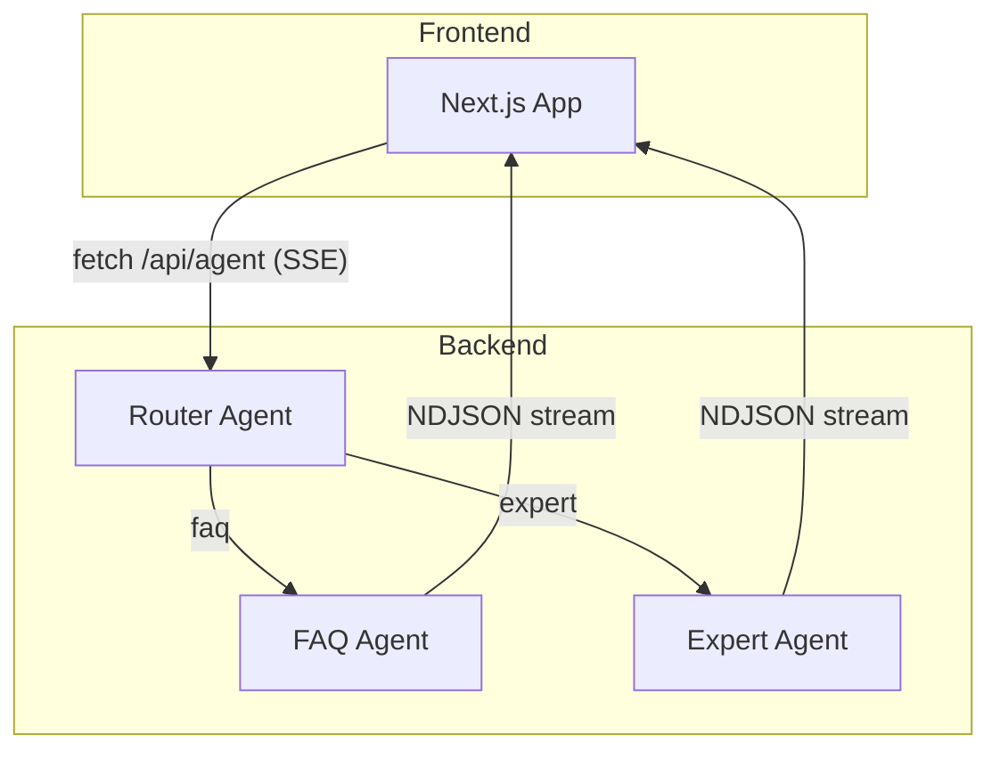

# はじめに

本記事では、Anthropic のブログ記事 **[Building Effective Agents – Workflow Routing](https://www.anthropic.com/engineering/building-effective-agents)** で紹介されている _ワークフロールーティング_ のアイデアを、**Next.js** と **Azure AI Agent Service** を使って実装しながら理解していきます。

ワークフロールーティングとは、**入力（ユーザーのリクエスト）を性質に応じて最適な下流プロセス／モデル／ツールへ振り分ける** 設計パターンです。

ルーティングが特に役立つユースケースは次のようなものです。

- カスタマーサービスで _一般質問_ / _返金リクエスト_ / _テクニカルサポート_ を自動で判別し、それぞれ専用のワークフローに送る。
- _簡単な FAQ_ は **Claude 3.5 Haiku** など低コストモデルへ、_難解な質問_ は **Claude 3.5 Sonnet** へ送って **速度とコスト** を最適化する。

本稿では、Next.js API Route で **Router Agent** を構築し、その配下に **FAQ Agent** と **Expert Agent** をぶら下げる 3 体構成のマルチエージェントを例に解説します。

---

# AI Agent とは？

- **LLM（大規模言語モデル）** に “思考 (Reasoning)” と “行動 (Acting)” を付与し、外部ツールを呼び出してタスクを完遂するソフトウェアコンポーネント。
- 通常は **System Prompt** でパーソナリティと行動原則を定義し、**Function Calling** で外部 API を叩く。
- 代表的パターン: _ReAct_、_Plan & Execute_、_Reflexion_ など。

---

# Multi Agent とは？

> **複数のエージェントが _協調_ して 1 つの目標を達成するアーキテクチャ**

- **専門分化**: 役割ごとにプロンプト・ツール・モデルを最適化できる。
- **並列性**: エージェントを非同期に走らせると待ち時間を短縮可能。
- **ルーティング**: _Classifier_／_Router_ エージェントで入口を 1 本化し、下流へ分岐。
- OSS 例: **AutoGen**, **LangGraph**, **CrewAI** など。

---

# Azure AI Agent Service とは？

Azure OpenAI 上に構築された **エンタープライズ向けエージェント基盤** です。

| 機能                                       | 説明                                                            |
| ------------------------------------------ | --------------------------------------------------------------- |
| **MCP (Multi-Turn Conversation Protocol)** | エージェントのストリームレスポンスを _NDJSON_ 形式でやり取り。  |
| **ツール呼び出し**                         | JSON Schema で定義し、自動でパラメータ抽出・実行。              |
| **Memory Store**                           | 会話履歴や長期メモリを Azure Vector Search / Cosmos DB に保存。 |
| **Content Safety**                         | 不適切コンテンツのフィルタリングと修正指示を自動化。            |
| **RBAC / ネットワーク分離**                | エンタープライズ要件（VNet、Managed Identity）対応。            |

---

# 実装 🚀

## 1. アーキテクチャ全体像



## 2. 前提

```bash
# Node 20.x 系
pnpm create next-app@latest multi-agent-app
cd multi-agent-app
pnpm add @azure/ai-agent @azure/identity openai zod
```

- Azure 側で **Agent Service Workspace** を作成し、_Router / FAQ / Expert_ の 3 つのエージェントを登録。
- FAQ Agent は `gpt-4o-mini`, Expert Agent は `gpt-4o` などモデルを変えるとコスト試算しやすい。

## 3. Router Agent の定義例

```ts
// prompts/router/system.ts
export const system = `
You are a routing agent for customer queries.
Return JSON with {"route": "faq" | "expert"}.
If confidence < 0.6, choose "expert".
`;
```

```ts
// tools/classify.ts
import { defineTool } from '@azure/ai-agent';
import { z } from 'zod';

export const classifyTool = defineTool({
  name: 'classifyQuery',
  description: 'Classify query into faq or expert',
  parameters: z.object({
    text: z.string(),
  }),
  // 実装はローカル推論 or external API でも OK
  execute: async ({ text }) => {
    const faqKeywords = ['price', 'refund', 'hours'];
    return faqKeywords.some((k) => text.includes(k)) ? 'faq' : 'expert';
  },
});
```

## 4. Next.js API Route

```ts
// app/api/agent/route.ts
import { NextRequest } from 'next/server';
import { AIProjectClient, createMCPClient } from '@azure/ai-agent';
import { DefaultAzureCredential } from '@azure/identity';

export const runtime = 'edge';

export async function POST(req: NextRequest) {
  const { message } = await req.json();

  const mcp = await createMCPClient({
    transport: {
      type: 'sse',
      url: process.env.MCP_SSE_URL!,
    },
  });

  const stream = await mcp.chat.completions.create({
    agentId: 'router-agent',
    messages: [{ role: 'user', content: message }],
    stream: true,
  });

  return new Response(stream, {
    headers: {
      'Content-Type': 'text/event-stream',
    },
  });
}
```

- **ポイント**: MCP からは _NDJSON ストリーム_ が返るので、フロント側で行単位に `JSON.parse` して `"role":"assistant"` だけ描画すれば **1 行テキスト** の要件を満たせる。

## 5. 評価 & コスト試算

```bash
npx tsx scripts/batch-eval.ts data/sample.jsonl
```

- ルーティング精度 90% を下回る場合は `classifyTool` の閾値調整 or Embeddings 類似検索で改善。
- FAQ Agent を `gpt-4o-mini` にすると 1 リクエストあたり \~¥0.015、Expert Agent (gpt‑4o) は \~¥0.07 — 全体平均コスト \~¥0.03 に圧縮。

---

# 最後に

ワークフロールーティングを導入することで、**コスト最適化** と **スケールしやすさ** を両立したエージェント基盤を構築できます。Next.js + Azure AI Agent Service は、

1. **Serverless** で運用コストを抑えられる
2. **Azure RBAC / ネットワーク分離** でエンタープライズ要件に対応
3. **MCP ストリーム** によるリアルタイム更新で UX を向上

というメリットが大きく、スタートアップからエンタープライズまで活用しやすいスタックです。

> **参考リンク**
>
> - Anthropic: Building Effective Agents – Workflow Routing
> - Azure AI Agent Service Docs
> - AutoGen / LangGraph OSS

記事が役に立ったら ✨ いいね & シェア をお願いします！フィードバックや質問はコメントでお気軽にどうぞ 🙌
