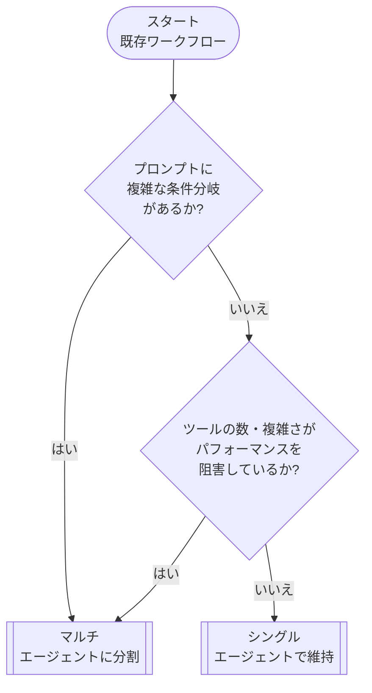
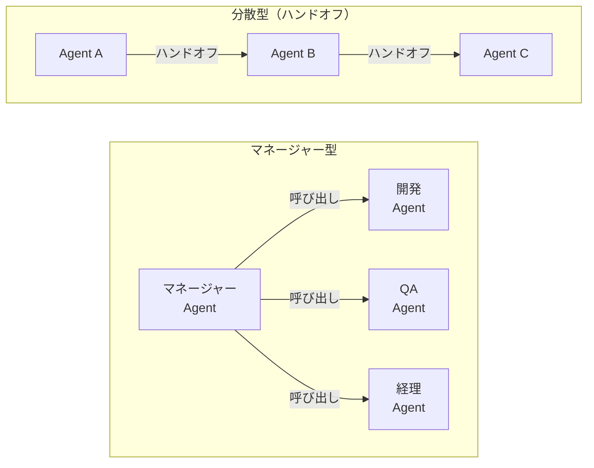

# はじめに

本記事では、昨今時代の AI Agent について DeepDive していきたいと思います。

まずは AI Agent の基本的な概念を理解し、次に Anthropic のブログ記事 **[Building Effective Agents – Workflow Routing](https://www.anthropic.com/engineering/building-effective-agents)** で紹介されている _ワークフロールーティング_ のアイデアを、**Next.js** と **Azure AI Agent Service** を使って実装しながら理解していきます。


ワークフロールーティングとは、**入力（ユーザーのリクエスト）を性質に応じて最適な下流プロセス／モデル／ツールへ振り分ける** 設計パターンです。

ルーティングが特に役立つユースケースは次のようなものです。

- カスタマーサービスで _一般質問_ / _返金リクエスト_ / _テクニカルサポート_ を自動で判別し、それぞれ専用のワークフローに送る。
- _簡単な FAQ_ は **gpt-4o-mini** など低コストモデルへ、_難解な質問_ は **o3, o3-pro** へ送って **速度とコスト** を最適化する。

本記事では、Next.js API Route で **Router Agent** を構築し、その配下に **FAQ Agent** 、 **Expert Agent** と **General Agent** をぶら下げる 4 体構成のマルチエージェントを例に解説します。

流れを図にするとこんな感じのアプリケーションを作っていきます。


# AI Agent とは？

前提として、AI Agent についてざっとおさらいです。

従来のソフトウェアでもワークフローを効率化・自動化することは可能ですが、エージェントはユーザーの代わりに**高い独立性**を持って同じワークフローを実行することができます。

> **エージェントとは、ユーザーに代わってタスクを自律的に遂行するシステムのこと**

ワークフローとは、ユーザーの目的を達成するために実行すべき一連のステップを指し、たとえばカスタマーサービスの問題解決、レストラン予約、コード変更のコミット、レポート生成などがあります。

LLM を統合していても、それをワークフローの実行側に利用しないアプリケーション（例：単純なチャットボット、単一ターンの LLM、感情分類器など）はエージェントとはみなされません。

より具体的には、エージェントはユーザーの代理として安定的かつ一貫してタスクを実行するために、次のような特性を持ちます。

具体的には、以下のような例です。

1. **ワークフローの実行を管理し、意思決定を行うために LLM を活用する**

   - ワークフローが完了したかどうかを認識し、必要に応じて自らの行動を積極的に修正する。
   - 失敗した場合には、実行を停止し、制御をユーザーに戻す。

2. **外部システムとやり取りするためのさまざまなツールにアクセスできる**
   - コンテキストを収集したりアクションを実行したりする。
   - ワークフローの現状に応じて適切なツールを動的に選択し、常に明確に定義されたガードレール内で動作する。

# Agent 利用のユースケース

エージェントを構築するには、システムの意思決定方法や複雑さへの対応方法を見直す必要があります。従来の自動化とは異なり、エージェントは**決定論的でルールベースの手法では対応できないワークフロー**において特に効果を発揮します。

具体的には、支払い不正の分析を考えてみましょう。
従来のルールエンジンはチェックリストのように機能し、あらかじめ設定された基準に基づいて取引を識別します。これに対して **AI エージェント** は、経験豊富な調査員のようにコンテキストを評価し微妙なパターンを考慮するため、明確なルール違反がない場合でも疑わしい活動を特定できます。

この高度な思考能力があるからこそ、エージェントは複雑で不明瞭な状況にも対応できるのです。

## エージェントが価値を提供できるユースケース

エージェントを検討する際は、従来の自動化が困難だったワークフロー、特に下記のような領域に注目してください。

1. **複雑な意思決定**

   - 綿密な判断や例外処理、文脈に応じた対応が必要なワークフロー
     - ex.) カスタマーサービスワークフローにおける返金承認

2. **運用が煩雑なルール**

   - 膨大かつ複雑なルールにより更新が困難になり、変更のたびにコストやエラーが発生しやすくなっているシステム
     - ex.) ベンダーのセキュリティレビューの実施

3. **非構造化データへの強い依存**
   - 自然言語の解釈や文書から情報を抽出する処理、あるいはユーザーとの会話を通じたやり取りが必要な場面
     - ex.) 住宅保険の請求処理

エージェントの開発を決定する前に、そのユースケースがこれらの条件を明確に満たしているか確認してください。満たしていない場合、従来の決定論的アプローチでも十分な可能性があります。

改めてになりますが、エージェントが効力を発揮するのは、**決定論的でルールベースの手法では対応できないワークフロー**です。
それ以外だと、従来の自動化手法で十分対応可能な場合が多いです。

## エージェント設計の基本

エージェントは、以下の **3 つの主要な構成要素** から成り立っています。

| #   | 要素                    | 役割割                                                         |
| --- | ----------------------- | -------------------------------------------------------------- |
| 01  | **モデル (Model)**      | エージェントの推論および意思決定を支える LLM                   |
| 02  | **ツール (Tools)**      | エージェントがアクションを実行するために使用する外部関数や API |
| 03  | **指示 (Instructions)** | エージェントの振る舞いを定める明確なガイドラインとガードレール |

python で OpenAI 社の Agent SDK を使う場合は以下のようなコードになります。

```python

weather_agent = Agent(
  name="Weather Agent",
  instructions="""You are a weather agent that provides accurate and up-to-date weather information.
Use the provided tools to fetch current weather data and respond to user queries.
""",
  tools=[get_weather]
)

```

## モデル(Model)の選択

モデルには、それぞれ **タスクの複雑さ・レイテンシ・コスト** に関する強みとトレードオフがあります。  
本記事の「オーケストレーション」セクションでは、ワークフロー内のさまざまなタスクに応じて複数のモデルを使い分ける方法を紹介します。

すべてのタスクに最高性能のモデルが必要なわけではありません。

- **単純な情報取得や分類** には、小型で高速なモデルで十分対応できます。
- **返金の可否判断のような複雑なタスク** には、より能力の高いモデルが適しています。

効果的なアプローチは以下の通りです。

1. **まず最高性能モデルでプロトタイプを構築**し、性能の基準線を確立する。
2. その後 **小型モデルに置き換え** ても許容できる結果が得られるかを確認する。
3. こうしてエージェントの能力を制限しすぎることなく、小型モデルで成功するタスクと失敗するタスクを把握できる。

モデル選択の原則は以下になります。

1. **評価基準を設定し、パフォーマンスの基準を確立する**
2. **最高性能のモデルを用いて、精度目標を達成することに注力する**
3. **コストとレイテンシを最適化** するために、可能な限り小型のモデルに置き換える

OpenAI 社 が提供するモデル選択に関する包括的なガイドは 以下 で確認できます。

https://platform.openai.com/docs/guides/model-selection

## ツール(Tools)の定義

ツールは、対象のアプリケーションやシステムが提供する **API** を利用することで、エージェントの能力を拡張します。  
API が存在しないレガシーシステムでは、コンピュータ操作モデルを用いて人間と同様に Web やアプリケーションの UI を介して直接やり取りを行います。

各ツールは標準化された定義に従い、ツールとエージェントの間に柔軟な多対多の関係を実現できます。適切にドキュメント化され、十分にテストされ、再利用可能なツールは**発見性を高め、バージョン管理を簡易化し、冗長な定義を防止**します。

エージェントが必要とするツールは、主に以下の **3 種類** です。

| 種類                     | 説明                                                                                                                     | 例                                                                                     |
| ------------------------ | ------------------------------------------------------------------------------------------------------------------------ | -------------------------------------------------------------------------------------- |
| **データ**               | エージェントがワークフローを実行するために必要なコンテキストや情報を取得するツール                                       | 取引データベースや CRM の検索、PDF ドキュメントの読み込み、Web 検索の実行              |
| **アクション**           | エージェントがシステムと対話し、データベースに新情報を追加・更新したり、メッセージを送信したりするツール                 | メール／テキストの送信、CRM レコードの更新、人間へのカスタマーサービスチケット引き継ぎ |
| **オーケストレーション** | エージェント自体が他のエージェントのツールとして機能するもの（オーケストレーションセクションのマネージャーパターン参照） | 返金エージェント、調査エージェント、ライティングエージェント                           |

## 指示 (Instructions) の設定

高品質な **指示 (Instructions)** は LLM を活用したアプリケーションにおいて不可欠ですが、特にエージェントではきわめて重要です。明確な指示は **曖昧さを減らし、エージェントの意思決定を改善し、ワークフローの円滑な実行とエラーの減少** につながります。

エージェント指示のベストプラクティスは以下になります。

### 既存のドキュメントを活用する

ルーチンを作成する際は、既存の業務手順書・サポート用スクリプト・ポリシードキュメントを活用し、LLM に適した形式へ落とし込みます。  
_例：カスタマーサービスでは、ルーチンがナレッジベース内の個々の記事に対応することが多い。_

### エージェントにタスクを細分化するよう指示する

密度の高いリソースから **小さく明確なステップ** を提供することで、曖昧さを最小限に抑え、モデルが指示を的確に理解できるようにします。

### 明確なアクションを定義する

ルーチン内の各ステップが **具体的なアクションや出力** に対応していることを確認します。  
_例：「ユーザーに注文番号を尋ねる」「API を呼び出してアカウント情報を取得する」など。_  
アクションを明確に示すことで（ユーザー向けメッセージ文言でも同様）、解釈の誤りを減らします。

### エッジケースを考慮する

現実のユーザー対応では、ユーザーが不完全な情報を提供したり、想定外の質問をするなど、判断が必要な場面が発生します。堅牢なルーチンでは、こうしたケースをあらかじめ想定し、**条件分岐や代替ステップ** を用意して対応します。

## オーケストレーション

基本となるコンポーネントが揃ったら、エージェントが効果的にワークフローを実行できるように、**オーケストレーションのパターン** を検討しましょう。

最初から複雑なアーキテクチャで完全自律型エージェントを作りたいという気持ちを抑えて、**少しずつ段階的なアプローチ** をとる方が成功する確率が高くなります。

一般的に、オーケストレーションのパターンは大きく **2 つのカテゴリー** に分類されます。

| #   | パターン                         | 説明                                                                                       |
| --- | -------------------------------- | ------------------------------------------------------------------------------------------ |
| 01  | **シングルエージェントシステム** | 単一のモデルが、必要なツールや指示を利用して、ループの中でワークフローを処理します。       |
| 02  | **マルチエージェントシステム**   | ワークフローの実行タスクを複数のエージェントに分散させ、それらを調整することで動作します。 |

それぞれのパターンについて詳しく見ていきましょう。

### シングルエージェントシステム

シングルエージェントは **ツールを段階的に増やす** ことで多様なタスクに適応できます。

この方式はシステムの複雑さを抑え、評価・保守を容易にします。  
また、新しいツールを追加するたびにエージェントの能力が拡張されるため、無理に複数エージェントを運用する必要がありません。

オーケストレーションのアプローチで **実行 (run)**という概念があります。これはループとして実装され、エージェントが何らかの修了条件を満たすまで継続的に動作します。終了条件はツールの呼び出しや structured output での出力、エラーの発生、または最大ターン数への到達などです。

- **実行ループ**: エージェントが連続的に動作し、タスク完了まで処理を続ける仕組み。
- **主な終了条件**
  1. ツール呼び出しの完了
  2. _structured output_ での出力完了
  3. エラーの発生
  4. 最大ターン数への到達


#### いつマルチエージェントを構築すべきか？

私たちの一般的なアドバイスは、**まずシングルエージェントの能力を最大限に活用**することです。  
エージェントの数を増やすと、概念の重複や分離が難しくなる一方で、より複雑性が増してオーバーヘッドが発生します。多くの場合、ツールを活用したシングルエージェントだけで十分でしょう。

しかし **複雑なワークフロー** では、プロンプトやツールをマルチエージェントに分割することで **パフォーマンスやスケーラビリティ** を向上できる可能性があります。

- エージェントが複雑な指示に従うことができない
- 一貫して誤ったツールを選択してしまう

といった場合には、システム全体を分割して **より明確に定義されたエージェント** を導入する必要があるかもしれません。

実務で検討されるケースとしては以下となります。

| 判断基準                   | 説明                                                                                                   | 推奨アクション                                                                                                     |
| -------------------------- | ------------------------------------------------------------------------------------------------------ | ------------------------------------------------------------------------------------------------------------------ |
| **複雑なロジック**         | プロンプトに多くの条件分岐 _(if-then-else)_ が含まれ、テンプレートの拡張が困難                         | 各ロジックを別エージェントに割り当て、管理とデバッグを簡素化                                                       |
| **ツールのオーバーヘッド** | 15 個以上の明確に定義された異なるツールを効率的に管理できる実装は稀。10 個未満でも複雑化するケースあり | ツール名をわかりやすくし、パラメータを明確に記述。それでもパフォーマンスが向上しない場合はマルチエージェントを検討 |

---

シングル・マルチエージェント 判断フローは以下のように考えられます。



上記に沿って正しくシングル・マルチエージェントを選択することで、システムの複雑さを抑えつつ、エージェントのパフォーマンスとスケーラビリティを最大化できます。

### マルチエージェントシステム

マルチエージェントシステムは、特定のワークフローや要件に合わせて**様々な方法で設計**できますが、実務上広く適用可能な **2 つの主要パターン** が見えています。

| パターン                                                   | 役割・特徴                                                                                                                            | 典型的なユースケース                                                            |
| ---------------------------------------------------------- | ------------------------------------------------------------------------------------------------------------------------------------- | ------------------------------------------------------------------------------- |
| **マネージャー型<br>(ツールとしてのエージェント)**         | 中央の **マネージャー役** のエージェントがツール呼び出しとして複数の**専門エージェント**を調整し、それぞれが特定ドメイン/タスクを担当 | コールセンターの自動応答基盤、RAG パイプラインのサブタスク分割                  |
| **分散型<br>(エージェントからエージェントへのハンドオフ)** | 複数のエージェントが**対等な立場で協働**し、専門性に基づいてタスクを**次のエージェントへ引き継ぐ**                                    | 開発 → レビュー → テストの CI/CD ワークフロー、複合ドキュメント生成パイプライン |

モデル化イメージは以下になります。



どのパターンを採用する場合でも、基本原則は共通です。

- コンポーネントは柔軟かつ再利用可能なモジュールとして構成
- 明確かつ簡潔 なプロンプトで制御
- グラフ構造で依存関係とデータフローを可視化

これにより、複雑なタスクでもスケーラブルかつ保守しやすいアーキテクチャを実現できます。

# Azure AI Agent Service とは？

Azure AI Foundry 内のサービスの一つで、マルチエージェントアプリケーションを簡単に構築・運用できるサービスです。

https://azure.microsoft.com/ja-jp/products/ai-agent-service

### Azure AI Foundry Agent Service 概要

- **目的**
  Azure AI Foundry の _モデル／ツール／フレームワーク_ を 1 つのマネージド・ランタイムに統合し、
  **安全かつスケーラブルに AI エージェントを開発・運用** できるようにするサービス。

- **主要機能**

  1. **スレッド管理** – すべての対話を構造化データとして保持し、ポータルでデバッグ可能。
  2. **ツール呼び出しの自動オーケストレーション** – JSON Schema で宣言した検索・DB・業務 API を安全に実行。
  3. **コンテンツセーフティ & ガードレール** – 不適切入力の検出と修正をランタイム側で強制。
  4. **統合運用** – Azure AD (RBAC)、VNet、監視 (App Insights) とそのまま連携。

- **エージェントの 3 要素**
  **モデル**（GPT-4o など LLM）＋ **Instructions**（ゴール・制約）＋ **Tools**（Grounding with Bing Search、Azure Logic Apps 等）を組み合わせて構築。

# いざ、実装 🚀

## サービスの流れの全体像

改めて、今回実装する multi-agent application の全体像を確認します。


各エージェントの役割は次の通りです。

- **Router Agent**: gpt-4o を使う。ユーザーのリクエストを受け取り、適切なエージェントへ振り分ける。
- **FAQ Agent**: gpt-4o を使う。よくある質問に対して、AI Search を用いてデータソースを検索し回答する。
- **Expert Agent**: o3 を使う。より専門的な質問に対して、データソースを検索し得られた知見をもとに回答する。
- **General Agent**: gpt-4o-mini を使う。一般的な質問に回答する。(ex. 今日は暑いですね。とか。)

## 環境の設定

```bash
# Node 20.x 系
pnpm create next-app@latest multi-agent-app
cd multi-agent-app
pnpm add @azure/ai-agent @azure/identity openai zod
```

- Azure 側で **Agent Service Workspace** を作成し、_Router / FAQ / Expert_ の 3 つのエージェントを登録。
- FAQ Agent は `gpt-4o-mini`, Expert Agent は `gpt-4o` などモデルを変えるとコスト試算しやすい。

## 3. Router Agent の定義例

```ts
// prompts/router/system.ts
export const system = `
You are a routing agent for customer queries.
Return JSON with {"route": "faq" | "expert"}.
If confidence < 0.6, choose "expert".
`;
```

```ts
// tools/classify.ts
import { defineTool } from '@azure/ai-agent';
import { z } from 'zod';

export const classifyTool = defineTool({
  name: 'classifyQuery',
  description: 'Classify query into faq or expert',
  parameters: z.object({
    text: z.string(),
  }),
  // 実装はローカル推論 or external API でも OK
  execute: async ({ text }) => {
    const faqKeywords = ['price', 'refund', 'hours'];
    return faqKeywords.some((k) => text.includes(k)) ? 'faq' : 'expert';
  },
});
```

## 4. Next.js API Route

```ts
// app/api/agent/route.ts
import { NextRequest } from 'next/server';
import { AIProjectClient, createMCPClient } from '@azure/ai-agent';
import { DefaultAzureCredential } from '@azure/identity';

export const runtime = 'edge';

export async function POST(req: NextRequest) {
  const { message } = await req.json();

  const mcp = await createMCPClient({
    transport: {
      type: 'sse',
      url: process.env.MCP_SSE_URL!,
    },
  });

  const stream = await mcp.chat.completions.create({
    agentId: 'router-agent',
    messages: [{ role: 'user', content: message }],
    stream: true,
  });

  return new Response(stream, {
    headers: {
      'Content-Type': 'text/event-stream',
    },
  });
}
```

- **ポイント**: MCP からは _NDJSON ストリーム_ が返るので、フロント側で行単位に `JSON.parse` して `"role":"assistant"` だけ描画すれば **1 行テキスト** の要件を満たせる。

## 5. 評価 & コスト試算

```bash
npx tsx scripts/batch-eval.ts data/sample.jsonl
```

- ルーティング精度 90% を下回る場合は `classifyTool` の閾値調整 or Embeddings 類似検索で改善。
- FAQ Agent を `gpt-4o-mini` にすると 1 リクエストあたり \~¥0.015、Expert Agent (gpt‑4o) は \~¥0.07 — 全体平均コスト \~¥0.03 に圧縮。

---

# 最後に

ワークフロールーティングを導入することで、**コスト最適化** と **スケールしやすさ** を両立したエージェント基盤を構築できます。Next.js + Azure AI Agent Service は、

1. **Serverless** で運用コストを抑えられる
2. **Azure RBAC / ネットワーク分離** でエンタープライズ要件に対応
3. **MCP ストリーム** によるリアルタイム更新で UX を向上

というメリットが大きく、スタートアップからエンタープライズまで活用しやすいスタックです。

# 参考文献

https://cdn.openai.com/business-guides-and-resources/a-practical-guide-to-building-agents.pdf

https://platform.openai.com/docs/guides/model-selection

https://www.anthropic.com/engineering/building-effective-agents
