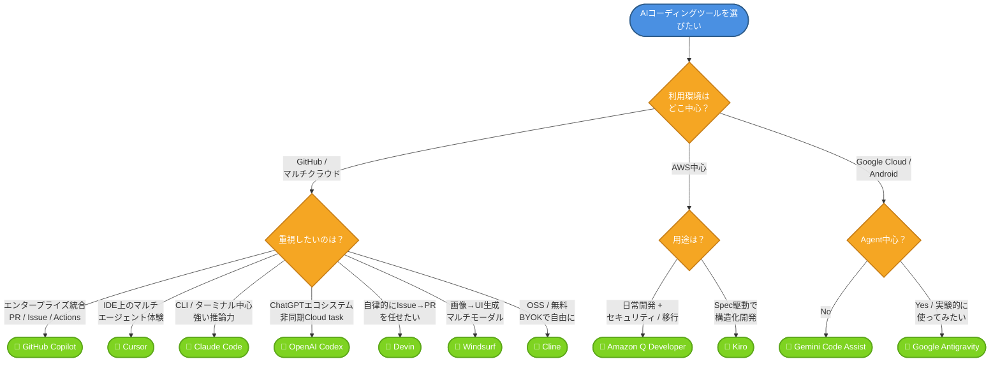

# はじめに

最近、ソフトウェア開発の現場では **AI駆動開発** が急速に広がっています。

GitHub Copilot のようなコード補完ツールから始まり、現在では ClaudeCode、OpenAI Codex、Devin、Cursor、Windsurf、Cline など、開発者の作業を支援するさまざまな **AI Coding Agent** が登場しています。

これらのツールは、単にコードを提案するだけではなく、要件の理解、既存コードの読み取り、バグ修正、テスト作成、リファクタリング、さらには Pull Request の作成まで、開発プロセス全体に関わる存在になりつつあります。

一方で、選択肢が増えたことで、こんな悩みを抱えていませんか？

- 「GitHub Copilot 入れたけど、Cursor の方が良いって聞いた...結局どっち？」
- 「Devin は月 $500 って聞いてたけど今いくら？コスパは？」
- 「会社で導入したい。SSO・監査ログ・IP補償に対応してるのは？」
- 「Claude Code と Codex CLI、どっちが推論強い？」
- 「AWS / Google Cloud 環境で使うなら何が最適？」
- 「Antigravity？Kiro？新しいツール多すぎて追いきれない...」

本記事を読めば、**代表的な11ツールを全観点で横並び比較**でき、自分やチームに合ったツールがハッキリ分かります。

本記事では、代表的な **AI コーディングツール / AI コーディングエージェント** を整理し、それぞれの特徴、強み、利用シーンをGitHub Copilotと比較する形で各ツールの優位性を理解していきます。

特に、以下のツールを中心に見ていきます。

- GitHub Copilot
- Cursor
- Claude Code
- OpenAI Codex
- Devin
- Windsurf
- Cline
- Amazon Q Developer
- Gemini Code Assist
- Antigravity

AI Coding Agent は、今後の開発生産性や DevOps のあり方を大きく変える可能性があります。  
本記事が、各ツールの違いを理解し、自分やチームに合った選択をするための参考になれば幸いです。

それでは見ていきましょう💡

# GitHub Copilotの概要

GitHub Copilot は、世界で最も広く採用されている AI 開発者ツールです。(2026年現在)
開発者が求める競争優位性を提供します。

GitHub Copilot は、開発ライフサイクル全体を通じて AI アシスタンスを提供します。  
IDE や GitHub.com 上で、計画、コーディング、プルリクエスト、コードレビュー、エージェント開発などを効率化します。

そうすることで我々人間は好きな作業に集中し、残りはエージェントに任せることが可能です。

反復作業を自動化し、コードレビューを効率化し、課題解決を支援します。

統合開発環境（IDE）上のエージェントモードでは、課題を深く理解し、次のステップを計画し、必要な変更を提案・適用します。  
その間も、開発者が主導権を持ち、Agentに指示を出し続けられます。

## GitHub Copilot の料金プラン

| プラン | 価格 | 含まれる AI Credits |
|---|---:|---:|
| GitHub Copilot Business | $19 / ユーザー / 月 | 1,900 AI Credits / ユーザー / 月 |
| GitHub Copilot Enterprise | $39 / ユーザー / 月 | 3,900 AI Credits / ユーザー / 月 |

GitHub Copilot Business および GitHub Copilot Enterprise では、利用量は **AI Credits** によって計測されます。  
AI Credits は、Copilot の利用に伴うトークン消費を課金単位に変換したものです。

### AI Credits / トークンベースの利用

Copilot の利用では、以下のトークンが消費されます。

- **入力トークン**：ユーザーのプロンプト、対象コード、参照されるコンテキストなど、モデルに送信される情報
- **出力トークン**：モデルが生成する回答、コード、説明、修正案など
- **キャッシュ済みトークン**：モデルが再利用または保持するコンテキスト

消費される AI Credits は、主に以下の2つで決まります。

- 利用する AI モデル
- 入力・出力・キャッシュ済みトークンの量

**1 AI Credit = $0.01 USD** として換算されます。

### AI Credits の対象となる主な機能

以下のような Copilot の AI モデルを利用する機能は、AI Credits の消費対象です。

- Copilot Chat
- Copilot CLI
- Copilot Cloud Agent
- Copilot Spaces
- Spark
- サードパーティの Coding Agent

一方で、以下は有料プランでは AI Credits の課金対象外です。

- Code completions
- Next edit suggestions

これらは、有料 Copilot プランでは引き続き無制限で利用できます。

### 組織単位での AI Credits プール

Business / Enterprise に含まれる AI Credits は、ユーザーごとに個別管理されるのではなく、組織または Enterprise の課金単位でプールされます。

例：  
GitHub Copilot Business を 100 ユーザー分契約している場合、  
**1,900 AI Credits × 100 ユーザー = 190,000 AI Credits / 月**  
が組織全体の共有プールとして利用できます。

そのため、利用頻度の高いユーザーが多く消費し、利用頻度の低いユーザーがその消費を相殺する形になります。

### 含まれる AI Credits を超過した場合

含まれる AI Credits を使い切った場合の挙動は、追加利用の設定によって変わります。

| 設定 | 挙動 |
|---|---|
| 追加利用を許可 | 超過分は AI Credits として追加課金され、利用を継続できます |
| 追加利用を許可しない | 次の請求サイクルで AI Credits がリセットされるまで、一部の利用がブロックされます |

追加利用は、モデルごとのトークン単価に基づいて AI Credits として課金されます。

### コスト管理

組織では、AI Credits の利用を管理するために予算や上限を設定できます。

主な管理単位は以下です。

- ユーザー単位の予算
- コストセンター単位の予算
- Enterprise 全体の利用上限
- Organization 単位の予算

これにより、特定ユーザーや組織全体の想定外の利用増加を抑制できます。

### モデルごとの単価

Copilot のモデル単価は、利用するモデルによって異なります。  
価格は **100万トークンあたり** で設定され、入力トークン、キャッシュ済み入力トークン、出力トークンごとに異なります。

たとえば、軽量モデルを使った短い質問は少ない AI Credits で済みますが、高性能モデルを使った長時間の Cloud Agent セッションや、複数ファイルを対象にした大規模なコード変更では、より多くの AI Credits を消費します。

## GitHub Copilot の主な機能
GitHub Copilotの機能を以下の表にまとめてみました。

| 機能 | 説明 |
|---|---|
| IDE サポート | GitHub Copilot は、多くの IDE と統合開発環境に対応しています。Visual Studio Code、Visual Studio、JetBrains IDE、IntelliJ、Eclipse、Neovim、Xcode などで利用できます。 |
| インラインコード補完 | カスタム学習済みモデルと高度な予測編集により、コード補完や次の編集候補を高速に提示し、開発効率を向上させます。 |
| Cloud Agent | GitHub Copilot Cloud Agent は、GitHub 上でリポジトリを調査し、実装計画を作成し、ブランチ上でコード変更を行い、Pull Request 作成まで支援します。開発者はバックグラウンドでエージェントに作業を任せ、必要に応じてレビュー・修正・マージできます。 |
| マルチモデル対応 | OpenAI、Anthropic、Grok、Gemini などの最新モデルをサポートします。用途に応じてモデルを選択でき、モデルの利用状況も確認できます。 |
| Responsible AI、認証、著作権補償、データプライバシー | エンタープライズレベルの制御により、コード提案や公開コードと一致する提案を除外できます。SOC 2 Type II、ISO/IEC 27001、CSA STAR などの認証・コンプライアンスに対応しています。Copilot によって生成されたコードは利用者の知的財産として扱われ、著作権に関するコミットメントと補償の対象となります。 |
| 拡張性とスケーラビリティ | Copilot の機能は拡張・再利用が可能です。VS Code 拡張 API による拡張に対応し、Business および Enterprise の両方で Model Context Protocol（MCP）をサポートします。また、シングルサインオン（SSO）にも対応しています。 |

## GitHub Copilot エディター別 の状況まとめ

エディター別に何がGAされているのかどうかもまとめてみました。(2026年6月現在)

VSCodeだけではなく、Xcodeへの対応も進んでいますね。

| 機能 | Visual Studio Code | Visual Studio | IntelliJ / JetBrains | Eclipse | Xcode | GitHub.com |
|---|---|---|---|---|---|---|
| Edit Mode | GA | GA | GA | N/A | N/A | N/A |
| Agent Mode | GA | GA | GA | GA | GA | N/A ※Agents タブは Public Preview |
| Next Edit Suggestions | GA | GA | Public Preview | N/A | N/A | N/A |
| Model Selection | GA | GA | GA | GA ※Chatのみ、補完は対象外 | GA ※Chatのみ、補完は対象外 | GA ※Chat |
| GitHub Copilot for Azure | GA ※Agent Mode のサポートを含む | N/A | N/A | N/A | N/A | N/A |
| Custom Instructions | Copilot Chat：リポジトリ全体 Coding Agent：リポジトリ全体、パス指定、AGENTS.md Code Review：リポジトリ全体、パス指定 | Copilot Chat：リポジトリ全体 Coding Agent：N/A Code Review：リポジトリ全体 | Copilot Chat：リポジトリ全体 Coding Agent：N/A Code Review：N/A | Copilot Chat：リポジトリ全体 Coding Agent：N/A Code Review：N/A | Copilot Chat：リポジトリ全体 Coding Agent：N/A Code Review：N/A | Copilot Chat：リポジトリ全体 Coding Agent：リポジトリ全体、パス指定、AGENTS.md Code Review：リポジトリ全体、パス指定 |
| Azure MCP Server Support | GA | Public Preview | Public Preview | Public Preview | Public Preview | Public Preview ※Coding Agent ではセットアップが必要 |
| Other MCP Server Support | GA | Public Preview | Public Preview | Public Preview | Public Preview | Public Preview ※Coding Agent |
| .NET AppMod Extensions | N/A | .NET Upgrade：GA ※v17.14.17 以降に含まれる | N/A | N/A | N/A | N/A |
| Java AppMod Extensions | Java Upgrade：GA Migrate Java to Azure：GA | N/A | N/A | N/A | N/A | N/A |

# 各CLIツールの状況まとめ

ここで早速ですが、CLIツールの各社の比較状況をまとめてみます。
昨今、CLIツールがどんどん使いやすく且つ賢くなってきているので、各社のツールで何が出来るのかはチェックが必須の状況です。

以下にまとめてみました。

| 項目 | GitHub Copilot CLI Public Preview | Claude Code CLI | OpenAI Codex CLI | Amazon Q CLI |
|---|---|---|---|---|
| インタラクティブ・インターフェース・モード | ✅ あり | ✅ あり | ✅ あり | ✅ あり |
| プロンプトへのファイル追加 | ✅ あり 特定ファイルの追加に対応 | ✅ あり | ⚠️ あり 画像に対応 | ✅ あり 画像および Git-aware fuzzy finder に対応 |
| 非同期コーディングタスクの委任 | ✅ あり Coding Agent 経由 | ✅ あり GitHub Actions 経由 | ⚠️ あり CLI では非インタラクティブモードのみ。`codex exec` または `codex cloud-tasks` | ⚠️ あり ただし Tangent / Delegate モードは実験的 |
| リポジトリコンテキストとの連携 | ✅ あり | ✅ あり | ✅ あり Azure Cloud では Codex レビューが可能 | ✅ あり リポジトリに依存しない fuzzy finder |
| PR・Action の作成と管理 | ✅ あり | ✅ あり PR と Action を作成可能 | ❌ なし | ❌ なし GitHub アプリは Preview。OpenAI / Anthropic CLI との互換性はなし |
| ツール権限の強制 | ✅ あり CLI 自体で制御 | ✅ あり 設定ファイル経由 | ✅ あり 管理者設定で制御 | ✅ あり CLI 自体で制御 |
| モデル選択 | ✅ あり デフォルト：Claude Sonnet 4.5 変更可能 | ⚠️ Anthropic モデルのみ | ✅ あり OpenAI および BYOK 対応 | ⚠️ Anthropic モデルのみ |
| MCP Server サポート | ✅ あり | ✅ あり | ✅ あり | ✅ あり |
| カスタム指示 | ✅ あり | ✅ あり | ✅ あり AGENTS.md に対応 | ⚠️ あり ただし一部機能は実験的 |
| カスタムエージェント | ✅ あり | ✅ あり | ⚠️ あり MCP、Agent Builder、Agents SDK によるセットアップが必要 | ✅ あり |
| セッションコンテキスト / 統計の表示 | ✅ あり | ✅ あり 編集内容を表示 | ❌ なし | ✅ あり |

### 注記

1. Public Preview 機能は補償保護の対象に含まれます。  
2. GitHub Enterprise が必要です。  
3. GitHub Copilot CLI の利用は、AI Credits / トークンベース利用の対象です。

# 競合比較大全
ここから、各社のAIコーディングエージェントの比較を行います。
それぞれ、GitHub Copilotと比較する形で記載していきたいと思います。

# GitHub Copilot vs Cursor

## Cursor について

Cursor は、AI ファーストのコードエディターです。  
VS Code をベースに構築されており、大規模な言語モデルを統合することで、以下のようなコーディング作業を支援します。

- エージェント型のコード編集
- コード説明
- デバッグ
- コード補完/作成支援

Cursor は **Cursor 2.0**（2025年10月）でマルチエージェント・オーケストレーション基盤に進化し、その後 **Composer 2**（2026年3月）として独自モデルを刷新しました。  
複数のエージェントをローカルかつ並列で実行でき、Cloud Agents による非同期処理、Background Agents による CI / PR 自動化など、エージェント中心の開発体験を提供します。

Cursor は、GitHub Copilot のリポジトリ固有のアプローチに関係なく、既存のコードベースをすぐにインデックス化できる点も特徴です。  
2025年10月時点では、Pricing、Team Rules、Enhanced Auditing、Sandbox、Enhanced Dashboard など 25 の新機能が発表されており、エンタープライズ向け機能の強化も進んでいます。

## Cursor の主な機能

| 機能 | 内容 |
|---|---|
| Agent-centric interface | 複数の Agent を並列実行し、プロジェクト横断のオーケストレーション、ローカル分離された Git worktree、非同期クラウド処理に対応します。 |
| Composer 2 モデル | Cursor 独自のフロンティアクラスのコード特化モデル。最大 200K トークンのコンテキストに対応し、エージェント型ワークフローに最適化されています。 |
| Background / Cloud Agents | クラウド VM 上で Agent を実行し、CI タスク、GitHub issue 対応、ブランチ・コミット・PR 作成までを非同期で処理します。 |
| Bugbot（AI コードレビュー） | ローカルコードと Pull Request を自動レビューし、修正案を提示します。 |
| Cursor Rules / Team Rules | プロジェクト固有・チーム横断のルールを定義し、Agent の振る舞いに一貫性を持たせられます。 |
| MCP / Skills / Hooks | Model Context Protocol、Skills、Hooks に対応し、外部ツールやワークフローを Agent から呼び出せます。 |
| Multi-Model 対応 | Composer 2 に加え、OpenAI、Anthropic、Google、xAI などのモデルをタスクに応じて使い分けられます。 |
| コードベースインデックス | リポジトリ全体を自動でインデックス化し、セマンティック検索とコンテキスト取得に活用します。 |

## Cursor の強み

| 強み | 内容 |
|---|---|
| マルチエージェントの並列実行 | 1つのプロンプトから複数の Agent を並列に起動し、サブタスクごとに自律実行できます。大規模リファクタやリポジトリ横断作業に強みがあります。 |
| Composer 2 によるコスト性能 | 自社開発の Composer 2 は、コーディングベンチマークで Claude / GPT-5 系と競合する性能を、より低コストで提供します。 |
| 既存コードベースの即時インデックス | 設定不要でリポジトリをインデックス化し、コンテキストを把握した提案・編集が可能です。 |
| エージェントワークフロー UX | Agent パネル、複数 worktree、Compose diff、Background Agent など、AI-native な編集体験を IDE 内に統合しています。 |
| 柔軟なモデル選択 | Composer 2 に加え、Anthropic、OpenAI、Google、xAI モデルを切り替えながら利用できます。 |
| エンタープライズ機能 | Team Rules、Bugbot、Cloud Agents、Enhanced Auditing、SSO / SCIM、利用量プールなど組織導入向け機能が整っています。 |

## Cursor の弱み

| 弱み | 内容 |
|---|---|
| VS Code フォークの制約 | クローズドソースの VS Code フォークであり、公式 VS Code Marketplace への直接アクセスがなく、一部拡張機能（WSL、Remote SSH、C#、Python など）のサポートが限定的です。 |
| MCP サポートの範囲 | MCP は基本仕様中心のサポートで、Claude Code / Codex / GitHub Copilot と比較すると拡張範囲が狭いとされます。 |
| コンテキスト保持の限界 | 長時間セッションや大規模プロジェクトでは、コンテキストの暗黙的な圧縮により、ルールやプロジェクト情報が脱落する場合があります。 |
| 利用量・コスト管理 | マルチエージェント / リポジトリ横断ワークフローではクレジット消費が急増しやすく、コスト予測が難しい場面があります。 |
| エンタープライズ統合 | Cursor 単体での管理機能は強化されていますが、GitHub Enterprise / Azure DevOps と連携した開発ライフサイクル全体の統合では GitHub Copilot に分があります。 |
| 学習コスト | Rules、`.cursor` 設定、プロンプト設計など、エージェントを最大限活かすには習熟が必要です。 |

## Cursor の料金プラン

Cursorの料金プランは以下の通りです。

| 区分 | プラン | 価格 | 主な対象 |
|---|---|---:|---|
| Individual | Hobby | 無料 | Cursor を試したい個人ユーザー |
| Individual | Pro | $20 / 月 | 個人開発者、日常的に AI コーディングを利用するユーザー |
| Individual | Pro+ | Pro より上位 | Agent を日常的に使うユーザー |
| Individual | Ultra | Pro+ より上位 | Agent を高頻度で使うパワーユーザー |
| Teams | Standard | $40 / user / 月 | チーム開発、集中管理、SSO、利用分析が必要な組織 |
| Teams | Premium | $120 / user / 月 | Agent 利用が多いチーム内のパワーユーザー |
| Enterprise | Custom | 個別見積 | 大規模組織、PO / 請求書払い、高度な管理・セキュリティ要件がある企業 |

### Individual プラン

| プラン | 内容 |
|---|---|
| Hobby | クレジットカード不要で利用可能。限定的な Agent リクエストと Tab 補完を含む無料プラン。 |
| Pro | Hobby の内容に加えて、Agent の利用上限拡張、Frontier models へのアクセス、MCP / Skills / Hooks、Cloud Agents、Bugbot の従量課金利用に対応。 |
| Pro+ | 日常的に Agent を使うユーザー向けの上位プラン。Pro より多くのモデル利用量を含む。 |
| Ultra | Agent を高頻度で利用するパワーユーザー向けの最上位個人プラン。 |

### Teams プラン

| プラン | 価格 | 内容 |
|---|---:|---|
| Teams Standard | $40 / user / 月 | Individual の内容に加えて、チーム請求・管理の一元化、社内ルール / Skills / Plugins 用のチームマーケットプレイス、Bugbot による Agentic Code Review、共有チームコンテキストを使った Cloud Agents / Automations、利用分析、チーム全体の Privacy Mode、SAML / OIDC SSO を提供。 |
| Teams Premium | $120 / user / 月 | Standard の約5倍の利用量を含む、ヘビー Agent ユーザー向けプラン。チーム内で Standard seat と Premium seat を混在可能。 |

### Enterprise プラン

| プラン | 価格 | 内容 |
|---|---:|---|
| Enterprise | Custom | Teams の内容に加えて、利用量プール、請求書 / PO 支払い、SCIM によるシート管理、リポジトリ / モデル / MCP のアクセス制御、Auto-run / Browser / Network controls、監査ログ、Service Accounts、AI Code Tracking API、優先サポート、アカウント管理を提供。 |

### Usage-based Pricing / 利用量ベース課金

Cursor の各プランには、一定量のモデル利用枠が含まれます。  
含まれる利用量を超過した場合、On-demand usage によりモデル利用を継続でき、超過分は後払いで請求されます。

Teams では、利用量は以下の2つのプールに分かれます。

| 利用プール | 内容 |
|---|---|
| Composer / Auto | Cursor のファーストパーティモデルおよび Auto 用の利用枠 |
| Third-Party API | サードパーティモデル利用分の利用枠 |

### コスト管理

Cursor は、チームや組織向けに利用状況の可視化とコスト管理機能を提供しています。

- Admin Dashboard で利用状況と主要メトリクスを確認可能
- Auto / Composer と Third-Party API の利用状況を分けて確認可能
- Slack または Email による支出アラートを設定可能
- Enterprise では PO / 請求書払い、利用量プール、より細かい管理制御に対応

### データプライバシー

Privacy Mode を有効化すると、Cursor およびモデルプロバイダーはコードデータを学習に利用しないとされています。  
Teams ではチーム全体に Privacy Mode を適用できます。

Cursor は、個人向けには Pro / Pro+ / Ultra によって Agent 利用量に応じたプランを提供しています。  
チーム向けには、Standard と Premium seat を組み合わせることで、通常ユーザーとヘビー Agent ユーザーのコストを分けて管理できます。  
大企業向けには Enterprise により、利用量プール、SSO、SCIM、監査ログ、モデル制御、PO / 請求書払いなどのエンタープライズ要件に対応します。

## GitHub Copilot vs Cursor 比較表

GitHub Copilot と Cursorの比較をまとめてみました。

| Capability | GitHub Copilot | Cursor |
|---|---|---|
| IDE Support | GitHub.com および各種エディターと統合。VS Code、Visual Studio、JetBrains / IntelliJ、VIM、Eclipse、Xcode などに対応。 | クローズドソースの VS Code フォークとして提供。 |
| Multi-Model | OpenAI、Anthropic、Gemini、Grok などの最新モデルをサポート。AI を活用したエージェントモードにも対応。 | DeepSeek、Grok、LLM プロバイダー向け BYOK もサポート。Composer 1 は自社開発モデル。 |
| Context | GitHub.com、Azure DevOps Repos、ローカルリポジトリ全体に対して、セマンティックコード埋め込みを提供。AI コードレビュー向けの横断リポジトリ検索にも対応。 | 独自インデックスサービス、開発者向けドキュメント、Web 検索を通じて、コードベースインデックスを提供。 |
| Customization | カスタム指示、再利用可能なプロンプトファイル、チャットモードにより、タスクやコードベースに応じて Copilot を調整可能。Organization Instructions により組織全体の適用も可能。 | Cursor Rules により類似体験を提供。さらに Team Rules と Hooks により、チーム横断の共有コーディングポリシーを強制可能。 |
| Extensibility | VS Code 拡張機能、プライベート Marketplace、MCP サーバーを含む拡張に対応。 | MCP サーバー、基本的な MCP サーバー、拡張 API をサポート。ただし、WSL、Remote SSH、C#、Python など公式拡張のサポートは限定的。 |
| Agentic AI Development | エージェントモード、移行エージェント、バックグラウンドコーディングエージェント、Spark による迅速なプロトタイピングを提供。 | 非同期コーディングタスク向けに、エージェントモードとリモートバックグラウンドエージェントを提供。 |
| Usage Monitoring | Copilot の利用メトリクスダッシュボードにより、管理者は組織全体の開発者アクティビティを把握可能。利用状況と導入状況について基本的な可視化を提供。 | Cursor 2.0 で分析機能を強化。チーム利用パターン、生成コード量、組織全体のエンゲージメントなど、より詳細なインサイトを提供。 |
| Responsible AI and Enterprise Controls | 公開コードと一致する提案の除外、ライセンスフィルタリング、アノテーションを管理するエンタープライズレベルの制御を提供。ただし、コード除外は Agent Mode ではまだ完全には強制されない。 | 除外フィルターは提供されるが、Copilot と同様に Agent Mode では機能しない。 |
| Certifications | SOC 2 Type II、ISO/IEC 27001:2013 認証、CSA STAR コンプライアンスに対応。 | SOC 2 Type II 基準を満たす。 |
| Data Privacy | Copilot Business は、ユーザーデータを保存・学習に利用しない。コード除外を組織レベルまたはリポジトリレベルで有効化可能。 | Privacy Mode とゼロデータ保持がデフォルト。ただし、利用されるプロバイダーごとにデータが使用される可能性がある。 |
| Copyright / Indemnity | Copilot によって生成されたコードは利用者の知的財産であり、著作権に関する問題が発生した場合は保護対象となる。 | OpenAI は ChatGPT Enterprise 顧客向けに API および ChatGPT Enterprise の補償義務を提供。サードパーティの請求に対応。 |

# GitHub Copilot vs Claude Code
## Claude Code について

Claude Code は、Anthropic が提供する **AI 搭載のコーディングアシスタント兼エージェント型開発ツール**です。  
Claude モデルシリーズを基盤として構築されており、ターミナル、IDE、デスクトップ、Web、Slack などから利用できます。

Claude Code は、開発者がコーディングタスクを直接 Claude に委任できる点に特徴があります。  
ターミナル上で、自然言語による指示からコード変更、調査、テスト実行、Git 操作などを支援し、統合された開発ワークフローを実現します。

従来のコード補完ツールとは異なり、Claude Code は開発者の代わりに単純な補完を行うだけではなく、より会話型・エージェント型の開発支援を提供します。

特に、Claude Opus 4 系（4.6 / 4.7）や Sonnet 4.6 との連携により、コード理解やコード生成に最適化されています。  
2026年時点では、複数 Agent の協調実行（Multi-agent Orchestration）、セッション横断のプロジェクトメモリ、Outcomes による品質ゲートなど、単なるコード補完を超えた **AI 開発プラットフォーム** へと進化しています。

## Claude Code の主な機能

| 機能 | 内容 |
|---|---|
| Multi-agent Orchestration | 複数の Claude Agent を並列に起動し、サブタスクを協調処理できます。大規模リファクタやクロスリポジトリ作業に対応します。 |
| Cross-Session Project Memory | プロジェクトごとに永続的なメモリを保持し、セッション間で文脈やルールを引き継ぎます。 |
| Dreaming（メモリキュレーション） | セッション間に Agent が自動でメモリを整理・学習し、ノイズを減らしながら品質を高めます。 |
| Outcomes | エラー検出、要件検証、レビュー自動化など、タスク完了時の品質ゲートをスクリプトとして定義できます。 |
| Ultraplan | クラウド CLI を介して実装計画を共同レビュー・実行でき、チームで計画段階から協調できます。 |
| Remote Control / Scheduled Tasks | Web、モバイル、クラウドから稼働中の Claude Code セッションへ接続し、夜間ジョブ等を自動実行できます。 |
| Add-ins / Skill Plugins | CLI ツール、CI/CD、外部 API、セキュリティスキャナーなどを標準的なプラグインアーキテクチャで統合できます。 |
| Computer Use（研究プレビュー） | OS の UI を直接操作し、E2E フローを CLI から検証できます。 |
| IDE / Desktop 連携 | VS Code、JetBrains IDE、macOS / Windows のデスクトップアプリ、Web 環境などから利用できます。 |
| 大きなコンテキスト | Opus / Sonnet 系で最大 1M トークン級のコンテキストに対応し、大規模リポジトリ全体の推論が可能です。 |

## Claude Code の強み

| 強み | 内容 |
|---|---|
| 推論力と問題解決力 | Claude は高い推論能力を持ち、複雑なコーディング課題や大規模コードベースのロジック理解に優れています。 |
| 大きなコンテキストウィンドウ | 最大 1M トークン級のコンテキストを扱えるため、大規模リポジトリ、長文ドキュメント、詳細な指示の理解に強みがあります。 |
| ターミナル中心のワークフロー | 開発者が普段利用する CLI 環境から直接利用でき、既存の開発フローを大きく変えずに導入できます。 |
| マルチエージェント連携 | 複数 Agent の並列・協調実行により、従来は週単位だった大規模変更を時間単位で完了できる事例も報告されています。 |
| 永続メモリと学習 | Cross-Session Memory と Dreaming により、プロジェクトごとに文脈と学習を蓄積できます。 |
| エージェント型タスク実行 | バグ修正、テスト作成、リファクタリング、複数ファイル編集、CI/CD 連携を自然言語で依頼できます。 |
| Claude モデルとの親和性 | Claude Sonnet / Opus など、推論・コード理解に強い Anthropic モデルを活用できます。 |

## Claude Code の弱み

| 弱み | 内容 |
|---|---|
| 利用量制限 | Claude Pro などの有料プランには利用上限があります。大量のファイルを扱う場合、長時間のエージェント処理を行う場合、大規模なワークフローを回す場合には、利用量制限に達する可能性があります。 |
| 慎重な応答 | Claude は安全性を重視する設計のため、リスクがある操作や曖昧な依頼に対して、保守的な応答を返すことがあります。その結果、GitHub Copilot と比べて詳細度が抑えられたり、作業が進みにくい場合があります。 |
| GitHub との統合範囲 | 強力な CLI / Agent 体験を提供しますが、GitHub Copilot のように GitHub.com、Pull Request、Issue、Actions、GitHub Enterprise 全体に深く統合されているわけではありません。 |
| エンタープライズ管理 | GitHub Copilot は GitHub Enterprise と連携した管理、監査、ポリシー、利用状況可視化が強みです。Claude Code は Anthropic 側の Team / Enterprise 管理機能に依存します。 |
| 自律性と制御のバランス | マルチエージェント運用時に Agent の挙動を制御・デバッグする難しさがあり、プラグインの予期しない動作にも注意が必要です。 |
| 設定の複雑さ | Skills、権限、プラグイン、メモリ運用など、本格活用には学習コストがかかります。 |

## Claude Code の料金プラン

Claude Code は、個人向けでは **Claude Pro** および **Claude Max** に含まれます。  
チーム・企業向けでは **Team** および **Enterprise** プランで利用できます。

| 区分 | プラン | 価格 | Claude Code 利用 |
|---|---|---:|---|
| Individual | Pro | $20 / 月 年払いの場合は $17 / 月相当 | Claude Code を含む |
| Individual | Max 5x | $100 / 月 | Pro より多い利用量で Claude Code を利用可能 |
| Individual | Max 20x | $200 / 月 | Max 5x よりさらに多い利用量で Claude Code を利用可能 |
| Team | Team | 地域・契約条件により変動 | チーム向け管理機能と Claude Code 利用に対応 |
| Enterprise | Enterprise | 個別見積 | 大企業向けの管理、セキュリティ、コンプライアンス、利用量管理に対応 |

## Claude Code の利用量・課金の考え方

Claude Code の利用量は、プランごとに設定された利用上限に基づきます。  
Pro、Max、Team、Enterprise では、それぞれ利用可能な容量が異なります。

特に以下のような利用では、消費量が増えやすくなります。

- 大規模なコードベースの解析
- 複数ファイルにまたがる変更
- 長時間のエージェント実行
- テスト、ビルド、デバッグを含む反復処理
- 大きなコンテキストを含むプロンプト
- Claude Opus など高性能モデルの利用

Claude Console / API 経由で Claude Code を利用する場合は、通常の API トークン単価に基づいて課金されます。

## モデル別 API 価格

Claude API を利用する場合、モデルごとに入力トークン、出力トークン、プロンプトキャッシュの単価が異なります。

| モデル | 入力 | 出力 | 主な用途 |
|---|---:|---:|---|
| Claude Opus 4.8 | $5 / 100万トークン | $25 / 100万トークン | 複雑なエージェント型コーディング、エンタープライズ業務 |
| Claude Sonnet 4.6 | $3 / 100万トークン | $15 / 100万トークン | コスト・性能・速度のバランスがよい一般的な開発支援 |
| Claude Haiku 4.5 | $1 / 100万トークン | $5 / 100万トークン | 高速・低コストな軽量タスク |

## GitHub Copilot vs Claude Code 比較表
GitHub Copilot と Claude Codeの比較をまとめてみました。

| Capability | GitHub Copilot ※Coding Agent を含む | Claude Code |
|---|---|---|
| IDE Support | GitHub.com および各種エディターと統合。VS Code、Visual Studio、JetBrains / IntelliJ、VIM、Eclipse、Xcode などに対応。 | 多くの IDE ではターミナル経由で利用。VS Code および JetBrains には専用サポートあり。 |
| Multi-Model | OpenAI、Anthropic、Gemini、Grok などの最新モデルをサポート。 | Anthropic モデルのみをサポート。Claude Opus 4、Claude Sonnet 4、Claude Haiku 3.5 など。 |
| Context | GitHub.com、Azure DevOps Repos、ローカルリポジトリ全体に対して、セマンティックコード埋め込みを提供。AI コードレビュー向けの横断リポジトリ検索にも対応。 | 有料版では最大 100万トークン級のコンテキストウィンドウを提供。複雑な関係性を含む複数リポジトリ横断の推論に対応。 |
| Customization | カスタム指示、再利用可能なプロンプトファイル、チャットモードにより、タスクやコードベースに応じて Copilot を調整可能。 | 特定のプロジェクト要件やコーディングスタイルに合わせるため、さまざまなカスタマイズ手段を提供。 |
| Extensibility | VS Code 拡張機能、プライベート Marketplace、MCP サーバーを含む拡張に対応。 | API および MCP を中心に、拡張性を設計思想の中核として提供。 |
| Agentic AI Development | エージェントモード、移行エージェント、リモート PR 対応のコーディングエージェント、Spark による迅速なプロトタイピングを提供。 | エージェント型 AI 開発を支援・促進するために設計されている。 |
| Usage Monitoring | 管理者はダッシュボード上で、組織全体の Copilot 利用状況を確認可能。H2 に提供予定のダッシュボードがある。 | 開発者の利用パターンを把握し、生産性指標を追跡し、Claude Code の導入を最適化するためのダッシュボードを提供。 |
| Responsible AI and Enterprise Controls | 公開コードと一致する提案を除外する、エンタープライズレベルの制御を提供。 | 堅牢なガバナンス、モニタリング、セキュリティ機能を提供。ただし、公開コードや外部出力との一致を自動的に除外する機能は不足。 |
| Certifications | SOC 2 Type II、ISO/IEC 27001:2013 認証、CSA STAR コンプライアンスに対応。 | SOC 2 Type II レポート、ISO 27001 認証、CSA STAR コンプライアンスをサポート。 |
| Data Privacy | Copilot Business は、ユーザーデータを保存・学習に利用しない。コード除外を組織レベルまたはリポジトリレベルで有効化可能。 | 2025年8月の規約改定以降、Free、Pro、Max アカウントでは、ユーザーのチャットやコーディングセッションのデータが新しいモデルの学習に利用される可能性がある。Team / Enterprise プランは対象外。 |
| Copyright / Indemnity | Copilot によって生成されたコードは利用者の知的財産であり、著作権に関する問題が発生した場合は保護対象となる。 | 商用・エンタープライズユーザー向けに、Anthropic は補償を提供。 |

# GitHub Copilot vs Codex
## Codex について

OpenAI Codex は、コードの読み取り、編集、デバッグ、テスト実行、Pull Request 作成などを支援する **ソフトウェアエンジニアリング向け AI Agent** です。

自然言語で依頼された内容をもとに、コードベースを理解し、必要な変更を自律的に実行できます。  
CLI、IDE拡張、Web、GitHub連携などを通じて利用でき、ローカル開発からクラウド上の非同期タスクまで対応します。

Codex は、開発者のワークフローに深く入り込み、以下のような作業を支援します。

- コード生成
- バグ修正
- デバッグ
- テスト作成・実行
- リファクタリング
- Pull Request 作成
- コードレビュー
- CI / GitHub Actions との連携
- 大規模コードベースの調査

公開資料では、Codex はもともと `codex-1` を基盤にしたソフトウェアエンジニアリング向けモデルとして説明されていました。  
ただし、最新の情報では Codex はより広く ChatGPT / Codex CLI / IDE / GitHub / Cloud task と統合され、Codex向けモデルやGPT系モデルを利用する形に進化しています。

## Codex の強み

| 強み | 内容 |
|---|---|
| GitHub / ChatGPT との親和性 | Codex は ChatGPT Sidebar や GitHub、IDE、CLI から利用でき、開発者が普段使う環境に統合しやすい。 |
| コード自動化とAgent的な振る舞い | Codex は単なる補完ツールではなく、ソフトウェアエンジニアリングAgentとして、コード編集、テスト、レビュー、PR作成などを支援できる。 |
| 非同期タスク実行 | Cloud task により、開発者が別作業をしている間に、Codexがバックグラウンドでタスクを進められる。 |
| GitHub連携 | GitHub上のPull Requestやコードレビューと連携し、レビュー、修正提案、変更作成を支援できる。 |
| 大規模コンテキスト | Codex向けモデルでは大きなコンテキストを扱えるため、大規模コードベースや複数ファイルにまたがる変更に対応しやすい。 |
| CLI / IDE / Web の複数UI | CLI、IDE拡張、Web、GitHub、iOSなど複数の利用経路があり、用途に応じて使い分けられる。 |

## Codex の弱み

| 弱み | 内容 |
|---|---|
| IDEエコシステムの成熟度 | GitHub CopilotはVS Code、Visual Studio、JetBrains、Eclipse、Xcodeなど幅広いIDEに深く統合されている。一方、CodexはCLI、IDE拡張、Web、GitHub連携を中心に拡大中。 |
| エンタープライズ統合 | GitHub CopilotはGitHub Enterprise、Organization管理、監査、ポリシー、Pull Request、Issue、Actionsとの統合が強い。CodexはOpenAI Workspace側の管理・課金・セキュリティ設計に依存する。 |
| 利用量・コスト管理 | Codexは大規模コードベース解析、長時間Agent実行、複数Cloud task、Fast mode利用などで消費が増えやすい。利用量はモデル、入力トークン、キャッシュ済み入力、出力トークン、実行環境に左右される。 |
| 補償・IP保護の訴求 | GitHub Copilotは著作権補償や公開コード一致除外をエンタープライズ向けに訴求しやすい。Codex側もエンタープライズ向けのIP保護はあるが、GitHub開発ワークフロー全体との統合訴求ではCopilotが強い。 |

## Codex の料金プラン

Codex は、ChatGPT の各プランに含まれる形で提供されています。  
また、API Key経由で利用する場合は、トークンベースの従量課金になります。

| 区分 | プラン | 価格 | Codex 利用 | 主な内容 |
|---|---|---:|---|---|
| Individual | Free | $0 / 月 | 利用可能 | 短いコーディングタスクでCodexを試すための無料プラン。 |
| Individual | Go | $8 / 月 | 利用可能 | 軽量なコーディングタスク向け。 |
| Individual | Plus | $20 / 月 | 利用可能 | 週に数回の集中的なコーディングセッション向け。Web、CLI、IDE拡張、iOS、Cloud連携、コードレビュー、Slack連携などに対応。 |
| Individual | Pro | $100 / 月〜 | 利用可能 | Plusより高い利用上限。5倍または20倍のCodex利用量を選択可能。高頻度にCodexを使う個人開発者向け。 |
| Business | Business | Pay as you go | 利用可能 | スタートアップや成長企業向け。標準ChatGPT seatまたは利用量ベースのCodex seatを選択可能。SAML SSO、MFA、管理機能、ビジネスデータの学習不使用が含まれる。 |
| Enterprise / Edu | Enterprise / Edu | 個別見積 | 利用可能 | 大規模組織向け。SCIM、EKM、RBAC、監査ログ、利用状況モニタリング、データ保持、データレジデンシーなどに対応。 |
| API Key | API利用 | 従量課金 | 利用可能 | CLI、SDK、IDE拡張で利用可能。GitHubコードレビューやSlackなどのクラウド機能は対象外。利用したトークン量に応じて課金。 |

## Codex のクレジット / トークンベース課金

Codex の追加利用では、クレジットを購入して利用を継続できます。  
2026年4月2日以降、Codexの課金はAPIスタイルのトークンベースに移行しています。

課金・消費量は主に以下で決まります。

- 利用するモデル
- 入力トークン
- キャッシュ済み入力トークン
- 出力トークン
- ローカルタスクかクラウドタスクか
- Fast modeなどの速度設定
- タスクの複雑さ
- コードベースやAGENTS.mdのサイズ
- MCP Serverなど追加コンテキストの有無

Codexでは、大規模なコードベース、長時間のAgent実行、複数ファイル編集、Cloud task、コードレビュー、Slack連携などで消費量が増えやすくなります。

## Codex API / モデル別価格

API Key経由でCodexを使う場合は、APIのモデル別トークン単価に基づいて課金されます。

| モデル | 入力 | キャッシュ済み入力 | 出力 |
|---|---:|---:|---:|
| gpt-5.3-codex | $1.75 / 100万トークン | $0.175 / 100万トークン | $14.00 / 100万トークン |
| gpt-5.3-codex Priority | $3.50 / 100万トークン | $0.35 / 100万トークン | $28.00 / 100万トークン |

## GitHub Copilot vs Codex 比較表

| Capability | GitHub Copilot | OpenAI Codex |
|---|---|---|
| IDE Support | GitHub.com および各種エディターと統合。VS Code、Visual Studio、JetBrains / IntelliJ、VIM、Eclipse、Xcode などに対応。 | Codex CLI、VS Code、Cursor、Windsurf拡張などを通じて利用可能。ChatGPT Sidebarからもアクセス可能。 |
| Multi-Model | OpenAI、Anthropic、Gemini、Grok などの最新モデルをサポート。 | OpenAI系モデルを中心にサポート。Codex向けモデルを利用可能。 |
| Context | GitHub.com、Azure DevOps Repos、ローカルリポジトリ全体に対して、セマンティックコード埋め込みを提供。AIコードレビュー向けの横断リポジトリ検索にも対応。 | Codex向けモデルでは大きなコンテキストを扱える。大規模コードベース、長い指示、複数ファイル変更に対応しやすい。 |
| Customization | カスタム指示、再利用可能なプロンプトファイル、チャットモードにより、タスクやコードベースに応じてCopilotを調整可能。 | `AGENTS.md` によって、コーディング規約、テスト設定、プロジェクト構成、タスク指示などをAgentに伝えられる。 |
| Extensibility | VS Code拡張機能、プライベートMarketplace、MCP Serverを含む拡張に対応。 | MCPをサポートし、AIモデルを外部ツールやデータへ安全に接続できる。 |
| Agentic AI Development | Agent mode、Migration agent、Remote PR対応のCoding Agent、Sparkによる迅速なプロトタイピングを提供。 | 最新のCodexは、ソフトウェアエンジニアリングAgentとして、タスク実行、コード編集、レビュー、テスト支援を行う。 |
| Usage Monitoring | 管理者は利用レポートを確認し、ビジネス全体のCopilot利用状況を把握できる。 | Codexの利用状況ダッシュボードで、現在の利用上限や消費状況を確認可能。Business / Enterpriseではクレジット利用や開発者アクティビティの可視化が可能。 |
| Responsible AI and Enterprise Controls | 公開コードと一致する提案を除外する、エンタープライズレベルの制御を提供。 | Workspace管理、セキュリティ、データ管理機能を提供。ただし、GitHub Copilotのような公開コード一致除外やコードライセンスフィルターの訴求は限定的。 |
| Certifications | SOC 2 Type II、ISO/IEC 27001:2013 認証、CSA STAR コンプライアンスに対応。 | GDPR、CCPAなどのプライバシー法に対応し、Business / Enterprise向けのセキュリティ・管理機能を提供。 |
| Data Privacy | Copilot Business は、ユーザーデータを保存・学習に利用しない。コード除外を組織レベルまたはリポジトリレベルで有効化可能。 | Business / Enterpriseでは、ビジネスデータはデフォルトで学習に利用されない。Team dataはデフォルトで学習から除外され、保存時・転送時に暗号化される。 |
| Copyright / Indemnity | Copilotによって生成されたコードは利用者の知的財産であり、著作権に関する問題が発生した場合は保護対象となる。 | Enterprise向けに一部IP関連の保証・補償を提供するが、内容は契約条件に依存する。 |

# GitHub Copilot vs Devin

## Devin について

Devin は、Cognition が提供する **AIソフトウェアエンジニア / 自律型コーディングエージェント**です。

単なるコード補完ツールではなく、開発タスクを自然言語で受け取り、設計、実装、テスト、デバッグ、Pull Request 作成、レビュー対応などを自律的に進めることを目指した AI Agent です。

公開情報では、Devin は以下のように説明されています。

- Cognition Labs が提供する、推論能力に重点を置いた AI Lab 発の AI Assistant
- 「Junior engineer」のような位置づけで、明確に定義された管理可能なタスクを処理することを得意とする
- 大規模または複雑なプロジェクトにも対応できるが、複数エージェントの運用や改善計画なしに継続的なコンテキスト理解を維持することは難しい
- 独自の統合開発環境内で動作し、コマンドラインインターフェース、コードエディター、Webブラウザーを含む

現在の公式説明では、Devin は複雑なエンジニアリングタスクを計画・実行でき、コード移行、オンコールインシデント対応、PRレビュー、Visual QA、ドキュメント生成、リファクタリング、Issue triage、バグ修正などに利用できるとされています。

## Devin の強み

| 強み | 内容 |
|---|---|
| 自律的なタスク実行 | Devin の大きな強みは、独立してタスクを実行できる点です。コード調査、実装、テスト、修正、Pull Request 作成までを一連の流れとして進められます。 |
| ベンチマークでの性能 | 公開情報では、SWE-Bench などの特定のコーディングベンチマークで優れた結果を示し、GitHub Issue の解決において他のAIモデルを上回ったと説明されています。 |
| 統合された開発環境 | Devin は独自の開発環境内で動作し、シェル、コードエディター、ブラウザーを使って作業できます。 |
| 複数ツールとの連携 | GitHub、Linear、Slack、Teams、Jira、Datadog など、開発チームが利用するツールと連携できます。 |
| 大規模タスクへの対応 | コード移行、レガシーシステムのドキュメント化、複数リポジトリにまたがる変更など、長めの開発タスクに適しています。 |
| チーム利用 | Devin はチームの作業環境に入り、Slack や Linear からタスクを受け取り、PR 作成まで進めることができます。 |

## Devin の弱み

| 弱み | 内容 |
|---|---|
| コスト | 公開情報では、旧価格として月額 $500 が高いと記載されています。ただし、これは古い情報です。現在は Pro $20/月、Max $200/月、Teams は $80/月 + full dev seat あたり $40/月から利用できます。 |
| 性能の一貫性 | 公開情報では、実世界のテストや一部研究において、成功率が低いケースもあると指摘されています。タスクの粒度、リポジトリの状態、テスト環境、指示の明確さにより結果が変わりやすい点には注意が必要です。 |
| 調査・検索の限界 | Devin はドキュメントを参照できますが、一般的なコードスニペットや十分に文脈化されていない回答を返す可能性があります。 |
| IDE サポートの限定性 | GitHub Copilot は複数IDEやGitHub.comと深く統合されています。一方、Devin は独自環境での作業が中心で、既存IDEに自然に溶け込む体験は Copilot ほど強くありません。 |
| エンタープライズ補償の明確性 | 公開情報では、Devin の補償ポリシーは Microsoft ほど目立って明示されていないとされています。企業提案では契約条件の確認が必要です。 |

## Devin の料金プラン

Devin の料金体系は、現在 **Self-serve** と **Enterprise** の2つに分かれています。  
Self-serve は Free / Pro / Max / Teams で、含まれる利用枠とオンデマンドクレジットの組み合わせで課金されます。Enterprise は契約に基づく **Agent Compute Units（ACUs）** で課金されます。

| 区分 | プラン | 価格 | 主な内容 |
|---|---|---:|---|
| Individual | Free | $0 / 月 | エージェント利用の軽量枠、限定的なモデル利用、無制限のinline edits、無制限のTab completions |
| Individual | Pro | $20 / 月 | Free の内容に加え、利用枠の拡張、OpenAI / Claude / Gemini の frontier models へのアクセス、全モデル利用、SWE 1.6 と主要OSSモデルの無料利用、Devin Cloud、追加利用の購入 |
| Individual | Max | $200 / 月 | Pro の内容に加え、大幅に高い利用枠 |
| Team | Teams | $80 / 月 + full dev seat あたり $40 / 月 | Pro の内容に加え、無制限のチームメンバー、共有・コラボレーション、集中請求、分析付き管理ダッシュボード、優先サポート |
| Enterprise | Enterprise | 個別見積 | Teams の内容に加え、最高優先度サポート、専任アカウント管理、SAML/OIDC SSO、集中エンタープライズ管理、専用デプロイオプション |

## Devin の利用量・課金の考え方

Devin の各有料プランには、日次・週次で自動更新される利用枠が含まれます。  
多くのユーザーはこの利用枠内でエージェント利用をカバーできる設計ですが、含まれる利用枠を超えた場合は、追加利用をAPI価格ベースで購入できます。

利用量は主に以下によって変動します。

- 利用するモデル
- タスクのサイズ
- タスクの複雑性
- 必要な推論量
- プロンプトや参照コンテキストの大きさ
- リポジトリの規模
- テスト、ビルド、ブラウザー操作の有無
- 長時間実行や複数セッションの有無

Self-serve では、含まれる利用枠とオンデマンドクレジットの組み合わせで課金されます。Enterprise では、契約で定めたレートに基づき ACU によって課金されます。

## GitHub Copilot vs Devin 比較表

| Capability | GitHub Copilot ※Coding Agent を含む | Devin |
|---|---|---|
| IDE Support | GitHub.com および各種エディターと統合。VS Code、Visual Studio、JetBrains / IntelliJ、VIM、Eclipse、Xcode などに対応。 | 独自の統合環境内で動作し、シェル、コードエディター、ブラウザーを含む。ただし、現時点では Copilot と同等の既存IDE統合は提供されていない。 |
| Multi-Model | OpenAI、Anthropic、Gemini、Grok などの最新モデルをサポート。 | モデル選択は限定的。 |
| Context | GitHub.com、Azure DevOps Repos、ローカルリポジトリ全体に対して、セマンティックコード埋め込みを提供。AIコードレビュー向けの横断リポジトリ検索にも対応。 | コードベース全体を解析し、過去の判断を呼び出し、時間をかけてコーディングスタイルへ適応できる。 |
| Customization | カスタム指示、再利用可能なプロンプトファイル、チャットモードにより、タスクやコードベースに応じて Copilot を調整可能。 | 単一セッションを超えて知識を管理する独自システムを持つ。 |
| Extensibility | VS Code拡張機能、プライベートMarketplace、MCP Serverを含む拡張に対応。 | MCP Marketplace をサポートしていないが、他のMCPツールをサポートする。 |
| Agentic AI Development | Agent mode、Migration agent、Remote PR対応のCoding Agent、Sparkによる迅速なプロトタイピングを提供。 | 計画からデプロイまで、ソフトウェア開発タスク全体をend-to-endで処理できる完全自律型Agentとして設計されている。 |
| Usage Monitoring | 管理者は利用レポートを確認し、ビジネス全体のCopilot利用状況を把握できる。ダッシュボード提供が予定されている。 | チームレベルのダッシュボードは限定的だが、管理者はAgent Compute Units（ACUs）の使用状況を確認・設定できる。 |
| Responsible AI and Enterprise Controls | 公開コードと一致する提案を除外する、エンタープライズレベルの制御を提供。 | フルデータ分離のためのSaaSおよびVPCをサポート。セキュリティと制御は提供するが、公開コード一致除外などの訴求は限定的。 |
| Certifications | SOC 2 Type II、ISO/IEC 27001:2013 認証、CSA STAR コンプライアンスに対応。 | SOC 2 Type II、データ暗号化、VPCデプロイメントオプションをサポート。 |
| Data Privacy | Copilot Business は、ユーザーデータを保存・学習に利用しない。コード除外を組織レベルまたはリポジトリレベルで有効化可能。 | Enterprise顧客について、Devinはデータを学習に利用しない。 |
| Copyright / Indemnity | Copilotによって生成されたコードは利用者の知的財産であり、著作権に関する問題が発生した場合は保護対象となる。 | Cognition は、Microsoftほど明確に補償ポリシーを前面に出していないため、契約条件の確認が必要。 |

# GitHub Copilot vs Windsurf

## Windsurf について

Windsurf は、Codeium が開発した **AI搭載コードエディター**です。  
現在は **Devin Desktop** に名称変更され、Devin / Cognition のエージェント開発体験の一部として提供されています。

Windsurf は、単なる従来型の IDE ではなく、開発者を常に「フロー状態」に保つことを目的とした AI-native IDE として設計されています。  
日常的な作業を自動化し、認知負荷を減らし、より直感的なコーディング体験を提供することを目指しています。

公開情報では、Windsurf は以下のように説明されています。

- Codeium が開発した AI 搭載コードエディター
- 高度な AI を開発ワークフローに直接統合することで、ソフトウェア開発体験を変革することを目的としている
- 開発者を「フロー状態」に保ち、単調な作業を自動化し、コンテキストの切り替えを減らす
- 直感的なコーディング環境を提供する
- 最先端技術を基盤に構築されており、強力な AI-native IDE である

## Windsurf の強み

| 強み | 内容 |
|---|---|
| Cascade | Cascade は、複雑な複数ファイル編集を可能にする主要機能です。高度なツールとリアルタイムのコードベース認識により、コードを生成・改善・最適化し、エラーを事前に発見できます。 |
| マルチモーダル機能 | 画像アップロードに対応しており、HTML、CSS、JavaScript による UI 生成を支援できます。デザインスクリーンショットから実装へつなげ、デザインとコードのギャップを埋められます。 |
| AI-native IDE 体験 | IDE 全体が AI 利用を前提に設計されており、補完、チャット、エージェント編集、プレビュー、デプロイなどを自然に扱えます。 |
| 開発者体験 | フロー状態を維持することを重視しており、複雑な操作やコンテキストスイッチを減らす設計になっています。 |
| 複数モデル対応 | OpenAI、Claude、Gemini などの frontier models にアクセスできます。Pro 以上ではモデル利用範囲が広がります。 |

## Windsurf の弱み

| 弱み | 内容 |
|---|---|
| 大規模・複雑プロジェクトでの性能 | 公開情報では、複数ファイルの編集には強い一方で、非常に大きなファイルや複雑なプロジェクトでは、処理が遅くなったり、IDE統合の制約や拡張機能の未成熟さによって性能が低下する可能性があると説明されています。 |
| トークン / クレジット消費 | 旧プランでは、複雑なデバッグや大規模コード生成でクレジット消費が増えやすいとされていました。現在はクレジット制から日次・週次で更新される利用枠ベースに移行していますが、モデル、タスクサイズ、複雑性、推論量によって消費量は変動します。 |
| VS Code 拡張機能との互換性 | VS Code フォークとして提供されるため、公式 VS Code Marketplace やライセンス制約がある一部拡張機能への対応は限定的です。 |
| エンタープライズ管理 | GitHub Copilot は GitHub Enterprise、Pull Request、Issue、Actions、Organization 管理と深く統合されています。一方、Windsurf / Devin Desktop は独自の管理体系に依存します。 |

## Windsurf の料金プラン

Windsurf は現在 **Devin Desktop** として提供されており、料金プランは **Free / Pro / Max / Teams / Enterprise** です。

2026年3月に、従来のクレジットベース課金から、日次・週次で更新される利用枠ベースのプランに変更されました。  
有料プランで利用枠を超過した場合は、API価格ベースで追加利用を購入できます。

| 区分 | プラン | 価格 | 主な内容 |
|---|---|---:|---|
| Individual | Free | $0 / 月 | Agent とコーディングするための軽量利用枠、限定的なモデル利用、無制限の inline edits、無制限の Tab completions |
| Individual | Pro | $20 / 月 | Free の内容に加え、利用枠の拡張、OpenAI / Claude / Gemini の frontier models へのアクセス、全モデル利用、SWE 1.6 と主要 OSS モデルの無料利用、Devin Cloud へのアクセス、追加利用の購入 |
| Individual | Max | $200 / 月 | Pro の内容に加え、大幅に高い利用枠 |
| Team | Teams | $80 / 月 + full dev seat あたり $40 / 月 | Pro の内容に加え、無制限のチームメンバー、共有・コラボレーション、集中請求、分析付き管理ダッシュボード、優先サポート |
| Enterprise | Enterprise | 個別見積 | Teams の内容に加え、最高優先度サポート、専任アカウント管理、SAML/OIDC SSO、集中エンタープライズ管理、専用デプロイオプション |

## Windsurf の利用量・課金の考え方

Windsurf / Devin Desktop の有料プランには、日次・週次で自動更新される利用枠が含まれます。  
多くの通常利用ではこの枠内で Agent 利用をカバーできる設計ですが、利用枠を超えた場合は追加利用を購入できます。

利用量は主に以下で変動します。

- 利用するモデル
- タスクのサイズ
- タスクの複雑性
- 必要な推論量
- プロンプトや参照コンテキストの大きさ
- コードベースの規模
- 長時間セッションの有無
- Fast / Priority などの速度設定
- Cloud Agent や Code Review など追加機能の利用

Enterprise では **Agent Compute Units（ACUs）** によって課金されます。  
ACU は、タスク完了に必要な Agent の作業量を表す単位で、モデル選択や推論量に応じて変動します。

## GitHub Copilot vs Windsurf 比較表

| Capability | GitHub Copilot | Windsurf |
|---|---|---|
| IDE Support | GitHub.com および各種エディターと統合。VS Code、Visual Studio、JetBrains / IntelliJ、VIM、Eclipse、Xcode などに対応。 | Windows、macOS、Linux 向けの Windsurf Editor として提供。VS Code、Visual Studio、JetBrains、Android Studio、Eclipse、Google Colab 向けプラグインも提供。 |
| Multi-Model | OpenAI、Anthropic、Gemini、Grok などの最新モデルをサポート。 | Claude、OpenAI、Gemini、Grok をサポートし、BYOK にも対応。 |
| Context | GitHub.com、Azure DevOps Repos、ローカルリポジトリ全体に対して、セマンティックコード埋め込みを提供。AIコードレビュー向けの横断リポジトリ検索にも対応。 | コンテキストエンジンにより、コードベース、開いているリポジトリ、過去のアクション、ユーザーの意図を深く理解できる。 |
| Customization | カスタム指示、再利用可能なプロンプトファイル、チャットモードにより、タスクやコードベースに応じて Copilot を調整可能。 | MCP サポートは限定的。標準機能として8つのMCPサーバー / リソースをサポートするが、プロンプト向けではない。 |
| Extensibility | VS Code 拡張機能、プライベート Marketplace、MCP Server を含む拡張に対応。 | VS Code フォークとして、公式 VS Code Marketplace への直接アクセスはなく、ライセンス制約により一部拡張機能のサポートが限定的。MCP サポートもツール・リソース中心。 |
| Agentic AI Development | Agent mode、Migration agent、Remote PR対応のCoding Agent、Sparkによる迅速なプロトタイピングを提供。 | Cascade は複数ファイルのコード編集を行う Agent モードを提供するが、現時点では本格的な async mode は未対応。 |
| Usage Monitoring | 管理者は利用レポートを確認し、組織全体の Copilot 利用状況を把握できる。 | 利用量ベースの消費管理とチームレベルのダッシュボードを提供。 |
| Responsible AI and Enterprise Controls | 公開コードと一致する提案を除外する、エンタープライズレベルの制御を提供。 | エンタープライズ向けの補償、プロアクティブなガードレール、プライバシーに配慮した設計、フル監査ログに対応。セルフホスト / ハイブリッド構成にも対応。 |
| Certifications | SOC 2 Type II、ISO/IEC 27001:2013 認証、CSA STAR コンプライアンスに対応。 | SOC 2 Type II、FedRAMP High 認定に対応。 |
| Data Privacy | Copilot Business は、ユーザーデータを保存・学習に利用しない。コード除外を組織レベルまたはリポジトリレベルで有効化可能。 | Enterprise ではプライバシーモードとゼロデータ保持を提供。Windsurf は、クレーム時にも利用規約に違反しない限り、学習目的で提供データを使用しないとされている。 |
| Copyright / Indemnity | Copilot によって生成されたコードは利用者の知的財産であり、著作権に関する問題が発生した場合は保護対象となる。 | Codeium 製品が生成したコードはユーザーが所有する。 |

# GitHub Copilot vs Cline

## Cline について

Cline は、オープンソースの **自律型 AI コーディングアシスタント**です。  
以前は **Roo Code** と呼ばれており、VS Code 上で動作する拡張機能として広く利用されています。

Cline は、デュアルモードの **Plan / Act** ワークフローを提供します。

- **Plan mode**：タスクを分解し、実行計画を立てる
- **Act mode**：ユーザー承認のもとで、ファイル編集、コマンド実行、ブラウザ操作などを実行する

公開情報では、Cline は以下のように説明されています。

- VS Code 内で動作する、オープンソースの自律型 AI コーディングアシスタント
- まず複数ステップの計画を提案し、その後にファイル編集、コマンド実行、ブラウザ操作を行う
- Anthropic、OpenAI、Gemini、DeepSeek、Grok、ローカル Ollama など、OpenAI互換の任意のエンドポイントを利用可能
- MCP Server との統合により、データベース、クラウドサービス、ドキュメントなどの外部ツールに接続可能
- クライアントサイド設計により、ゼロデータ保持や任意のテレメトリ設定に対応
- 46K+ GitHub star を持つオープンソースプロジェクトとして、Slash commands、Rules files、Community forks などにより拡張可能

Cline は、単なるコード補完ツールではなく、**IDE内で開発タスクを計画・実行するエージェント型ツール**として位置づけられます。  
ファイルを読み取り、編集し、ターミナルコマンドを実行し、必要に応じてブラウザ操作や外部ツール連携を行います。

## Cline の主な機能

| 機能 | 内容 |
|---|---|
| Plan & Act dual modes | ステップごとの計画を作成し、その後にファイル編集、テスト実行、ターミナルコマンドを実行できます。 |
| Multi-provider / BYOK | Anthropic、OpenAI、Gemini、DeepSeek、Grok、ローカル Ollama、その他 OpenAI互換エンドポイントを利用できます。 |
| MCP Server integration | Model Context Protocol により、データベース、クラウドサービス、ドキュメントなどへ接続し、Agentが外部ツールを利用できます。 |
| Open-source and extensible | OSSとして公開されており、Slash commands、Rules files、Community forks などで拡張できます。 |
| Privacy-by-design | クライアントサイド中心の設計で、ゼロデータ保持や任意のテレメトリ設定に対応します。 |
| Terminal / browser actions | ターミナルコマンド実行やブラウザ操作を含む、より実行型の開発支援が可能です。 |
| Human-in-the-loop approval | ファイル編集やコマンド実行は、ユーザー承認を挟みながら進められるため、制御性を保てます。 |

## Cline の強み

| 強み | 内容 |
|---|---|
| オープンソース | Cline はオープンソースで提供されており、個人開発者は無料で利用できます。 |
| モデル選択の自由度 | Anthropic、OpenAI、Gemini、DeepSeek、Grok、OpenRouter、AWS Bedrock、GCP Vertex、Ollama、LM Studio など、多様なモデルプロバイダーを選択できます。 |
| BYOK / Bring Your Own Key | ユーザー自身のAPIキーやクラウド契約を利用できるため、モデル選択とコストを自分で管理できます。 |
| Plan / Act モード | いきなり実行せず、まず計画を提示してから実行に移るため、エージェント作業を制御しやすいです。 |
| MCP 連携 | MCP Server を通じて、外部ツール、API、データベース、クラウドリソースと連携できます。 |
| プライバシー重視 | コードやコンテキストをCline側で保存・学習しない設計を訴求しています。 |
| 拡張性 | Rules、Skills、MCP、CLI、SDKなどにより、開発チームのワークフローへ合わせやすいです。 |

## Cline の弱み

| 弱み | 内容 |
|---|---|
| 利用量・コストの予測が難しい | Cline自体は無料でも、AIモデル利用は従量課金です。大規模ファイル、複雑なタスク、長時間Agent実行ではAPIコストが増えやすくなります。 |
| 利用状況可視化は限定的 | OSS版では、チーム全体の利用状況、トークン消費、コスト、モデル別使用量を管理する機能は限定的です。Enterpriseでは可視化と管理機能が提供されます。 |
| エンタープライズ統合はEnterprise依存 | SSO、RBAC、集中請求、監査ログ、チーム管理などはEnterprise向け機能です。OSS版だけでは大規模組織の統制には不足があります。 |
| IDEサポートの範囲 | 公開情報ではVS Code中心と説明されています。現在はCLIやJetBrains Pluginもありますが、GitHub Copilotほど広範なIDE統合を前面に出せるわけではありません。 |
| Responsible AI / IP補償 | OSSライセンスに基づく利用であり、GitHub Copilotのような公開コード一致除外や著作権補償を標準で訴求しにくいです。 |
| 品質は選択モデルに依存 | Clineはモデル非依存のAgentですが、実際の品質・速度・コストは選択するモデルやプロバイダーに大きく依存します。 |

## Cline の料金プラン

Cline の料金体系は、**OSS版は無料 + AI推論は従量課金**という考え方です。  
個人開発者はCline本体を無料で使えますが、AIモデル利用時には選択したモデルプロバイダーのトークン利用料が発生します。

| 区分 | プラン | 価格 | 主な内容 |
|---|---|---:|---|
| Individual | Open Source | 無料 | VS Code Extension、CLI、Secure Client-Side Architecture、BYOK、Cline Providerでの推論、MCP Marketplace、Multi-Root Workspaces、Community Support |
| Individual / Team | BYOK | Cline本体は無料 推論コストは各プロバイダー課金 | OpenAI、Anthropic、Google、OpenRouter、AWS Bedrock、GCP Vertex、Groq、Cerebras、DeepSeek、Ollama、LM Studio などを利用可能 |
| Individual / Team | Cline Provider | 従量課金 | Cline上でAI推論クレジットを購入し、利用量に応じて支払い |
| Enterprise | Enterprise | 個別見積 | OSS版の機能に加え、JetBrains Extension、SSO、SLA、Dedicated Support、Centralized Billing、Config Management、RBAC、Provider制限、Team Management Dashboard、Authentication Logs などを提供 |

## Cline の課金・コスト管理の考え方

Cline では、AIモデルを利用するたびに、選択したモデルのトークン料金が発生します。  
Cline公式Docsでは、タスクコストは以下の要素で決まると説明されています。

- 入力トークン：ユーザーのプロンプト、ファイル内容、会話履歴、システム指示
- 出力トークン：モデルの回答、コード提案、ツール呼び出し
- キャッシュ利用：プロバイダーが対応している場合、同一コンテキストの再利用でコスト削減
- 選択モデル：Claude、GPT、Gemini、OpenRouter、ローカルモデルなど
- タスクの長さ・複雑さ
- 読み込むファイル数
- コマンド実行やツール利用の回数

Clineはタスクヘッダー上で推定コストを表示し、作業中に支出を確認できます。  
クラウドモデルを使う場合はトークン課金が発生しますが、ローカルモデルを使う場合はAPIコストは発生せず、必要なのはローカル実行環境のハードウェアです。

## GitHub Copilot vs Cline 比較表

| Capability | GitHub Copilot | Cline |
|---|---|---|
| IDE Support | GitHub.com および各種エディターと統合。VS Code、Visual Studio、JetBrains / IntelliJ、VIM、Eclipse、Xcode などに対応。 | VS Code に深く組み込まれている。現在は CLI や JetBrains Plugin も提供されているが、GitHub Copilotほど広範なIDE統合ではない。 |
| Agentic AI Development | Agent mode、Migration agent、Remote PR対応のCoding Agent、Sparkによる迅速なプロトタイピングを提供。 | Plan / Act型の自律Agentとして、ファイル編集、ターミナル操作、ブラウザ操作を実行できる。 |
| Context | GitHub.com、Azure DevOps Repos、ローカルリポジトリ全体に対して、セマンティックコード埋め込みを提供。AIコードレビュー向けの横断リポジトリ検索にも対応。 | ワークスペース全体を読み取り、MCPやドキュメント経由でコンテキストを取得する。ただし、埋め込みベースの全体インデックスではなく、必要に応じて読み込む設計。 |
| Multi-Model | OpenAI、Anthropic、Gemini、Grok などの最新モデルをサポート。 | OpenAI互換プロバイダー、Anthropic、Gemini、OpenRouter、AWS Bedrock、GCP Vertex、Groq、DeepSeek、Ollama、LM Studio、ローカルモデルなど、多様なモデルを利用可能。 |
| Customization | カスタム指示、再利用可能なプロンプトファイル、チャットモードにより、タスクやコードベースに応じて Copilot を調整可能。 | Cline Rules、Skills、プロジェクト固有ルールにより、プロジェクトのコーディング規約や作業方針を反映できる。 |
| Extensibility | VS Code拡張機能、プライベートMarketplace、MCP Serverを含む拡張に対応。 | MCP、SDK、CLI、コミュニティ拡張により、外部ツール、API、データベース、クラウドサービスへ接続できる。 |
| Responsible AI and Enterprise Controls | 公開コードと一致する提案を除外する、エンタープライズレベルの制御を提供。 | OSS版ではライセンスフィルターは組み込みではなく、ユーザーが選択したモデルやプロバイダーの制御に依存する。Enterpriseではモデル・ツール・MCPの利用統制を提供。 |
| Usage Monitoring | 管理者は利用レポートを確認し、組織全体のCopilot利用状況を把握できる。 | OSS版ではチーム横断の利用監視は限定的。Enterpriseではコスト可視化、モデル別利用、OpenTelemetry Export、中央管理ダッシュボードを提供。 |
| Certifications | SOC 2 Type II、ISO/IEC 27001:2013 認証、CSA STAR コンプライアンスに対応。 | 公開情報ではOSS版のセキュリティ透明性を訴求。Enterprise利用時は、組織の環境、VPC、オンプレ、Air-gapped構成などで統制可能。 |
| Data Privacy | Copilot Business は、ユーザーデータを保存・学習に利用しない。コード除外を組織レベルまたはリポジトリレベルで有効化可能。 | Clineはクライアントサイド中心の設計で、コードやコンテキストをCline側にアップロード、インデックス、学習利用しないことを訴求。 |
| Copyright / Indemnity | Copilotによって生成されたコードは利用者の知的財産であり、著作権に関する問題が発生した場合は保護対象となる。 | 公式な著作権補償は前面に出していない。OSSライセンスおよび利用モデルプロバイダーの条件に依存するため、企業利用では契約確認が必要。 |

# GitHub Copilot vs Amazon Q Developer

## Amazon Q Developer について

Amazon Q Developer は、AWS が提供する開発者向け AI アシスタントです。  
AWS マネジメントコンソール、IDE、CLI、AWS ドキュメント、AWS サービス運用の文脈で利用でき、コード生成、コード補完、コードレビュー、セキュリティスキャン、トラブルシューティング、アプリケーション移行などを支援します。

公開情報では、Amazon Q Developer は以下のように説明されています。

- AWS に関する専門知識を持つ AI アシスタント
- AWS マネジメントコンソールから、利用者のコードコスト、コードセキュリティ、アーキテクチャのベストプラクティスに関する回答を提供
- 運用インシデントの調査を支援
- ネットワーク問題の診断と解決を支援

Amazon Q Developer は、特に **AWS 環境で開発・運用しているチーム**に強みがあります。  
AWS のサービス、IAM、ネットワーク、インフラ、セキュリティ、運用、Java / .NET モダナイゼーションなど、AWS ネイティブな作業に深く統合されています。

## Amazon Q Developer の主な機能

| 機能 | 内容 |
|---|---|
| Chat and code completion | IDE 内で、リアルタイムのコード提案を提供します。関数、クラス、コードスニペットのコメントや既存コードをもとに、単一行から複数行のコードを生成できます。CLI では、コマンドライン操作の補完や自然言語から bash への変換を支援します。 |
| AWS リポジトリ連携 | Amazon Q Developer をプライベートリポジトリに接続し、より関連性の高いコード提案を生成できます。 |
| テスト作成 | Unit Test を作成し、コード上の脆弱性をスキャンできます。 |
| コード改善提案 | コードを改善するための提案を行います。 |
| Agentic development | 新機能の実装、バグ修正、コードレビュー、アップグレードなどに特化した Agent を提供します。 |
| App modernization | Amazon Q Developer Agent により、Windows から Linux への .NET ポーティングや、Java アップグレードなどのアプリケーションモダナイゼーションを支援します。これにより、プロセスの効率化とコスト削減を狙えます。 |
| AWS 運用支援 | AWS コスト、セキュリティ、アーキテクチャ、運用インシデント、ネットワーク問題に関する調査・診断を支援します。 |
| CLI 連携 | Amazon Q Developer CLI により、ターミナル上で自然言語からコマンド生成、補完、開発支援を利用できます。 |

## Amazon Q Developer の強み

| 強み | 内容 |
|---|---|
| AWS との深い統合 | AWS マネジメントコンソール、AWS CLI、AWS サービス、AWS リソース運用と統合されており、AWS 上で開発・運用するチームにとって使いやすい。 |
| 運用・インフラ文脈に強い | コードだけでなく、AWS コスト、セキュリティ、アーキテクチャ、ネットワーク、運用インシデントなども支援対象にできる。 |
| アプリケーションモダナイゼーション | Java アップグレードや .NET の Windows から Linux への移行など、AWS 移行・近代化に直結するユースケースを支援できる。 |
| セキュリティ支援 | コード上の脆弱性検出、セキュリティスキャン、AWS ベストプラクティスに関する助言が可能。 |
| CLI / IDE / Console の複数接点 | IDE、CLI、AWS Console など、開発・運用の複数の場面で利用できる。 |
| AWS 利用企業への訴求力 | AWS を標準クラウドとして利用している企業には、既存の AWS 管理・課金・ID 基盤と合わせて提案しやすい。 |

## Amazon Q Developer の弱み

| 弱み | 内容 |
|---|---|
| AWS 依存が強い | AWS に最適化されている一方で、マルチクラウド、GitHub Enterprise 全体、開発ライフサイクル横断の標準化という観点では GitHub Copilot の方が訴求しやすい。 |
| マルチモデル選択の自由度 | GitHub Copilot は OpenAI、Anthropic、Gemini、Grok など複数モデルをサポートしますが、Amazon Q Developer は AWS 側が提供するモデル基盤に依存します。 |
| GitHub ワークフロー統合 | GitHub Copilot は Pull Request、Issue、Actions、GitHub Advanced Security などと深く統合されています。Amazon Q Developer は AWS 文脈には強い一方、GitHub 開発ワークフロー全体の統合訴求は限定的です。 |
| IDE サポートの幅 | Amazon Q Developer は VS Code、JetBrains、Eclipse などに対応しますが、GitHub Copilot は Visual Studio、Xcode、GitHub.com なども含め、より広範な開発環境を前面に出せます。 |
| Agentic AI の成熟度 | 公開情報では、Amazon Q Developer は full-stack application scaffolding に完全対応していないとされています。GitHub Copilot は Agent mode、Cloud Agent、Code Review、Spark などの統合体験を訴求できます。 |

## Amazon Q Developer の料金プラン

Amazon Q Developer の料金は、現在 **Free Tier** と **Pro Tier** の2つが基本です。

| プラン | 価格 | 主な内容 |
|---|---:|---|
| Free Tier | $0 | 個人開発者や評価用途向け。IDE / CLI でのチャット、コード補完、基本的な開発支援を利用可能。AWS Builder ID または AWS アカウントで利用。 |
| Pro Tier | $19 / ユーザー / 月 | Free より高い利用上限と高度な機能を提供。IAM Identity Center による組織管理、管理者制御、カスタマイズ、より多くの Agent 利用、Transformation Agent などに対応。 |

Pro Tier は、AWS 公式Pricing上で **$19 / ユーザー / 月** とされています。  
また、Amazon Q Developer の公式ドキュメントでは、Pro Tier は Free Tier より高い利用上限と高度な機能を提供する有料版として説明されています。

## Transformation Agent の追加利用

Amazon Q Developer Pro には、Transformation Agent 向けの利用枠が含まれます。

| 項目 | 内容 |
|---|---|
| 含まれる利用枠 | Pro Tier では、Amazon Q Developer agents for transformation に対して、**1ユーザーあたり月4,000 LOC** が含まれます。 |
| 対象例 | Java アップグレード、.NET ポーティングなどのアプリケーション変換・移行タスク |
| 超過時 | 含まれる LOC を超えた場合、追加課金が発生する可能性があります。詳細は AWS 公式Pricingで確認が必要です。 |

AWS 公式Pricingでは、Q Developer transformation customers on the Pro tier receive **4,000 LOC per month per user** と説明されています。

## GitHub Copilot vs Amazon Q Developer 比較表

| Capability | GitHub Copilot | Amazon Q Developer |
|---|---|---|
| IDE Support | Visual Studio、Visual Studio Code、JetBrains / IntelliJ、VIM、Eclipse、Xcode、GitHub.com など、幅広い開発環境と統合。 | Visual Studio Code、JetBrains、Eclipse、Amazon CodeCatalyst、CLI、Visual Studio などをサポート。 |
| Agentic AI Development | Agent mode、Migration agent、Remote PR 対応の Coding Agent、Spark による迅速なプロトタイピングを提供。 | 新機能実装、バグ修正、コードレビュー、Java / .NET アップグレードに特化した Agent mode を提供。ただし、公開情報では full-stack application scaffolding は未対応とされている。 |
| Multi-Model | OpenAI、Anthropic、Gemini、Grok などの最新モデルをサポート。 | Amazon Q は、Bedrock LLM 実装を利用し、複数の基盤モデルへクエリをルーティングしてタスクやプロンプトに適したモデルを選択する。Claude 4 や Nova Code などに対応。 |
| Customization | Copilot Instructions、再利用可能なプロンプトファイル、チャットモード、組織向けカスタマイズにより、チームやコードベースに合わせて調整可能。 | プロジェクト単位の rules files に対応。コードベースまたはプロジェクトレベルのカスタマイズは可能だが、公開情報ではユーザー単位のデフォルトプロンプトではなく、読み込み対象ファイル数に制限があるとされている。 |
| Extensibility | VS Code 拡張機能、プライベート Marketplace、MCP Server を含む拡張に対応。 | Amazon Q CLI と、MCPクライアント対応IDEプラグインで MCP 統合が可能。VS Code、JetBrains などに対応。MCP はローカルコンテキスト、製品ドキュメント、インフラ、AWS 上の実行中ソフトウェアと接続できる。 |
| Responsible AI and Enterprise Controls | ポリシー管理、アクセス管理、監査ログ、組織単位のコードナレッジベース、コード除外、公開コードライセンスフィルタリングを提供。 | AWS ネイティブのガバナンス機能を活用。IAM ベースの RBAC、監査ログ、統合セキュリティスキャン、CodeWhisperer Reference Tracker、Code Filtering、Annotation に対応。 |
| Usage Monitoring | 管理者はユーザー状況、インストール状況、モデル利用傾向、消費量などを含むダッシュボードで組織全体の利用状況を確認可能。 | AWS wide tools の利用状況を CloudWatch と Bedrock metrics で確認可能。価格ツールもあり、利用実績は請求レポートから確認できる。 |
| Certifications | SOC 2 Type II、ISO/IEC 27001:2013 認証、CSA STAR コンプライアンスに対応。 | SOC 1、2、3 に対応。AWS Artifact 経由でその他の認証にも対応可能。 |
| Data Privacy | Copilot Business は、ユーザーデータを保存・学習に利用しない。コード除外を組織レベルまたはリポジトリレベルで有効化可能。 | Amazon Q は、ユーザープロンプトや提案を学習に利用する場合があるが、Pro Tier ではサービス改善目的のデータ利用から自動的にオプトアウトされる。Customer Content retention policy に基づき、削除または利用しない設定も可能。 |
| Copyright / Indemnity | Copilot によって生成されたコードは利用者の知的財産であり、著作権に関する問題が発生した場合は保護対象となる。正式な著作権補償を提供。 | IP 補償は提供されるが、Free Tier ではなく Pro Tier に限定される。 |

# GitHub Copilot vs Kiro

## Kiro について

Kiro は、AWS / Amazon 系の **agentic IDE** です。  
現在は一般公開されており、プロトタイプ開発にとどまらず、構造化されたアプローチでフルスタックのソフトウェア開発を支援することを目的としています。

公開情報では、Kiro は以下のように説明されています。

- 実験的な IDE として登場し、パブリックプレビュー段階で提供されていた
- 単純なコード補完を超えた、agentic approach によってフルスタック開発を支援することを目指している
- Spec-driven development により、ユーザーストーリー、技術設計書、タスクリストを生成する
- AI Agent が、仕様・実装計画・承認フローに基づいて、複数ファイルにまたがる変更や機能実装を実行する
- Autopilot mode により迅速でハンズオフな開発を支援する一方、Supervised mode では各AI提案に対して開発者の明示的承認を求める
- `.kiro/steering` ディレクトリ内のMarkdownドキュメントを使い、生成コードがプロジェクト固有のアーキテクチャ標準に沿うよう制御できる

Kiro 公式ドキュメントでも、Kiro は **Specs / Steering / Hooks** などを備えた agentic IDE と説明されています。  
また、Kiro は Code OSS ベースで構築されており、VS Code 設定や Open VSX 互換プラグインを利用できます。

## Kiro の主な機能

| 機能 | 内容 |
|---|---|
| Spec-driven development | 要件、ユーザーストーリー、技術設計、実装タスクを構造化し、仕様に基づいて開発を進めます。 |
| Specs | プロンプトから要件、設計、タスクを生成し、実装前に計画を明確化します。 |
| Steering | `.kiro/steering` 配下のMarkdownファイルなどを通じて、プロジェクト固有のルール、設計方針、アーキテクチャ標準をAIに反映します。 |
| Hooks | ファイル保存や変更などのイベントをトリガーに、AI Agent が自動で処理を実行します。 |
| Agent chat | アドホックな開発タスクをAI Agentに依頼できます。 |
| MCP support | Model Context Protocol により、外部ツールや専門ツールを接続できます。 |
| Autopilot mode | 開発者の手をあまり介さず、AI Agent に迅速に作業を進めさせるモードです。 |
| Supervised mode | AI が提案する変更ごとに、開発者の明示的な承認を求めるモードです。 |
| Code OSS ベース | VS Code に近い操作感を持ち、Open VSX 互換プラグインを利用できます。 |

## Kiro の強み

| 強み | 内容 |
|---|---|
| 仕様駆動開発 | Kiro 最大の特徴は、vibe coding をそのまま実装に進めるのではなく、要件・設計・タスクに分解してから開発を進める点です。 |
| 本番品質を意識した開発 | プロトタイプを作るだけではなく、仕様、設計、テスト、実装タスクの整合性を保ちながら、本番に近いコードへ進めることを重視しています。 |
| 開発プロセスの構造化 | ユーザーストーリー、技術設計、タスクを自動生成し、開発の抜け漏れを減らします。 |
| AI Agent の制御性 | Autopilot と Supervised の使い分けにより、スピード重視とレビュー重視の両方に対応できます。 |
| プロジェクト固有ルールの反映 | Steering により、チームの設計方針、アーキテクチャ標準、コーディング規約を反映できます。 |
| AWS / Amazon との親和性 | Amazon Q Developer などAWS系の開発者体験と近い文脈で利用しやすいです。 |

## Kiro の弱み

| 弱み | 内容 |
|---|---|
| IDE サポートの限定性 | 公開情報では、Kiro は Code OSS のフォークであり、既存IDE全体への統合という観点では GitHub Copilot より限定的とされています。 |
| Agentic Experience の成熟度 | Kiro は新機能実装、バグ修正、コードレビュー、専門Agentなどに対応しますが、公開情報では full-stack application scaffolding には完全対応していないとされています。 |
| マルチモデルの柔軟性 | Kiro は複数の基盤モデルへルーティングする仕組みを持ちますが、GitHub Copilot のようにOpenAI、Anthropic、Gemini、Grokなどを明示的に使い分ける訴求とは異なります。 |
| カスタマイズの粒度 | プロジェクトルールには対応しますが、公開情報ではユーザーレベルのデフォルトプロンプトではなく、読み込めるルールファイル数にも制限があるとされています。 |
| Usage Monitoring | AWS 系の CloudWatch / Bedrock metrics による可視化は可能ですが、公開情報では開発者向けの直感的な利用監視は限定的とされています。 |
| Enterprise 導入実績 | GitHub Copilot は GitHub Enterprise と連携した大規模導入・管理の実績を訴求しやすい一方、Kiro は比較的新しいIDEとして評価・検証段階の企業も多いと考えられます。 |

## Kiro の料金プラン

Kiro の料金体系は、**月額プラン + credit制** です。  
無料プランには 50 credits が含まれ、有料プランでは利用量が増え、追加creditを購入できます。

| プラン | 価格 | 含まれる credits | 主な対象 |
|---|---:|---:|---|
| Free | $0 / 月 | 50 credits | Kiro を試したい個人ユーザー |
| Pro | $20 / 月 | 1,000 credits | 日常的にKiroを使う個人開発者 |
| Pro+ | $40 / 月 | 2,000 credits | Proより多くのAgent利用が必要なユーザー |
| Power | $200 / 月 | 10,000 credits | 高頻度・大規模にAgentワークフローを使うパワーユーザー |

Kiro 公式Pricingでは、Free は永続的な無料枠として 50 credits を含み、有料プランは Pro $20/月、Pro+ $40/月、Power $200/月と説明されています。  
また、有料プランでは超過利用が **$0.04 / additional credit** で利用できます。

### Kiro credits / 利用量の考え方

Kiro の利用量は credits によって管理されます。  
credit は、Kiro Agent が実行するAI処理や開発作業の利用量を表す単位です。

主に以下の要素で消費が増えます。

- 利用するモデル
- タスクの複雑さ
- 読み込むコンテキスト量
- 複数ファイルにまたがる変更
- Specs / Hooks / Agent chat の利用
- Autopilot mode での長時間実行
- テスト、コード生成、設計書生成、リファクタリングなどの反復作業

Free tier では追加超過利用はできず、上限に達した場合は翌月のリセットを待つ必要があります。有料プランでは、超過利用を許可することで、上限到達後も作業を継続できます。

## GitHub Copilot vs Kiro 比較表

| Capability | GitHub Copilot | Amazon Kiro |
|---|---|---|
| IDE Support | Visual Studio、Visual Studio Code、JetBrains / IntelliJ、VIM、Eclipse、Xcode、GitHub.com など、幅広い開発環境と統合。 | Code OSS のフォークとして提供。VS Code に近い操作感を持つが、既存IDEとの統合範囲は限定的。 |
| Agentic AI Development | Agent mode、Migration agent、Remote PR 対応の Coding Agent、Spark による迅速なプロトタイピングを提供。 | 新機能実装、バグ修正、コードレビュー、専門Agentなどに対応。公開情報では full-stack application scaffolding は未対応とされている。 |
| Multi-Model | OpenAI、Anthropic、Gemini、Grok などの最新モデルをサポート。 | ユーザーのクエリを複数の基盤モデルへルーティングし、タスクやプロンプトに適したモデルを選択する。Claude 4 などに対応。 |
| Customization | Copilot Instructions、再利用可能なプロンプトファイル、チャットモード、組織向けカスタマイズにより、チームやコードベースに合わせて調整可能。 | プロジェクト単位の rules files に対応。コードベースまたはプロジェクトレベルのカスタマイズは可能だが、公開情報ではユーザー単位のデフォルトプロンプトではなく、読み込み対象ファイル数に制限があるとされている。 |
| Extensibility | VS Code 拡張機能、プライベート Marketplace、MCP Server を含む拡張に対応。 | MCP 統合に対応。ただし、公開情報では AWS 中心のワークフローに最適化されており、外部ツール連携はAWS上のデータベース、インフラ、サービス文脈に寄りやすいとされている。 |
| Responsible AI and Enterprise Controls | ポリシー管理、アクセス管理、監査ログ、組織単位のコードナレッジベース、コード除外、公開コードライセンスフィルタリングを提供。 | AWS ネイティブのガバナンス機能を活用。IAM ベースのRBAC、監査ログ、統合セキュリティスキャン、Code Filtering、Annotation に対応。 |
| Usage Monitoring | 管理者はユーザー状況、インストール状況、モデル利用傾向、消費量などを含むダッシュボードで組織全体の利用状況を確認可能。 | AWS wide tools の利用状況は CloudWatch や Bedrock metrics で確認可能。ただし、公開情報では開発者向けの直感的な利用監視は限定的とされている。 |
| Certifications | SOC 2 Type II、ISO/IEC 27001:2013 認証、CSA STAR コンプライアンスに対応。 | SOC 1、2、3 に対応。AWS Artifact 経由でその他の認証にも対応可能。 |
| Data Privacy | Copilot Business は、ユーザーデータを保存・学習に利用しない。コード除外を組織レベルまたはリポジトリレベルで有効化可能。 | Free tier のプロンプトや提案はサービス改善に利用される可能性がある。有料プランでは、データ利用の扱いが異なり、通常のコード除外ポリシーが適用される。 |
| Copyright / Indemnity | Copilot によって生成されたコードは利用者の知的財産であり、著作権に関する問題が発生した場合は保護対象となる。正式な著作権補償を提供。 | Paid tier では出力に対するIP補償が提供されるが、Free tierでは提供されない。 |

# GitHub Copilot vs Google Gemini Code Assist

## Google Gemini Code Assist について

Google Gemini Code Assist は、Google が提供する AI 搭載のコーディングアシスタントです。  
コード補完、コード生成、コード説明、テスト作成、コード変換、コードレビュー、アプリケーション修正などを支援します。

公開情報では、Gemini Code Assist は以下のように説明されています。

- GitHub、Gemini 2.5、IDE を組み合わせた AI 搭載コーディングアシスタント
- インラインコード提案、チャットベースの支援、コードアクションを提供
- 複数言語に対応
- GitHub と統合し、コードレビューや修正の自動化を支援
- 対応 IDE 上で利用でき、VS Code、JetBrains、Android Studio などに対応
- Python、Java、JavaScript などの主要言語でコード補完が可能
- コメントをもとに関数・コードブロックを生成できる
- コード理解、ドキュメント作成、コード説明を支援できる

Gemini Code Assist は、Google Cloud の Gemini for Google Cloud ポートフォリオの一部として提供される **Standard / Enterprise** と、個人開発者向けの **Gemini Code Assist for individuals** に分かれています。

## Google Gemini Code Assist の主な機能

| 機能 | 内容 |
|---|---|
| Chat and code completion | IDE 内で、リアルタイムのコード提案やチャット支援を提供します。コメントや既存コードをもとに、単一行から複数行のコードを生成できます。 |
| Code completion and generation | コード補完、関数生成、コードブロック生成、コメントからのコード生成を支援します。 |
| Smart actions and commands | IDE 内で、コード説明、修正、テスト作成、ドキュメント生成などのアクションを実行できます。 |
| External services as tools | 外部サービスをツールとして利用し、開発ワークフローと連携できます。 |
| Intellectual property and compliance | コード利用や知的財産、コンプライアンスに関する企業向け機能を提供します。 |
| GitHub integration | GitHub 上の Pull Request レビューやコード修正の支援に利用できます。 |
| IDE integration | Visual Studio Code、JetBrains IDE、Android Studio などの IDE と統合されます。 |
| Google Cloud integration | Google Cloud の開発・運用文脈で、アプリケーション構築、デプロイ、運用を支援します。 |

## Google Gemini Code Assist の強み

| 強み | 内容 |
|---|---|
| Google Cloud との親和性 | Google Cloud 上でのアプリケーション開発、デプロイ、運用に強く、Google Cloud を利用する開発チームに適しています。 |
| Gemini モデルとの統合 | Google の Gemini モデルを活用し、コード生成、コード説明、コードレビュー、開発支援を行います。 |
| IDE 内のコード補完 | VS Code、JetBrains、Android Studio などで、インラインコード補完やチャットを提供します。 |
| 個人向け無料版 | 個人開発者向けに無料版が提供されており、評価や学習用途で使いやすいです。 |
| GitHub 連携 | GitHub と連携し、コードレビューや修正支援に対応します。 |
| Google エコシステムとの接続 | Google Cloud、Google Workspace、Gemini モデル群との接続により、Google 環境を中心とした開発者体験を提供できます。 |

## Google Gemini Code Assist の弱み

| 弱み | 内容 |
|---|---|
| Agentic AI の成熟度 | 公開情報では、Gemini Code Assist はまだ予測型支援が中心で、Agent 型のオーケストレーションは限定的とされています。 |
| マルチモデル対応 | GitHub Copilot は OpenAI、Anthropic、Gemini、Grok など複数モデルをサポートしますが、Gemini Code Assist は Google の Gemini モデル中心です。 |
| 拡張性 | 公開情報では、Gemini Code Assist は GitHub Copilot の MCP を含む拡張アーキテクチャと比べると、閉じた設計でプログラム可能性が低いとされています。 |
| エンタープライズ統合 | Google Cloud 環境では強い一方で、GitHub Enterprise、Pull Request、Issue、Actions を中心とした開発ライフサイクル統合では GitHub Copilot の方が訴求しやすいです。 |
| 使用状況の可視化 | 公開情報では、管理者向けダッシュボードはあるが、開発者の利用状況を素早く把握する用途に寄っているとされています。 |
| IP補償の条件 | 公開情報では、Google は生成コードに関する侵害請求には対応するものの、責任ある利用を条件とし、公開コード一致に関する引用表示も提供するとされています。企業提案では契約条件の確認が必要です。 |

## Google Gemini Code Assist の料金プラン

Google Gemini Code Assist は、主に以下の3つに分けて整理できます。

| 区分 | プラン | 価格 | 主な内容 |
|---|---|---:|---|
| Individual | Gemini Code Assist for individuals | 無料 | 個人開発者向け。IDEでのコード補完、チャット、コード生成などを利用可能。 |
| Business / Enterprise | Gemini Code Assist Standard | $22.80 / user / 月 年契約の場合 $19 / user / 月 | 開発チーム向けの標準プラン。月次または年次コミットで購入可能。30日間の無料トライアルあり。 |
| Business / Enterprise | Gemini Code Assist Enterprise | 公式Pricing確認 | Standard より高度な企業向け機能、より深いGoogle Cloud統合、エンタープライズ管理機能を提供。 |

Gemini Code Assist Standard は、月額契約では **$22.80 / user / month**、年契約では **$19 / user / month** と掲載されています。  
また、Google Cloud 公式ドキュメントでは、Gemini Code Assist Standard / Enterprise は Gemini for Google Cloud portfolio の製品として整理され、個人向けの Gemini Code Assist for individuals とは別製品とされています。

### Gemini Code Assist の課金・利用量の考え方

Gemini Code Assist Standard / Enterprise は、基本的に **ユーザー単位の月額ライセンス**で提供されます。  
月次契約または年次コミットメントで購入でき、ユーザー数に応じて課金されます。

利用量・コストを考える際は、以下を確認する必要があります。

- 契約プラン：Individuals / Standard / Enterprise
- 契約形態：月次契約 / 年次契約
- 対象ユーザー数
- IDE利用か、GitHub連携・コードレビュー利用か
- Google Cloudとの統合要件
- エンタープライズ管理、コンプライアンス、IP保護要件
- Quota / usage limits

## GitHub Copilot vs Google Gemini Code Assist 比較表

| Capability | GitHub Copilot | Google Gemini Code Assist |
|---|---|---|
| IDE Support | Visual Studio、Visual Studio Code、JetBrains / IntelliJ、VIM、Eclipse、Xcode、GitHub.com など、幅広い開発環境と統合。 | Visual Studio Code、JetBrains、Android Studio などをサポート。公開情報では Visual Studio Code、JetBrains、Android Studio への対応が記載されています。 |
| Agentic AI Development | Agent mode、Edit mode、Cloud Agent、Migration agent、Remote PR 対応の Coding Agent、Spark による迅速なプロトタイピングを提供。 | 公開情報では、Gemini Code Assist はまだ予測型支援が中心で、Agent 型のオーケストレーションは限定的とされています。 |
| Multi-Model | OpenAI、Anthropic、Gemini、Grok などの最新モデルをサポート。 | Google の Gemini モデルを中心に提供。公開情報では Gemini 1.5 Pro を含む Gemini モデルで提供されるとされています。 |
| Customization | Copilot Instructions、再利用可能なプロンプトファイル、チャットモード、組織向けカスタマイズにより、チームやコードベースに合わせて調整可能。 | 公開情報では、Enterprise のみ利用可能で、チーム固有の振る舞いやプロジェクト固有の詳細なカスタマイズには制限があるとされています。 |
| Extensibility | VS Code拡張機能、プライベート Marketplace、MCP Server、Agent mode API、Code extension API などを含む拡張に対応。 | 公開情報では、Gemini Code Assist はよりクローズドで、GitHub Copilot のMCPを含む拡張アーキテクチャと比較するとプログラム可能性が低いとされています。 |
| Responsible AI and Enterprise Controls | ポリシー管理、アクセス管理、監査ログ、組織単位のコードナレッジベース、コード除外、公開コードライセンスフィルタリングを提供。 | 公開情報では、No Code Filtering はないが、他プロジェクトから直接引用した場合に引用表示を提供するとされています。 |
| Usage Monitoring and Dashboard | 管理者は、インラインコード提案、アクティブユーザー、利用状況、モデル利用傾向などを含むダッシュボードで組織全体の利用状況を確認可能。 | Google は、管理者が利用データを素早く確認できるダッシュボードを提供します。 |
| Certifications | SOC 2 Type II、ISO/IEC 27001:2013、CSA STAR コンプライアンスに対応。 | 公開情報では、SOC 1、2、3 に対応し、AWS Artifact 経由でその他の認証にも対応可能と記載されています。ただし、Google製品のため、実際にはGoogle Cloudの公式コンプライアンス情報で確認する必要があります。 |
| Data Privacy | Copilot Business は、ユーザーデータを保存・学習に利用しない。コード除外を組織レベルまたはリポジトリレベルで有効化可能。 | Gemini Code Assist はデータプライバシーを重視しており、特にGoogle Workspace / Vertex AI / Enterprise文脈では、private codeやpromptsが学習に利用されない設計を訴求します。 |
| Copyright / Indemnity | Copilot によって生成されたコードは利用者の知的財産であり、著作権に関する問題が発生した場合は保護対象となる。正式な著作権補償を提供。 | Google は生成コードに起因する侵害請求に対応しますが、責任ある利用を条件とし、公開コード一致の引用表示も提供するとされています。 |

# GitHub Copilot vs Google Antigravity

## Google Antigravity について

Google Antigravity は、Google が提供する **AI-first / Agent-first IDE** です。  
2025年11月にパブリックプレビューとして発表され、単なるコード補完ツールではなく、**自律型AI Agentによるフルスタック開発**を目指した製品として位置づけられています。

公開情報では、Google Antigravity は以下のように説明されています。

- Google が2025年11月にローンチした AI-first IDE
- パブリックプレビュー段階にあり、開発者の役割を「コードを書く人」から「AI Agent をオーケストレーションする人」へ変えることを目指している
- Agent-first platform として、AI Agent がプロジェクトを自律的に計画・実行・検証できる
- Agent はコマンド実行、ブラウザ操作、アウトプット検証などを行える
- VS Code に近いUIを持つが、中央に Agent Manager を備える
- 複数の非同期タスクを同時に処理できる
- AIが開発作業の中心となる agent-centric な開発体験を目指している

Google 公式ブログでも、Antigravity は macOS / Windows / Linux 対応のクロスプラットフォーム製品として提供され、Gemini 3 Pro、Claude Sonnet、OpenAI GPT-OSS などのモデルをサポートすると説明されています。

## Google Antigravity の主な機能

| 機能 | 内容 |
|---|---|
| Agent-first development | 開発者がAI Agentを起動・監視・調整し、複数タスクを並列に進めることを前提にした開発体験を提供します。 |
| Agent Manager | 複数のAgentを中央で管理し、それぞれの進捗、成果物、実行状況を確認できます。 |
| Autonomous task execution | Agent が自律的に計画、実行、検証を行い、コード編集、コマンド実行、ブラウザ操作などを進めます。 |
| Asynchronous workflows | 複数のAgentが非同期で並列作業でき、開発者は必要なタイミングでレビュー・介入できます。 |
| Browser control | Agent がブラウザを操作し、UIや動作を確認しながら実装・検証できます。 |
| Multi-model support | Gemini 系モデルに加え、Claude Sonnet / Opus、GPT-OSS など複数モデルを利用できます。 |

## Google Antigravity の強み

| 強み | 内容 |
|---|---|
| Agent-first platform | 従来のIDEにAIを追加するのではなく、AI Agentを中心に開発プロセスを設計している点が最大の特徴です。 |
| 複数Agentの並列実行 | 複数のAgentが同時にタスクを進められるため、開発者は「作業者」ではなく「オーケストレーター」として振る舞えます。 |
| 自律的な検証 | Agent がコードを書くにとどまらず、コマンド実行やブラウザ操作を通じて結果を検証できます。 |
| Google / Gemini との連携 | Gemini 3 Pro を中心に、GoogleのAIモデルや開発者向けエコシステムと統合されています。 |
| マルチモデル対応 | Gemini に加え、Claude Sonnet / Opus、GPT-OSS などを利用できるため、タスクに応じたモデル選択が可能です。 |
| 無料で試せる | Individual は $0/month で利用でき、基本的なAgentモデル、Tab補完、Command request を利用できます。 |

## Google Antigravity の弱み

| 弱み | 内容 |
|---|---|
| まだ新しい製品 | 公開情報では、Antigravity はまだ初期段階であり、実運用での大規模導入実績やエンタープライズ運用ノウハウは今後の蓄積が必要とされています。 |
| 人間中心のIDE体験とは異なる | GitHub Copilot + VS Code は、人間の開発者が中心でAIが支援する設計です。一方、Antigravity はAgent中心であり、既存の開発体験からの変化が大きいです。 |
| Agent制御の複雑性 | 複数Agentが自律実行するため、組織利用ではガバナンス、監査、権限、実行範囲の制御が重要になります。 |
| Usage monitoring | 公開情報では、現時点で十分なモニタリングが提供されていないとされています。 |
| Enterprise control | 公開情報では、GitHub Copilotと比較して、専用の制御プレーンやエンタープライズ向けのAgent permission controlなどが限定的とされています。 |
| Privacy / Indemnity の明確性 | 公開情報では、Google内部のプライバシー保証に依存する部分が大きく、明確な補償範囲は内部・実験的ツール向けの一般的な範囲に近いとされています。 |

## Google Antigravity の料金プラン

Google Antigravity は、現時点では **Individual $0/month** で利用可能です。  
ただし、利用上限はプランやGoogle AI subscriptionによって変わります。

| 区分 | プラン | 価格 | 主な内容 |
|---|---|---:|---|
| Individual | Antigravity Individual | $0 / 月 | Agent model、Unlimited Tab completions、Unlimited Command requests、Basic weekly rate limits を含む。 |
| Google AI | Google AI Pro | 地域により異なる | Antigravity、Gemini CLI、Gemini Code Assist などの利用上限が引き上げられます。 |
| Google AI | Google AI Ultra | 地域により異なる | Antigravity で最も高い利用上限、優先アクセス、新モデルへの先行アクセスなどを提供。 |
| Overage | AI Credit overage | AI credits 消費ベース | Google AI Pro / Ultra 利用者は、ベースライン上限を超えた追加利用にAI creditsを利用可能。 |

公式Pricingでは、Individual は **$0/month** で、Agent model、Unlimited Tab completions、Unlimited Command requests、Basic weekly rate limits が含まれるとされています。

また、Google AI Ultra では、Google Antigravity の最高レベルの利用上限、優先トラフィック、新モデルへの先行アクセスが提供されます。

### Google Antigravity の利用量・AI Credit の考え方

Google Antigravity の利用上限は、単純なリクエスト回数やコード行数ではなく、**タスクの複雑さや必要な推論量**によって消費されます。  
報道では、無料ユーザーは週次ベースのrate limit、Google AI Pro / Ultra利用者はより高い利用上限と優先アクセスが提供されると説明されています。

Google の公式Plansドキュメントでは、Google AI Pro / Ultra 利用者は、ベースラインのquotaを使い切った後、購入済みAI creditsやプロモーションクレジットを追加利用に使えると説明されています。

利用量は主に以下で変動します。

- 利用するAgent model
- タスクの複雑さ
- 読み込むコンテキスト量
- 複数Agentの同時実行
- ブラウザ操作やテスト実行の有無
- コマンド実行やビルド・デバッグの反復
- GitHub / Playwright / Browserbase などの外部連携
- Autonomy level / Agent設定

## GitHub Copilot vs Google Antigravity 比較表

| Feature | GitHub Copilot + VS Code | Google Antigravity |
|---|---|---|
| Core Philosophy | 開発者中心のプラットフォーム。AIはコーディングを支援し、人間のコントロールを維持しながら、GitHub Agent HQ経由でオートメーションを提供します。 | Agent-first platform。AI Agent がタスクを自律的に計画、実行、検証し、人間は最小限の介入で進捗を監督します。 |
| Agentic Development | GitHub Copilot Agent HQ はログとトレースを提供します。ただし、公開情報ではAntigravityのような視覚的なArtifact systemは持たず、まだコマンド実行、フィードバックループ、Agent間連携の制御が進化中とされています。 | Antigravity Agent は、Artifactを作成します。タスクリスト、実装計画、スクリーンショット、ブラウザ記録などを生成し、Agentが正しく動作しているかを可視化できます。複数のAgentを同時に起動でき、Agent同士が協調実行します。 |
| Model Choice | GPT-5、Claude、Geminiなど複数モデルを含むモデル選択に対応。GitHubはOpenAI、Anthropic、Googleなどのモデルをサポートします。 | Gemini 3 Pro、Flash、Claude Sonnet、GPT-OSS-120Bなどをサポートします。高度な推論が必要なタスクにはOpusを使うなど、タスクに応じてルーティングします。 |
| Customization | VS Code Chat UI内の継続的なログや対話を中心に、カスタマイズ可能です。 | Rules system instructions と Workflows により、ワークスペース全体で適用されるプロンプトや構造化された指示を保存できます。 |
| Enterprise Control | 集中管理されたAIアクセス、Agent permission control、モデルアクセスポリシー、セキュリティ適用、監査ログを含む専用の制御プレーンを提供します。 | 4つの自律性プリセットを提供します。Agent-driven、Review-driven、Agent-assisted、Custom、Terminal execution policies、Data isolation recommendations など。ただし、現時点ではGitHub Copilotのような集中型エンタープライズポリシーは限定的です。 |
| Extensibility | VS Codeは最大級の拡張エコシステムを持ち、VS Code Marketplace、Open VSX、AI enhancementなどのプラグインに対応します。 | VS Code forkベースのため見慣れたIDE構造を持ちますが、公開情報ではMarketplaceエコシステムが同程度には成熟していないとされています。 |
| Usage and Monitoring | テレメトリは透明で設定可能です。管理者は利用傾向を監視できますが、公開情報ではインライン候補のためのリアルタイムのシグナルは限定的とされています。 | 公開情報では、現時点でモニタリングは提供されていないとされています。 |
| Security and Privacy | Copilotはユーザーワークフローの安全性を重視します。脆弱性フィルタリングに組み込みはありますが、EnterpriseではGitHub Organization、IDEポリシー、監査ログ、既存エンドポイントセキュリティを通じた管理が可能です。 | AntigravityはTrusted Workspaceを必要とします。高権限モデルとして動作するため、複数の重大な脆弱性リスクが指摘されます。プロンプトインジェクション、リモートコマンド実行、永続バックドアなどへの注意が必要です。 |
| Privacy & Data Handling | データ保持、プロンプト処理、学習利用に関するプライバシー制御が明確に文書化されています。 | プライバシー保証は主にGoogle内部のデータ取扱ポリシーに依存しますが、公開情報ではローカル/実験的ツールとして十分明示されていないとされています。 |
| Indemnity | 対象となるエンタープライズ顧客にはIP補償を提供し、生成コードに関する請求に対応します。 | 公開情報では、明確な第三者IP補償や責任範囲は提供されていないとされています。これは内部・実験的ツールでは一般的です。 |

# まとめ

本記事では、代表的な AI Coding Agent / AIコーディング支援ツールを比較してきました。

最後に、本記事で紹介した **11ツール** の特徴を、主要な観点ごとに一覧で整理します。

※ 料金・プラン内容は **2026年6月時点の公開情報** をもとにしています。AIコーディングツールの料金体系・利用上限・対象機能は頻繁に変更されるため、導入前には必ず各社の公式Pricingを確認してください。

## 🗺️ どのAIツールを選ぶべきか？ - 選び方フローチャート

「結局どれ使えばいいの？」という方向けに、ざっくりとした選び方をフロー図にまとめました。  
あくまで**最初の一歩としての目安**として活用ください。

:::message
**補足**：複数ツールの併用も十分アリです。例えば「**GitHub Copilot（IDE補完）+ Claude Code（CLI / 推論タスク）**」のような組み合わせは、多くの開発者が実践しています。
:::

## 総合比較マトリクス

### 評価記号の見方

| 記号 | 意味                            |
| -- | ----------------------------- |
| ◎  | 強い / 主要機能として提供 / 企業導入でも訴求しやすい |
| ○  | 対応あり / 実用可能だが一部制約あり           |
| △  | 限定的 / 発展途上 / 特定条件下で利用可能       |
| —  | 明確な提供なし、または公開情報上は確認できない       |

## 基本情報・ポジショニング

| ツール                      | 提供元                 | 種別                             | 主な強み                                                            |
| ------------------------ | ------------------- | ------------------------------ | --------------------------------------------------------------- |
| GitHub Copilot           | GitHub / Microsoft  | IDE統合 + GitHub統合 + Cloud Agent | GitHub / IDE / Enterprise との深い統合、開発ライフサイクル全体の支援                 |
| Cursor                   | Anysphere           | AI-native IDE                  | VS CodeベースのAI IDE、マルチエージェント、Cloud Agents、Composer系モデル、独自UI体験    |
| Claude Code              | Anthropic           | CLI / IDE / Agent              | 高い推論力、大きなコンテキスト、ターミナル中心のワークフロー                                  |
| OpenAI Codex             | OpenAI              | CLI / IDE / Web / Cloud Agent  | ChatGPT / GitHub 連携、非同期Cloud task、CLI / IDE / Web / iOSでの利用     |
| Devin                    | Cognition           | 自律型AIエンジニア                     | End-to-endの自律タスク実行、Slack / Linear / Jira連携、独自開発環境               |
| Windsurf / Devin Desktop | Cognition（旧Codeium） | AI-native IDE                  | Cascadeによる複数ファイル編集、マルチモーダル、リアルタイムコードベース認識                       |
| Cline                    | Cline / OSS         | VS Code拡張 / CLI / Agent        | OSS、BYOK、Plan / Act、MCP連携、任意モデル利用                               |
| Amazon Q Developer       | AWS                 | IDE / CLI / AWS Console        | AWSネイティブ統合、セキュリティスキャン、Java / .NET移行、AWS運用支援                     |
| Kiro                     | AWS / Amazon        | Agentic IDE                    | Spec-driven development、要件→設計→タスクの構造化、Autopilot / Supervisedモード |
| Gemini Code Assist       | Google              | IDE統合 / Google Cloud開発支援       | Google Cloud / Android Studio連携、Geminiモデル活用、コードレビュー支援           |
| Google Antigravity       | Google              | Agent-first IDE                | 複数Agentの並列実行、Agent Manager、Artifact、ブラウザ検証、Agent-first開発体験      |

## 料金比較

| ツール                      | 無料プラン                   | 個人向け有料                                                        | チーム / ビジネス向け                                                                                                | エンタープライズ                                              |
| ------------------------ | ----------------------- | ------------------------------------------------------------- | ----------------------------------------------------------------------------------------------------------- | ----------------------------------------------------- |
| GitHub Copilot           | Copilot Free: $0        | Pro: $10/月 Pro+: $39/月 Max: $100/月                      | Business: $19 / user / 月                                                                                    | Enterprise: $39 / user / 月                            |
| Cursor                   | Hobby: 無料               | Pro: $20/月〜 Pro+ / Ultraは上位プラン                             | Teams: $40 / user / 月                                                                                       | Custom                                                |
| Claude Code              | Claude FreeではCode利用は限定的 | Pro: $20/月 Max: $100/月〜                                    | Team Standard: $25 / seat / 月 年契約 $20 / seat / 月 Team Premium: $125 / seat / 月 年契約 $100 / seat / 月 | Enterprise: シート価格 + API利用量課金                          |
| OpenAI Codex             | Free: $0                | Go: $8/月 Plus: $20/月 Pro: $100/月〜                       | Business: Pay as you go                                                                                     | Enterprise / Edu: 個別見積                                |
| Devin                    | Free: $0                | Pro: $20/月 Max: $200/月                                     | Teams: $80/月 + $40/月 / full dev seat                                                                        | Enterprise: 個別見積                                      |
| Windsurf / Devin Desktop | Free: $0                | Pro: $20/月 Max: $200/月                                     | Teams: $80/月 + $40/月 / full dev seat                                                                        | Enterprise: 個別見積                                      |
| Cline                    | OSS: 無料                 | BYOKまたはCline Providerの推論コストのみ                                 | Team利用はBYOK / Cline Provider中心                                                                              | Enterprise: Custom                                    |
| Amazon Q Developer       | Free Tier: $0           | —                                                             | Pro Tier: $19 / user / 月                                                                                    | Pro Tier中心。大規模利用はAWS契約条件に依存                           |
| Kiro                     | Free: 50 credits        | Pro: $20/月 Pro+: $40/月 Pro Max: $100/月 Power: $200/月 | チーム向けにもPro / Pro+ / Pro Max / Powerを選択可能                                                                    | Enterprise billingあり                                  |
| Gemini Code Assist       | Individuals: 無料         | —                                                             | Standard: 約 $22.80 / user / 月 年契約: 約 $19 / user / 月                                                      | Enterprise: 約 $54 / user / 月 年契約: 約 $45 / user / 月 |
| Google Antigravity       | Individual: $0/月        | Google AI Pro / Ultraで利用上限拡張                                  | Google AI Pro / Ultra + AI Credits                                                                          | 現時点ではAntigravity単体のEnterprise価格は明示的には限定的              |

## 機能比較：主要開発体験

| 観点               | GitHub Copilot                                               | Cursor                       | Claude Code                     | OpenAI Codex                 | Devin                   | Windsurf / Devin Desktop     |
| ---------------- | ------------------------------------------------------------ | ---------------------------- | ------------------------------- | ---------------------------- | ----------------------- | ---------------------------- |
| IDE対応範囲          | ◎ VS Code、Visual Studio、JetBrains、Eclipse、Xcode、GitHub.comなど | △ VS Codeフォーク中心              | ○ CLI中心。VS Code / JetBrainsにも対応 | ○ CLI、IDE拡張、Web、iOS          | △ 独自環境中心                | ○ 独自IDE + 一部IDEプラグイン         |
| Agent型開発         | ◎ Agent mode、Cloud Agent、Code Review、Spark                   | ◎ マルチエージェント、Cloud Agents     | ◎ CLI / IDEからAgent実行            | ◎ Cloud task、CLI、GitHub連携    | ◎ 自律型AIエンジニア            | ○ Cascade中心                  |
| 非同期 / バックグラウンド実行 | ◎ Cloud Agent                                                | ◎ Cloud Agents               | ○ ターミナル / IDE中心、一部連携            | ◎ Cloud task                 | ◎ 自律実行                  | ○ Devin Cloud / Agent体験に統合   |
| コードレビュー          | ◎ GitHub PR / Code Review統合                                  | ◎ Bugbot                     | ○ 可能だがGitHub統合はCopilotほど深くない    | ◎ GitHub code review連携       | ◎ PR作成・レビュー対応           | ○                            |
| コンテキスト理解         | ◎ GitHub / IDE / repo文脈                                      | ◎ 独自インデックス                   | ◎ 大コンテキストと推論                    | ◎ 大規模コンテキストとCloud task       | ○ タスク・履歴・独自環境           | ◎ コードベース認識                   |
| マルチモデル           | ◎ OpenAI / Anthropic / Gemini / Grokなど                       | ◎ 複数モデル + Composer系          | △ Anthropic中心                   | ○ OpenAI中心                   | ○ 複数モデル利用は可能だが選択自由度は限定的 | ◎ OpenAI / Claude / Geminiなど |
| カスタム指示           | ◎ Instructions / prompt files / AGENTS.md                    | ◎ Rules / Team Rules / Hooks | ◎ CLAUDE.md等                    | ◎ AGENTS.md                  | ○                       | ○                            |
| MCP / 拡張性        | ◎ MCP / VS Code拡張 / GitHub連携                                 | ○ MCP / Marketplace          | ◎ MCP                           | ◎ MCP                        | ○                       | △ MCPは限定的                    |
| 料金モデル            | 月額 + AI Credits                                              | 月額 + 使用量ベース                  | 月額プラン + 利用上限 / API課金            | ChatGPTプラン + credits / API課金 | 月額 + quota + 追加利用       | Devinと同系統                    |

## 機能比較：クラウド / OSS / Google・AWS系

| 観点               | Cline                                                             | Amazon Q Developer                                        | Kiro                       | Gemini Code Assist                    | Google Antigravity                                |
| ---------------- | ----------------------------------------------------------------- | --------------------------------------------------------- | -------------------------- | ------------------------------------- | ------------------------------------------------- |
| IDE対応範囲          | ○ VS Code、CLI、JetBrains Plugin                                    | ○ VS Code、JetBrains、Eclipse、Visual Studio、CLI、AWS Console | △ Code OSSフォーク             | ○ VS Code、JetBrains、Android Studioなど  | △ VS Codeライクな独自IDE                                |
| Agent型開発         | ◎ Plan / Act Agent                                                | ○ IDE / CLIでAgentic coding、Transformation Agent           | ◎ Spec-driven Agentic IDE  | ○ Agent modeあり。ただしGoogle Cloud寄り      | ◎ Agent-first IDE、複数Agent並列実行                     |
| 非同期 / バックグラウンド実行 | ○ Kanban / CLI / Agent実行                                          | △ 用途による                                                   | ○ Autopilot                | △                                     | ◎ 複数Agentによる非同期実行                                 |
| コードレビュー          | ○                                                                 | ◎ セキュリティスキャン / レビュー支援                                     | ○                          | ◎ GitHub code review支援                | ○                                                 |
| コンテキスト理解         | ○ ワークスペース読取 + MCP                                                 | ○ AWS文脈に強い                                                | ◎ Specs / Steering / Hooks | ○ Local codebase awareness            | ◎ Artifact / Agent Manager                        |
| マルチモデル           | ◎ BYOK / OpenAI / Anthropic / Gemini / Bedrock / Vertex / ローカルモデル | △ AWS基盤中心                                                 | ○ 複数モデルへルーティング             | △ Gemini中心                            | ○ Gemini / Claude / GPT-OSSなど                     |
| カスタム指示           | ◎ Rules / Skills                                                  | ○ rules files                                             | ◎ Steering                 | ○ Standard / Enterpriseで対応            | ◎ Rules / Workflows                               |
| MCP / 拡張性        | ◎ MCP Marketplace / SDK                                           | ○ MCP対応                                                   | ◎ MCP対応                    | △ 限定的                                 | ○ 連携拡大中                                           |
| 料金モデル            | 本体無料 + 推論課金 / Enterprise Custom                                   | Free + Pro $19/user/月                                     | credits制                   | Individuals無料 + Standard / Enterprise | Individual無料 + Google AI Pro / Ultra / AI Credits |

## エンタープライズ対応比較

| 観点               | GitHub Copilot                    | Cursor                     | Claude Code                         | OpenAI Codex                       | Devin / Windsurf          | Cline                 | Amazon Q Developer               | Kiro             | Gemini Code Assist             | Antigravity           |
| ---------------- | --------------------------------- | -------------------------- | ----------------------------------- | ---------------------------------- | ------------------------- | --------------------- | -------------------------------- | ---------------- | ------------------------------ | --------------------- |
| SSO / SAML       | ◎                                 | ◎                          | ◎ Team以上                            | ◎ Business以上                       | ◎ Enterprise              | ◎ Enterprise          | ◎ IAM Identity Center            | ○                | ◎                              | △                     |
| 監査ログ             | ◎                                 | ◎                          | ◎ Enterprise                        | ◎ Enterprise                       | ○ Enterprise              | ◎ Enterprise          | ◎ AWS連携                          | ○                | ◎                              | △                     |
| 管理ダッシュボード        | ◎                                 | ◎                          | ○                                   | ○                                  | ◎ Teams以上                 | ◎ Enterprise          | ◎                                | ○                | ○                              | △                     |
| データ学習利用          | Business / Enterpriseでは学習利用されない設計 | Privacy Modeで学習利用を抑制       | Team以上はデフォルトで学習利用なし。個人向けは設定・規約確認が必要 | Business / Enterpriseはデフォルトで学習利用なし | Enterpriseでは学習利用なし        | クライアントサイド / BYOK中心    | Pro Tierではサービス改善目的のデータ利用からオプトアウト | プラン・設定により異なる     | Google Cloud / Enterprise条件に依存 | Google AIプラン・設定に依存    |
| コンプライアンス / 第三者認証 | SOC 2、ISO 27001、CSA STAR          | SOC 2                      | SOC 2、ISO 27001など                   | GDPR / CCPA等、Enterprise管理機能        | SOC 2等                    | OSS透明性 + Enterprise管理 | SOC 1/2/3等AWS準拠                  | AWS Artifact等に依存 | Google Cloud準拠                 | Google側ポリシーに依存        |
| IP補償 / Copyright | ◎ Business / Enterpriseで訴求しやすい    | ○ 条件確認                     | ○ 商用・Enterprise向け                   | ○ Enterprise契約条件に依存                | △ 契約確認                    | △ OSS / モデル提供元条件に依存   | ○ Pro Tier中心                     | ○ 有料Tier中心       | ○ 条件付き                         | △ 明確なEnterprise補償は要確認 |
| コスト管理            | ◎ AI Credits / 予算管理               | ◎ Dashboard / pooled usage | ○ usage limits / credits            | ○ credits / workspace管理            | ○ quota / ACU / Dashboard | ◎ Enterprise可視化       | ○ AWS Billing / CloudWatch等      | ○ credits        | ○ Google Cloud管理               | △ AI Credits中心        |

## どのAI開発ツールを選ぶべきか？

| こんなチーム・ユーザーには                                                           | おすすめツール                      |
| ----------------------------------------------------------------------- | ---------------------------- |
| GitHub Enterpriseを導入済みで、Pull Request、Issue、Actions、IDE、セキュリティ、管理まで統合したい | **GitHub Copilot**           |
| IDE上でのAI-native開発、マルチエージェント、独自UI体験を重視したい                                | **Cursor**                   |
| ターミナル中心で、推論力・コード理解力を最重視したい                                              | **Claude Code**              |
| ChatGPTエコシステムを活用し、CLI / IDE / Web / Cloud taskを横断して使いたい                 | **OpenAI Codex**             |
| IssueからPRまで、自律型AIエンジニアにまとまった開発タスクを任せたい                                  | **Devin**                    |
| AI-native IDEで複数ファイル編集、UI生成、コードベース認識を重視したい                              | **Windsurf / Devin Desktop** |
| OSS、BYOK、モデル選択の自由度、ローカル / 自社管理を重視したい                                    | **Cline**                    |
| AWS環境の開発・運用、セキュリティスキャン、Java / .NET移行を支援したい                              | **Amazon Q Developer**       |
| 仕様駆動で、要件→設計→タスク→実装をAI IDE上で進めたい                                         | **Kiro**                     |
| Google Cloud / Android Studio / Geminiモデル中心で開発したい                       | **Gemini Code Assist**       |
| 複数Agentを並列実行し、Agent-firstな新しい開発体験を試したい                                  | **Google Antigravity**       |

## 最終的なAIツールの選び方

AI Coding Agent は急速に進化しており、各ツールの機能差は日々縮まっています。
そのため、単純に「どのモデルが賢いか」や「どのAgentが一番自律的か」だけで選ぶのは危険です。

実際に選定する際は、以下の観点で見るのが重要です。

| 観点           | 確認すべきポイント                                        |
| ------------ | ------------------------------------------------ |
| 開発環境         | VS Code中心か、JetBrains中心か、GitHub.com中心か、CLI中心か     |
| 開発ワークフロー     | Pull Request、Issue、Actions、CI/CD、コードレビューとどうつながるか |
| Agentの自律性    | 人間が常にレビューするのか、バックグラウンドで任せるのか                     |
| コンテキスト理解     | 単一ファイルか、リポジトリ全体か、複数リポジトリか                        |
| モデル選択        | 特定モデル固定か、複数モデルを選べるか、BYOKできるか                     |
| セキュリティ       | コード除外、公開コード一致、権限管理、監査ログ、データ保持                    |
| コスト          | 月額固定か、credits制か、トークン課金か、上限管理できるか                 |
| Enterprise対応 | SSO、SCIM、RBAC、監査ログ、請求管理、契約条件                     |
| IP / 補償      | 生成コードに関する補償や契約条件が明確か                             |

## おわりに

個人開発や小規模チームでは、Cursor、Claude Code、Codex、Cline、Kiro、Antigravity のようなツールが非常に強力です。
一方で、企業全体で標準化し、セキュリティ、監査、コスト管理、開発ワークフロー統合まで考える場合は、GitHub Copilot のようなプラットフォーム統合型の選択肢が強くなります。

特に GitHub Copilot は、単体のコード補完ツールではなく、GitHub Enterprise、Pull Request、Issue、Actions、主要IDE、Code Review、Cloud Agent まで含めた **AI開発プラットフォーム** として位置づけられます。

今後、AI Coding Agent はさらに進化し、各ツールの差分は短期間で変化していくはずです。
だからこそ、ツール単体の機能比較だけではなく、自分やチームの **開発環境、ワークフロー、セキュリティ要件、コスト管理、Enterprise要件** に合うかどうかで選ぶことが重要です。

本記事が、AI駆動開発ツール選定の一助になれば幸いです。

それでは👍

# 参考文献

本記事の作成にあたって参照した各ツールの公式ドキュメント・公式 Pricing ページ等を以下にまとめます。

## GitHub Copilot

- [GitHub Copilot 公式サイト](https://github.com/features/copilot)
- [GitHub Copilot Pricing](https://github.com/features/copilot/plans)
- [GitHub Copilot Documentation](https://docs.github.com/copilot)
- [About billing for GitHub Copilot](https://docs.github.com/en/billing/managing-billing-for-your-products/managing-billing-for-github-copilot/about-billing-for-github-copilot)
- [GitHub Copilot CLI Documentation](https://docs.github.com/en/copilot/how-tos/use-copilot-cli)
- [GitHub Copilot Coding Agent](https://docs.github.com/en/copilot/concepts/about-copilot-coding-agent)

## Cursor

- [Cursor 公式サイト](https://cursor.com/)
- [Cursor Pricing](https://cursor.com/pricing)
- [Cursor Docs](https://docs.cursor.com/)
- [Introducing Cursor 2.0](https://cursor.com/blog/2-0)
- [Introducing Composer 2](https://cursor.com/blog/composer-2)
- [Cursor Models](https://docs.cursor.com/models)
- [Cursor Enterprise](https://cursor.com/enterprise)

## Claude Code

- [Claude Code 公式サイト](https://www.anthropic.com/product/claude-code)
- [Claude Code Documentation](https://docs.anthropic.com/en/docs/claude-code/overview)
- [Anthropic Pricing](https://www.anthropic.com/pricing)
- [Anthropic API Pricing](https://www.anthropic.com/api)
- [Claude for Enterprise](https://www.anthropic.com/enterprise)
- [Anthropic Privacy Policy / Consumer Terms 更新（2025年8月）](https://www.anthropic.com/news/updates-to-our-consumer-terms)

## OpenAI Codex

- [OpenAI Codex 公式サイト](https://openai.com/codex/)
- [OpenAI Codex Documentation](https://platform.openai.com/docs/codex)
- [Codex CLI (GitHub)](https://github.com/openai/codex)
- [ChatGPT Pricing](https://openai.com/chatgpt/pricing/)
- [OpenAI API Pricing](https://openai.com/api/pricing/)
- [OpenAI for Business](https://openai.com/business/)
- [AGENTS.md 仕様](https://agents.md/)

## Devin

- [Devin 公式サイト](https://devin.ai/)
- [Devin Pricing](https://devin.ai/pricing)
- [Cognition Labs](https://cognition.ai/)
- [Devin Documentation](https://docs.devin.ai/)

## Windsurf (Devin Desktop)

- [Windsurf 公式サイト](https://windsurf.com/)
- [Windsurf Pricing](https://windsurf.com/pricing)
- [Windsurf Docs](https://docs.windsurf.com/)
- [Cascade ドキュメント](https://docs.windsurf.com/windsurf/cascade)

## Cline

- [Cline 公式サイト](https://cline.bot/)
- [Cline GitHub リポジトリ](https://github.com/cline/cline)
- [Cline Documentation](https://docs.cline.bot/)
- [Cline Pricing](https://cline.bot/pricing)
- [Cline Enterprise](https://cline.bot/enterprise)

## Amazon Q Developer

- [Amazon Q Developer 公式サイト](https://aws.amazon.com/q/developer/)
- [Amazon Q Developer Pricing](https://aws.amazon.com/q/developer/pricing/)
- [Amazon Q Developer User Guide](https://docs.aws.amazon.com/amazonq/latest/qdeveloper-ug/what-is.html)
- [Amazon Q Developer CLI](https://docs.aws.amazon.com/amazonq/latest/qdeveloper-ug/command-line.html)
- [Q Developer Transformation Agent](https://aws.amazon.com/q/developer/agents/)

## Kiro

- [Kiro 公式サイト](https://kiro.dev/)
- [Kiro Pricing](https://kiro.dev/pricing/)
- [Kiro Documentation](https://kiro.dev/docs/)
- [Spec-driven development with Kiro](https://kiro.dev/docs/specs/)
- [Kiro Steering](https://kiro.dev/docs/steering/)

## Google Gemini Code Assist

- [Gemini Code Assist 公式サイト](https://codeassist.google/)
- [Gemini for Google Cloud Pricing](https://cloud.google.com/products/gemini/pricing)
- [Gemini Code Assist Documentation](https://cloud.google.com/gemini/docs/codeassist/overview)
- [Gemini Code Assist for individuals](https://developers.google.com/gemini-code-assist)
- [Gemini Code Assist for GitHub](https://developers.google.com/gemini-code-assist/docs/review-github-code)

## Google Antigravity

- [Google Antigravity 公式サイト](https://antigravity.google/)
- [Google Antigravity Documentation](https://antigravity.google/docs)
- [Google Blog: Introducing Antigravity](https://blog.google/technology/google-deepmind/google-antigravity/)
- [Google AI Plans](https://one.google.com/about/google-ai-plans/)

## その他参考資料

- [Model Context Protocol (MCP) 仕様](https://modelcontextprotocol.io/)
- [AI Coding Tools 比較記事 (DeployHQ)](https://www.deployhq.com/guides/cursor)
- [SWE-Bench](https://www.swebench.com/)

:::message
価格・機能・プラン構成は各社の公式ページで随時更新されます。導入検討時には**必ず各社の公式 Pricing / Documentation で最新情報を確認してください**。
:::

