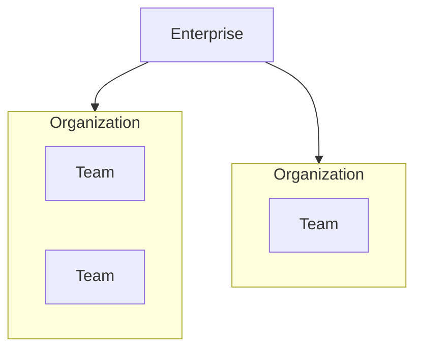

# はじめに
この記事では、普段皆さんがお使いのGitHubについて、TeamプランからEnterpriseプランにアップグレードして出来ることや、どのような企業がEnterpriseプランへのUpgradeを検討した方が良いかを解説します。

# GitHub Enterpriseプランとは？

https://docs.github.com/ja/enterprise-cloud@latest/admin/overview/about-github-for-enterprises

GitHub Enterpriseは、GitHubが提供する大規模組織・企業向けの上位プランです。

TeamプランやFreeプランと比べて、セキュリティ・管理性・サポートが強化されており、数百〜数千人規模の開発組織やグローバルに展開する企業に最適化されています。

特に、**セキュリティコンプライアンスが重視される業界（金融・公共・医療・通信・インフラ..etc）**や、クラウドネイティブに大規模な開発を進めるSaaS企業で多く導入されています。

# Free, Team, Enterpriseの比較

# GitHub プラン比較表

比較表は以下。
https://github.co.jp/pricing.html#compare-features

| 機能カテゴリ | Free | Team ($4/ユーザー/月) | Enterprise ($21/ユーザー/月) |
|---|---|---|---|
| **コード管理** | | | |
| パブリックリポジトリ | 無制限 | 無制限 | 無制限 |
| プライベートリポジトリ | 無制限 | 無制限 | 無制限 |
| **コードワークフロー** | | | |
| GitHub Codespaces | 利用不可 | 最大32コア（従量課金 $0.18/時間〜） | 最大32コア（従量課金 $0.18/時間〜） |
| GitHub Actions (CI/CD時間/月) | 2,000分 | 3,000分 | 50,000分 |
| GitHub Packages ストレージ | 500 MB | 2 GB | 50 GB |
| コードレビュー機能 | ✅ | ✅ | ✅ |
| Pull requests | ✅ | ✅ | ✅ |
| 保護されたブランチ | パブリックリポジトリのみ | ✅ | ✅ |
| 必須レビュー担当者 | パブリックリポジトリのみ | ✅ | ✅ |
| **コラボレーション** | | | |
| パブリックリポジトリ上の共同作業 | 無制限 | 無制限 | 無制限 |
| プライベートリポジトリ上の共同作業 | 無制限 | $4/ユーザー/月 | $21/ユーザー/月 |
| Issue & プロジェクトボード | ✅ | ✅ | ✅ |
| コードオーナー | – | ✅ | ✅ |
| Wiki | ✅ | ✅ | ✅ |
| 複数人でのドラフトPull Request | ✅ | ✅ | ✅ |
| **セキュリティ & コンプライアンス** | | | |
| GitHub Security Advisories | パブリックリポジトリ | パブリックリポジトリ | GitHub Advanced Security（別途ライセンス） |
| シークレットスキャン | パブリックリポジトリ | パブリックリポジトリ | GitHub Advanced Security |
| Dependabotアラート | ✅ | ✅ | ✅ |
| Dependabotセキュリティアップデート | ✅ | ✅ | ✅ |
| コードスキャン | パブリックリポジトリ | パブリックリポジトリ | GitHub Advanced Security |
| 依存関係レビュー | ✅ | ✅ | ✅ |
| SAML SSO | – | – | ✅ |
| 監査ログ API | – | – | ✅ |
| IP許可リスト | – | – | ✅ (Enterprise Cloud) |
| GitHub Connect | – | – | ✅ |
| **Marketplace & インテグレーション** | | | |
| GitHub Apps | 無制限 | 無制限 | 無制限 |
| スポンサシップ | ✅ | ✅ | ✅ |
| サードパーティアプリ利用 | ❌ | ✅ | ✅ |
| **サポート & 導入** | | | |
| GitHubコミュニティ＆Docs | ✅ | ✅ | ✅ |
| メンテナンスサポート | – | ✅ | ✅ |
| プレミアム／プレミアムプラスサポート | – | – | ✅ |
| 専任担当サポートエンジニア | – | – | ✅ |
| 請求書払い | – | – | ✅ |

上記の表を眺めていると、**不正アクセスの防御**や**専任のサポート**がついたり、**請求書払い**に出来ることは企業としては嬉しいですね。
それでは私が思う、特にEnterpriseプランの良いところを見ていきましょう。

# GitHub Enterpriseプランにするメリット
個人的に思う、企業がEnterpriseプランを使うメリットを記載します。

# 不正アクセスに対しての防御
管理者によるアカウント管理とセキュリティ制御がTeamプランと比べて強化されています。

GitHubでID／パスワードの漏洩、パーソナルアクセストークンやSSHキーの漏洩、シャドーIT（自宅PCなど企業が管理していないデバイスを用いる等）は、昨今のフルリモート勤務環境では特に気を付けたいところですが、なかなか管理だったり個人のセキュリティ意識の差があったりで徹底が難しい場面が出てきます。

そのような状況をシステム的に制御し、不正アクセスや情報漏洩リスクを回避することが可能になります。
特に以下の項目はTeamプランには無いので、Enterpriseプランにする大きなメリットになります。
- SAML認証  
- SCIMによるユーザプロビジョニング  
- IDP連携による多要素認証  
- IP制限  

### 機能比較

| 機能 | Team Plan | Enterprise Plan |
|---|---|---|
| SAML認証 | × | ○ |
| SCIMによるユーザプロビジョニング | × | ○ |
| IDP連携による多要素認証 | × | ○ |
| IP制限 | × | ○ |
| Enterprise Managed Users | × | ○ |

## ID・アクセス管理の徹底

**SAMLを有効化すると、Organizationにアクセスする際にIDP側の認証が必ず要求されるようになります。**

### ポイント
- 万一社員の **GitHubのID／パスワード、パーソナルアクセストークン、SSHキー** が攻撃者の手に渡った場合でも、  
  **SAML IdPの認証が通らない限りGitHub上の企業データへアクセス不可**。
- 管理者が当該ユーザーの **ログイン禁止（無効化）** を即時適用可能。
- **IdP側の監査ログ** で、ユーザーがどこからログインしているか（シャドーIT含む）の監視が可能。
- **SCIM対応IdP** の場合、**新入社員のアカウント発行／退職者のアカウント停止を自動化**。

## Enterprise Managed Users (EMU)機能
この機能が個人的にはEnterpriseプランの一番の目玉機能だと思っています。

https://docs.github.com/ja/enterprise-cloud@latest/admin/managing-iam/understanding-iam-for-enterprises/about-enterprise-managed-users

**EMU**は、GitHubのユーザーアカウントを企業が完全に管理するモードです。
通常のGitHubアカウントはユーザーが自由に作成・管理できますが、EMUを有効化すると IDプロバイダ（IdP：Azure AD, Oktaなど）でのみアカウントを作成・管理 できるようになります。

通常のアカウントとの違いをまとめると以下の通り。

#### 通常（Free/Team/Enterprise標準）
- アカウントは「個人」が所有
- 個人のメールアドレスでGitHubにサインアップ可能
- 退職してもその人のアカウント自体は残る
#### EMUあり（Enterprise限定）
- アカウントは「企業」が所有
- IdP（Azure AD, Oktaなど）でのみ発行・ログイン可能
- 退職・異動したらIdPでアカウント削除→GitHubアクセス即停止
- Publicリポジトリ作成は禁止（情報漏洩防止のため）

EMUを利用すると、通常の GitHub.com で公開されていない、ご契約企業専用の GitHub Enterprise Cloud 環境となり、IdP で直接ログインが可能です。EMU あり／なし、どちらの環境を利用するか選択できます。

EMUの機能としては以下になります。
- IdP と緊密に連携された企業専用の GitHub 環境  
- アカウント発行・管理は全て IdP と完全結結  
- Public で公開用の内容は一切作成不可  
- IdP 側のポリシーを適用可能  

EMU の利用条件には以下があります。
- 対応 IdP : Entra ID, Okta, PingFederate  
- IdP で SAML 連携および SCIM/OIDC 連携  
- EMU環境とNon-EMU環境の併用は不可、どちらか一方を選択して利用  

EMU あり／なしを比較すると以下です。

| 項目 | EMU あり | EMU なし |
|---|---|---|
| アカウント所有者 | 企業 | 個人 |
| 利用できる環境 | 企業専用の "EMUテナント" の中でのみ有効なアカウント | 招待された環境／役割の設定に応じて利用可能なアカウント |
| Public リポジトリ作成可否 | 不可（Enterprise 配下 Organization 配下／個人配下 で一切不可） | 可能（Organization配下：Organization Member には作成不可／個人アカウント配下では作成可能。アカウント削除後もPublicリポジトリは残存） |

つまり、EMUは
**社員や外部委託者が勝手にGitHubアカウントを作って使うことを禁止し、すべて企業が用意したマネージドアカウントでのみ開発を行わせる仕組み**
です。

これにより、
- 不正アクセス防止
- 情報漏洩リスク低減
- コンプライアンス遵守
- アカウントライフサイクル（発行・停止）の自動化
が可能になります。

# Organizationの上位概念にあたるEnterprise Accountが作成可能に
Enterprise Accountの作成、複数Organizationの作成し管理することが可能になります。

Team PlanではOrganizationごとに契約が必要で、複数Organizationを集約管理することは不可という縛りがありました。

Enterprise Planでは、上位概念として **Enterprise Account** を提供され、1つのEnterprise Account配下で複数Organizationを一括管理可能になり、外部協力会社との共同開発案件では、Organizationを分けて管理しつつ、特定コンポーネントだけを共有する等が可能でよりセキュアな開発管理を実現することが可能です。

#### 機能比較

| 機能 | Team Plan | Enterprise Plan |
|---|---|---|
| Enterprise Accountの作成 | × | ○ |
| 複数Organizationの作成 | × | ○ |

---

## Enterprise Accountの管理者が実施できる設定や情報取得

- 新規Organizationの作成や複数Organizationの一元管理  
- 所属するユーザ全員の管理（社内外含む、アクセス権を付与したユーザの管理）  
- GitHub Actions, Copilotなどの利用状況の可視化  
- SSO、多要素認証、IP制限などセキュリティ項目の一括設定  
- 全Organizationに対する共通ポリシーの強制  
  - Publicリポジトリ作成禁止  
  - MemberによるOutside Collaborator招待禁止  
  - Memberによるリポジトリ可視性変更の禁止  
  - リポジトリのFork禁止  
- 監査ログの取得（API経由／定期的保存／異常行動の監視）  
- Enterprise Server（オンプレ）利用時のライセンスファイル管理  

詳細: [Enterprise Account ドキュメント](https://docs.github.com/ja/enterprise-cloud@latest/admin/enterprise-accounts/about-enterprise-accounts)

---

## 共有「すべき」情報の取捨選択  
– リポジトリの可視性を制御

Enterprise Planの場合、Public／Privateリポジトリに加えて **Internal Repository** を作成可能。

- **Private Repository**: 外部パートナーやクライアントのOutside Collaboratorにも公開可能  
- **Internal Repository**: 社員のみに公開  

これにより、リポジトリの可視性を柔軟に制御し、機密情報をセキュアに保護可能。

#### 機能比較

| 機能 | Team Plan | Enterprise Plan |
|---|---|---|
| Public Repositoryの作成 | ○ | ○ |
| Private Repositoryの作成 | ○ | ○ |
| Internal Repositoryの作成 | × | ○ |

## 4. Microsoft製品との統合

GitHubはMicrosoft傘下のサービスであり、Azureとの親和性が高いです。

- **Azure AD連携**によるID統合管理  
- **Azure DevOps / GitHub Actions** の組み合わせでCI/CDを強化  
- **CodespacesやCopilot**を活用した開発生産性向上  

クラウド戦略にAzureを取り入れている企業にとって、Enterpriseプランはよりシームレスな統合を可能にします。

## 5. こんな企業におすすめ

- 社員数が数百〜数千規模の大企業  
- セキュリティや監査が厳格に求められる業界（金融・公共など）  
- グローバル展開しており、複数リージョンで統一的に開発基盤を運用したい企業  
- Azureとの連携を強化してDXを推進したい企業  

---

## まとめ

GitHub Teamプランは中小規模のチームに十分な機能を提供しますが、**セキュリティ・管理・サポート・統合性**を重視するならEnterpriseプランが圧倒的に有利です。  

特にクラウド戦略をMicrosoft Azureと合わせて進める場合、GitHub Enterpriseは強力な武器になります。  

---  
💡 次回の記事では、**GitHub Advanced Security**を活用した具体的なセキュリティ強化の方法について紹介する予定です。
