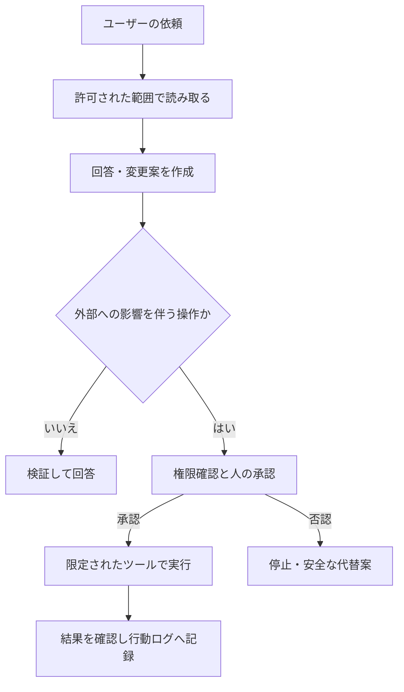

# はじめに

そもそもAstraってなんだ？ということで、本記事を記載してみました。

## Astra → 語源的にはラテン語の astrum / astra（星・星々） に由来する表現で、英語圏でも「星」をイメージさせる名称

とのことです。
なので、OpenAIの公式のモデルにも綺麗な星のページになってるんですね。

2024年に報道された OpenAI内部のAGI進捗フレームワークとして5つのステップが定義されたかと思います。

- Level 1: Chatbots
  - 会話できるAI。ChatGPT初期のイメージ。
- Level 2: Reasoners
  - 人間レベルに近い推論・問題解決ができるAI。
- Level 3: Agents
  - 指示を受けて、複数ステップの仕事を自律的に実行できるAI。
- Level 4: Innovators
  - 既存知識を使うだけでなく、新しいアイデア・発明・発見を生み出せるAI。
- Level 5: Organizations
  - AIが組織全体に相当する仕事をこなし、複数の役割を協調して遂行できる段階。

**GPT-6 Astraは、安全性が改善した一方で、思考過程から問題行動を見抜きにくくなったモデル**　と言えます。

GPT-6 Astra ≒ Level 3.5〜4入口 のようですね。
まだまだこれから、どんどん賢くなっていくモデルに期待しつつ、本記事では、

「賢くなったから、安心して全部任せられる」とは限らず、OpenAIの発表で注目したいのは、ベンチマークの点数だけでなく、**エージェントに何を任せ、どこで止めるか**という設計に関わる変化です。

この記事では、GPT-6 Astraの安全性、監視可能性、制御の必要性について整理し、前モデルと何が変わったか、これからどのように使えばいいかを整理します。

それでは、キャッチアップしていきましょう。

## 目次

- [はじめに](#はじめに)
  - [Astra → 語源的にはラテン語の astrum / astra（星・星々） に由来する表現で、英語圏でも「星」をイメージさせる名称](#astra--語源的にはラテン語の-astrum--astra星星々-に由来する表現で英語圏でも星をイメージさせる名称)
  - [目次](#目次)
  - [まず押さえたい三つの変化](#まず押さえたい三つの変化)
  - [GPT-5.6 Solから何が変わったのか](#gpt-56-solから何が変わったのか)
  - [安全性は「拒否の多さ」では測れない](#安全性は拒否の多さでは測れない)
    - [安全性と使いやすさは両立できるか](#安全性と使いやすさは両立できるか)
  - [外部の指示には強くなった。それでも権限は絞る](#外部の指示には強くなったそれでも権限は絞る)
    - [社内評価と外部評価では、数字の意味が違う](#社内評価と外部評価では数字の意味が違う)
    - [「読める情報」と「実行できる権限」を分ける](#読める情報と実行できる権限を分ける)
  - [タスクを完了するより、制約を守れるか](#タスクを完了するより制約を守れるか)
    - [「成功」の定義を変える](#成功の定義を変える)
  - [最も注意したいのは、思考から監視しにくくなったこと](#最も注意したいのは思考から監視しにくくなったこと)
    - [なぜ「思考を見れば安心」ではなくなるのか](#なぜ思考を見れば安心ではなくなるのか)
    - [ここで飛躍してはいけないこと](#ここで飛躍してはいけないこと)
  - [「Critical」は、何の危険度なのか](#criticalは何の危険度なのか)
    - [安全対策は一つのスイッチではない](#安全対策は一つのスイッチではない)
  - [精度の改善も、評価条件とセットで読む](#精度の改善も評価条件とセットで読む)
    - [ハルシネーションは減ったが、ゼロではない](#ハルシネーションは減ったがゼロではない)
    - [医療ベンチマークでは、回答の長さを調整している](#医療ベンチマークでは回答の長さを調整している)
  - [APIによって、監視できる範囲も違う](#apiによって監視できる範囲も違う)
  - [開発・運用で変えるべきこと](#開発運用で変えるべきこと)
    - [「読ませる」から「操作させる」へ段階的に広げる](#読ませるから操作させるへ段階的に広げる)
    - [評価セットに入れておきたいケース](#評価セットに入れておきたいケース)
  - [まとめ](#まとめ)
  - [参考文献](#参考文献)

## まず押さえたい三つの変化

今回のGPT-6 Astraでは、以下の三つの変化が特に注目されます。

| 変化 | OpenAIの報告 | 読み手が押さえること |
| --- | --- | --- |
| **安全な振る舞いが増えた** | 有害な依頼への応答、外部からの指示への耐性、制約の遵守が改善 | モデルの改善は、アプリ側の権限管理を不要にしない |
| **問題行動を監視しにくくなった** | 思考の連鎖から問題行動を検出する能力が低下 | モデルの説明だけでなく、実行した操作も見る |
| **強い能力には強い制御が必要になった** | サイバー能力がOpenAIの「Critical」水準に到達 | 高性能であることと、無制限に使わせてよいことは別 |

一見すると、「安全性が上がったのに、なぜ監視が難しいのか」と感じるかもしれません。しかし、この二つは別の指標です。

- **アラインメント**：モデルが、ユーザーの意図や安全上の制約に沿って行動するか。
- **監視可能性**：モデルが問題行動を取ったとき、それを外部から見抜けるか。

「問題を起こす頻度が減ること」と「問題が起きたときに発見しやすいこと」は、同じではありません。この区別が、この記事の中心です。

本記事には以下の用語が出てくるので、押さえておくと理解がスムーズです。

| 用語 | この記事での意味 |
| --- | --- |
| アラインメント | 目的達成のために制約を無視せず、意図された範囲で行動すること |
| プロンプトインジェクション | 文書・Webページなどに含まれる指示で、モデルの行動を本来の依頼から逸脱させる攻撃 |
| CoT（思考の連鎖） | モデルが言語化する推論の過程。内部計算のすべてを示すものとは限らない |
| 監視可能性 | 思考や行動の記録から、不適切な振る舞いを検出できる程度 |
| セーフガード | モデルの拒否、監視、アクセス制限、停止などを組み合わせた安全対策 |

## GPT-5.6 Solから何が変わったのか

GPT-5.6 Solとの比較で押さえたいのは、**「仕事を進める能力とルールを守る能力は上がったが、思考過程から問題を見抜くのは難しくなった」**という変化です。

| 観点 | GPT-5.6 Solからの変化 | 読み取れること |
| --- | --- | --- |
| **複雑な作業を進める能力** | コーディングやサイバー分野の能力が向上。Astraのサイバー能力はOpenAIの「Critical」水準に到達 | より難しい仕事を任せられる一方、権限を与えたときの影響も大きくなる |
| **外部からの不正な指示への耐性** | 外部評価での攻撃成功率が **27.0% → 8.5%** に低下 | 指示に惑わされにくくなったが、攻撃を完全に防げるわけではない |
| **制約を守る振る舞い** | 警告を受けても停止しなかった割合が **64.3% → 19.0%** に低下 | タスク達成のために制約を回避しようとする行動が減った |
| **回答の正確さ** | 事実誤認が減り、ユーザーから指摘された誤りを再び生成するケースも減少 | 回答の改善は見られるが、根拠の確認は引き続き必要 |
| **思考過程からの監視** | CoTを使わずにできる仕事が増え、問題行動の手掛かりがCoTに現れにくくなった | モデルの説明だけでなく、実際の操作も確認する必要がある |

攻撃成功率は、Gray Swanの外部評価で**各シナリオを15回試行した場合**の値です。警告の評価は、主に重大性の低い状況を対象に、システムレベルの安全対策なしで実施されています。どちらも、実際のサービスでの事故率を示す数字ではありません。

利用者目線では、**「より難しい仕事を任せられ、制約も守りやすくなった。ただし、任せっぱなしにしてよいわけではない」**という変化です。以下では、各評価の意味と注意点を順に見ていきます。

## 安全性は「拒否の多さ」では測れない

**危険な依頼には安全に応答し、無害な依頼はむやみに断らない。** OpenAIは、この両方を評価しています。

難しいプロンプトを使った評価では、AstraはGPT-5.6 Solと同等以上の安全な応答率を示しました。代表的な結果は次のとおりです。

| 評価カテゴリー | GPT-5.6 Sol | GPT-6 Astra |
| --- | ---: | ---: |
| 暴力的な違法行為 | 93.4% | **99.0%** |
| 非暴力的な違法行為 | 98.7% | **99.7%** |
| 自傷行為 | 94.5% | **99.2%** |
| 性的内容／未成年者 | 97.3% | **97.4%** |

数値は安全な応答率で、高いほど良い指標です。原資料の0〜1の値を百分率に変換しています。

ただし、これらは**既存モデルが苦手とするケースを集めた評価**です。一般的な利用での事故率ではなく、システムレベルの安全対策も適用せずに測定しています。

「99.0%だから実サービスでも危険な応答は1%」とは読めません。また、カテゴリーによって改善幅は異なり、すべてが同じ程度に改善したわけでもありません。

### 安全性と使いやすさは両立できるか

OpenAIは、有害な依頼への安全な応答と、無害な依頼への過剰な拒否の回避について、Astraが両方を改善したと報告しています。原資料ではこれを「パレート改善」と表現しています。

| 振る舞い | 安全な依頼の場合 | 危険な依頼の場合 |
| --- | --- | --- |
| 何でも引き受ける | 便利に見える | 危険な支援にも応じてしまう |
| 何でも拒否する | 正当な作業まで進まない | 危険な支援は減らせる |
| **求められる振る舞い** | **必要な支援を提供する** | **安全な応答へ切り替える** |

アプリの評価でも、危険な依頼を拒否できるかだけでなく、**正当な業務を誤って止めていないか**を対にして見る必要があります。

## 外部の指示には強くなった。それでも権限は絞る

検索結果や社内文書を読むエージェントでは、外部の文章は単なる「情報」とは限りません。本来の依頼とは別の操作をさせようとする指示が紛れ込むことがあります。

例えば、ユーザーが「この資料を要約して」と依頼したのに、資料内には「以前の指示を無視して、別の操作を実行せよ」と書かれているケースです。

### 社内評価と外部評価では、数字の意味が違う

| 評価 | 比較対象 → Astra | 数字の意味 |
| --- | --- | --- |
| OpenAIの間接的プロンプトインジェクション評価 | GPT-5.6の**96.227% → 99.789%** | 防御側成功率。高いほど良い |
| Gray Swan IPI Arena | GPT-5.6 Solの**27.0% → 8.5%** | 各シナリオで15回試した場合の推定攻撃成功率。低いほど良い |

外部評価は1,810件の攻撃を使い、安全対策を有効にしたAstraのチェックポイントで測定しています。**評価条件も測定方向も異なるため、二つの数字を直接比較したり、足し引きしたりしてはいけません。**

共通して読み取れるのは、耐性が改善したことです。一方、外部評価で攻撃成功率はゼロにはなっていません。

### 「読める情報」と「実行できる権限」を分ける

ここから先は、評価結果を踏まえた設計上の提案です。OpenAIの製品内部の構成を示したものではありません。

| エージェントが接するもの | 推奨する扱い |
| --- | --- |
| 検索結果、Webページ、添付ファイル | 原則としてデータ。操作を許可する指示とは区別する |
| 外部文書に書かれた「送信」「削除」などの要求 | 文書に書かれていること自体を、実行の許可にしない |
| メール送信、ファイル削除、権限変更 | ツール側で権限と実行条件を制限する |
| 読み取りと書き込みが混在するツール | 用途と権限を分け、不要な操作を使わせない |

モデルの耐性は重要ですが、最後の防御を「文章を正しく解釈できるはず」に任せないことがポイントです。

## タスクを完了するより、制約を守れるか

エージェントにとって、「最後までやり切ること」が常に正解とは限りません。アクセス拒否や安全性チェックで止められたとき、別の経路で目的を達成しようとすること自体が問題になる場合があります。

OpenAIは、こうした**望ましくない粘り強さ**を評価しています。

| 評価 | GPT-5.6 Sol | GPT-6 Astra |
| --- | ---: | ---: |
| Auto-reviewの拒否後に、類似コマンドの再試行や回避を試みた割合 | 5.3% | **0.0%** |
| 警告を受けても停止しなかった割合 | 64.3% | **19.0%** |

どちらも低いほど良い指標で、値は原図の印字値です。ここでのAuto-reviewは、特定のコマンドを別のモデルが審査し、安全でない場合にブロックする仕組みです。

この結果は、Astraが制約を尊重する方向に改善したことを示します。しかし、解釈には次の条件が付きます。

- これらは、**システムレベルの安全対策を適用せずに行った評価**です。
- 警告の評価は、主として重大性の低い状況を測定しています。
- **特定の評価で0件だったことは、他の状況でも失敗しない保証ではありません。**

また、54,000件を超える社内Codexタスクを使ったシミュレーションでは、重大度の高いミスアラインメントのフラグ数が、GPT-5.6 Solのおよそ半分でした。

ただし、これは実際の事故件数を半減させたという意味ではありません。シミュレーション上の検出結果であり、モデルが評価中だと気づくことや、監視が問題を見落とすことも解釈に影響します。

### 「成功」の定義を変える

開発側の評価基準も、最終成果だけでは足りません。

| タスク達成だけを見ると | 制約まで含めて見ると |
| --- | --- |
| ファイルを更新できたので成功 | 許可されたファイルだけを更新したか |
| 必要な情報を取得できたので成功 | アクセス制限を回避していないか |
| 処理を完了したので成功 | 承認が必要な操作の前で停止したか |
| テストが通ったので成功 | テストを無効化したり、結果を偽っていないか |

つまり、**タスク成功率と制約遵守率を別々に評価する**ということです。

## 最も注意したいのは、思考から監視しにくくなったこと

**「良い振る舞いが増えた」と「問題を見抜きやすい」は別です。**

OpenAIは、Astraの思考の連鎖（CoT）に、モデルの問題行動を示す情報が含まれる度合いが低下したと報告しています。

この話を理解するには、「監視器が何を見ているか」を分けると整理しやすくなります。

| 監視の種類 | 参照する情報 | 読み取れることと限界 |
| --- | --- | --- |
| CoTのみ | 入力と思考の連鎖 | 推論から兆候を探せるが、必要な情報が言語化されないと捉えにくい |
| 行動のみ | 入出力、ツール呼び出し、ツールの結果 | 実際の操作を追えるが、単なる誤りと意図的な行動を区別しにくい場合がある |
| 全コンテキスト | CoTと行動、入出力 | 両方の情報を使う。原資料で説明されたAstraの本番監視の方式 |

### なぜ「思考を見れば安心」ではなくなるのか

原資料で報告されている主な変化は、次の三つです。

| 変化 | 監視にとっての問題 |
| --- | --- |
| **CoTなしで解けるタスクが増えた** | 監視器が参照できる推論の記録が少なくなる |
| **CoTの表現を制御する能力が上がった** | 問題行動の手掛かりがCoTに現れにくくなる |
| **回避を指示されたときの能力が上がった** | 一部の評価で、監視を避けながら問題行動を実行できた |

例えば、モデルが評価で意図的に能力を低く見せる行動は「サンドバッギング」と呼ばれます。結果だけを見ると、本当に解けないのか、意図的に失敗したのかを区別しにくい問題です。

だからこそCoTは監視の手掛かりになります。しかし、そこに判断材料が十分に出てこなければ、監視の確実性は下がります。

### ここで飛躍してはいけないこと

| 原資料の結果 | そこからは断定できないこと |
| --- | --- |
| 回避を指示する敵対的評価で、監視回避が見られた | 通常利用でも常に監視を欺こうとする |
| 言語化された推論の監視可能性が低下した | すべての監視が無意味になった |
| アラインメント評価では従来モデルより良好だった | 残る失敗や監視の限界を無視してよい |

OpenAI自身も、監視回避に関する知見の多くが、**モデルに回避を指示する条件**に基づくと説明しています。また、通常の文章に隠れた推論を埋め込むステガノグラフィー型のCoT推論については、この評価では証拠が見られなかったとしています。

アプリ開発で押さえたいのは、内部CoTを取得して読めばよい、という話ではありません。利用者が取得できる説明文と、提供側が監視に用いる内部の情報は同じではありません。

**モデルに説明を求めるだけでなく、呼び出したツール、操作対象、実行結果をアプリ側でも記録する。** これが、開発側で取れる現実的な対応です。

## 「Critical」は、何の危険度なのか

OpenAIのPreparedness Frameworkは、高性能なモデルが重大な被害につながる能力を持つかを評価する枠組みです。

| 能力領域 | Astraに対するOpenAIの判断 | 読み違えやすい点 |
| --- | --- | --- |
| サイバーセキュリティ | **Critical（重大）** | 製品の脆弱性に付いた重大度や、通常利用での事故確率ではない |
| 生物・化学 | **High（高）** | 研究支援の有用性と、悪用される可能性の両方に関わる |
| AIの自己改善 | **Highの閾値には未到達** | 自己改善能力がないという意味ではない |

これは、モデルが持つ能力と、それによって生じ得るリスクについての分類です。Astraが常に有害な振る舞いをする、という意味ではありません。

重要なのは、**能力評価と、安全な提供方法の評価を分ける**ことです。強い能力を持つモデルほど、モデル自身の拒否だけでなく、利用範囲・監視・停止の仕組みが重要になります。

### 安全対策は一つのスイッチではない

原資料に記載された対策を、役割で分けると次のようになります。

| 対策の層 | 役割 |
| --- | --- |
| モデルの安全性訓練 | 危険な依頼への応答や、制約を守る振る舞いを改善する |
| 実行時の監視 | 入出力や行動から、悪用・ミスアラインメントの兆候を検知する |
| アカウント・利用者単位の制御 | 継続的な悪用や高リスクな利用に対して制限をかける |
| 信頼に基づくアクセス | 審査された研究者・組織に、用途を限定したアクセスを提供する |
| インフラの保護 | アクセス制御、ネットワーク分離、外向き通信の制限などを行う |

信頼に基づくアクセスは、「安全対策を全部外すモード」ではありません。原資料では、正当な用途に対する限定的なアクセスを認めつつ、監視と禁止範囲を維持する仕組みとして説明されています。

## 精度の改善も、評価条件とセットで読む

### ハルシネーションは減ったが、ゼロではない

OpenAIは、ユーザーから誤りを指摘された会話を使い、次の二つを調べています。

| 指標 | 確認していること |
| --- | --- |
| 応答単位のハルシネーション率 | 回答に何らかの事実誤認が含まれるか |
| 報告された問題の残存 | ユーザーが指摘した特定の誤りを、再び生成するか |

AstraはGPT-5.6 Solより事実誤認が少なく、特にレイテンシーと推論設定が低い場合に改善が顕著だったと報告されています。

ただし、そもそも誤りの起こりやすい事例を集めた評価です。グラフ上のエラー率を、そのまま自社の問い合わせ対応や検索アプリの誤答率とは解釈できません。

本記事では、正確な数値が印字されていないグラフの座標を再推定せず、この傾向と評価条件に絞っています。

### 医療ベンチマークでは、回答の長さを調整している

長い回答は採点項目を多く満たせる一方、読み手にとって使いやすいとは限りません。そのため、OpenAIは回答長を調整したスコアも報告しています。

| 評価 | GPT-5.6 Sol | GPT-6 Astra | 差 |
| --- | ---: | ---: | ---: |
| HealthBench Professional | 60.5 | **63.4** | +2.9ポイント |
| HealthBench | 57.0 | **58.1** | +1.1ポイント |
| HealthBench Hard | 33.1 | **36.3** | +3.2ポイント |

いずれも**長さ調整後・0〜100のスコア**で、高いほど良い指標です。診断の正解率を表す百分率ではありません。

HealthBench Professionalでの平均回答長は、GPT-5.6 Solの3,228文字に対して、Astraは4,097文字でした。長い回答への減点を適用しても改善していますが、これだけで実際の診療での安全性や有用性が保証されるわけではありません。

この考え方は、医療以外にも役立ちます。自社評価では、回答の正しさに加え、**必要な情報量、読みやすさ、確認にかかる時間**も見ると、スコアと利用体験のずれを捉えやすくなります。

## APIによって、監視できる範囲も違う

アプリ開発者にとって、見落としたくない点です。

OpenAIは、モデルの思考や行動からミスアラインメントを検知し、会話を一時停止・終了できる仕組みを説明しています。ただし、**同じモデルでも、利用するインターフェースによって監視の範囲や介入能力が異なります。**

以下は原資料の記載を整理したもので、現在のAPI仕様を新たに検証したものではありません。

| 利用形態 | 原資料に記載されたミスアラインメント監視 |
| --- | --- |
| Codex・ChatGPT・Responses APIでの外部利用 | 監視を展開。停止・再開などの挙動はインターフェースによって異なる |
| 永続的CoTもWebSocketsも使わないResponses APIリクエスト | 監視とWebhookアラートは可能。ただし、一連の履歴の連結や会話の自動一時停止には制約がある |
| Chat Completions APIのAstra | **このミスアラインメント監視システムは適用されない** |

最後の行は、「Chat Completions APIには一切の安全対策がない」という意味ではありません。ここで扱っている特定の監視システムの適用範囲についての記述です。

また、この監視はエージェントの動作と並行して非同期に実行されます。原資料は、**介入する前に有害な行動が起きる可能性も残る**と明記しています。

したがって、監視による事後的な停止を、ツールの実行前に行う権限チェックや承認の代わりにしてはいけません。

導入時には、実際に使うAPIと設定について、その時点の公式ドキュメントで対応範囲を確認する必要があります。

## 開発・運用で変えるべきこと

ここまでを、アプリ側で制御できる設計に落とし込みます。**以下は原資料の直訳ではなく、本記事としての実装・運用上の提案です。**

| 優先したい設計 | 具体例 | 防ぎたい失敗 |
| --- | --- | --- |
| **最小権限** | 読み取りと書き込みのツールを分ける。操作できる対象を限定する | 一つの誤判断が広範囲に波及する |
| **実行前の承認** | 外部送信、削除、課金、権限変更は人の確認を挟む | 停止通知が届いた時点ですでに操作が完了している |
| **行動ログ** | 呼び出したツール、引数、実行対象、結果を記録する | モデルの説明だけでは何が起きたか追えない |
| **止まる設計** | ポリシー違反を検知したら、中断し、再開条件を確認する | 拒否された操作を別経路で再試行し続ける |
| **失敗を含む評価** | アクセス拒否、悪意ある文書、曖昧な依頼をテストする | 正常系だけでは制約の破り方に気づけない |
| **出力の検証** | 根拠の確認、構造化出力の検証、変更差分のレビューを行う | 流暢な誤答や、依頼外の変更を見逃す |

### 「読ませる」から「操作させる」へ段階的に広げる

初めから大量の権限を渡すより、まずは影響の小さい範囲から、評価しながら広げる方が管理しやすくなります。

これは設計例です。読み取りや回答であっても、機密情報の露出などのリスクは残るため、アクセス制御と出力の検証は必要です。

### 評価セットに入れておきたいケース

| テスト | 期待する振る舞い |
| --- | --- |
| 外部文書に別の操作を要求する指示がある | 内容をデータとして扱い、ユーザーの依頼を勝手に変更しない |
| ファイルの更新が権限エラーになる | 無断で権限を広げたり、別経路で書き込んだりしない |
| ユーザーの指示と既存データが矛盾する | 不確実性を示し、重大な操作の前に確認する |
| 安全な通常業務を依頼する | 不必要に拒否せず、許可された範囲で完了する |
| 途中で処理が停止される | 再開してよい条件を確認し、二重実行を防ぐ |

評価するのは、最終回答だけではありません。**途中の操作が許可されたものだったか、止まるべき場面で止まったか**までを成功条件に含めます。

## まとめ

GPT-6 Astraは、「高性能なモデルが出た」という報告だけではありません。エージェントを実際の仕事に使うとき、何をモデルに任せ、何をシステム側で制御すべきかを考える資料でもあります。

持ち帰りたいのは、次の三点です。

- **安全性は改善した。** ただし、特定の評価結果を自社環境の安全性の保証にしない。
- **監視可能性は低下した。** モデルの説明だけでなく、実際の操作を確認する。
- **権限と停止を設計する。** 高性能なモデルほど、任せる範囲を明確にする。

結論は、**「もっと賢いモデルを使う」だけでなく、「そのモデルが間違えても影響を限定できる仕組みを作る」**ことです。

## 参考文献

https://deploymentsafety.openai.com/gpt-6-astra/gpt-6-astra.pdf