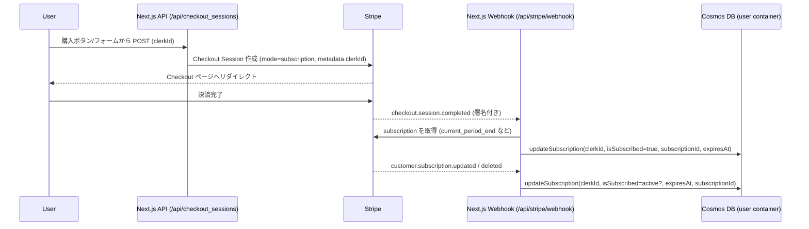

## Stripe の処理の流れについて

### 全体フロー（Checkout → Webhook → Cosmos DB）

### 保存している主なフィールド（Cosmos DB / user コンテナ）

- `subscriptionId`: Stripe の Subscription ID（解約後も保持）
- `isSubscribed`: 課金がアクティブかどうか（Webhook の `status` で更新）
- `subscriptionPurchasedAt`: 初回購入日時（ISO）
- `subscriptionExpiresAt`: Stripe の `current_period_end` を反映
- `subscriptionCancelledAt`: 解約操作時に付与（アプリ側で利用）

### フローの要点

- **決済完了の判定は Webhook で実施**：`checkout.session.completed` を受信した時点で Cosmos DB を更新し、Success ページでは DB 更新を行いません。
- **解約・更新も Webhook で同期**：`customer.subscription.updated` / `deleted` を受けて `status` を反映し、自動更新停止や失効を Cosmos DB に同期します。
- **clerkId の紐づけ**：Checkout Session の `metadata.clerkId` を保存し、Subscription 更新イベントでは Cosmos DB を `subscriptionId` で逆引きして対象ユーザーを特定します。
- **署名検証必須**：`STRIPE_WEBHOOK_SECRET` を用いて `stripe-signature` を検証しています。Stripe の Webhook エンドポイントを `/api/stripe/webhook` に設定してください。

### Cosmos DB 側の簡易アーキテクチャ

- Database: `process.env.COSMOS_DATABASE_NAME`
- Containers:
  - `COSMOS_CONTAINER_NAME_USER`: ユーザー情報＋購読状態を格納
  - `COSMOS_CONTAINER_NAME_DRILL`: ドリル結果（正答率や受験日時）
  - `COSMOS_CONTAINER_NAME_SUMMARY`: 要点暗記状態
- 主要な更新経路:
  - Webhook → `updateSubscription` で user コンテナを upsert
  - アプリ機能（ドリル/要点整理）から各コンテナへ upsert
