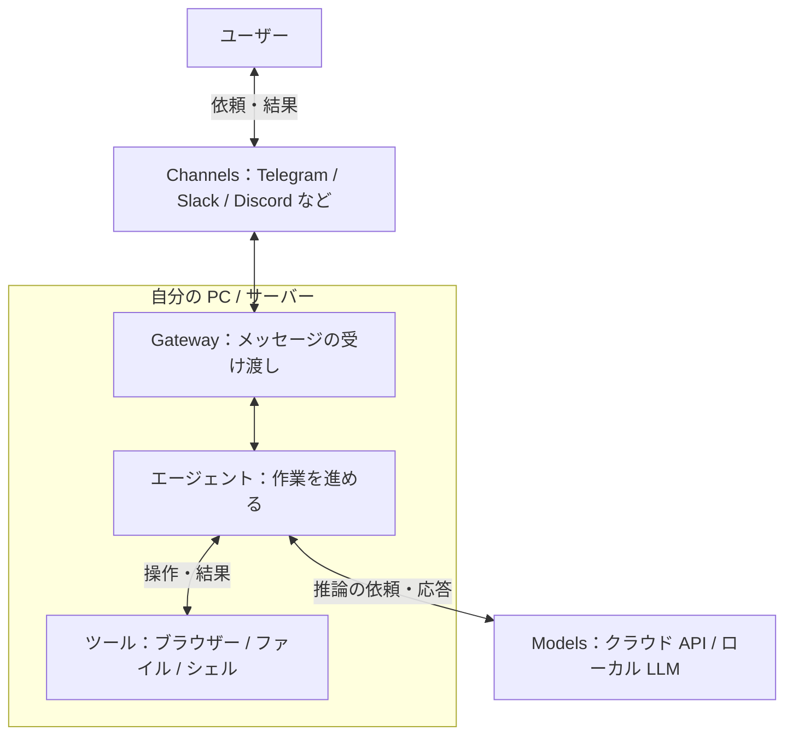
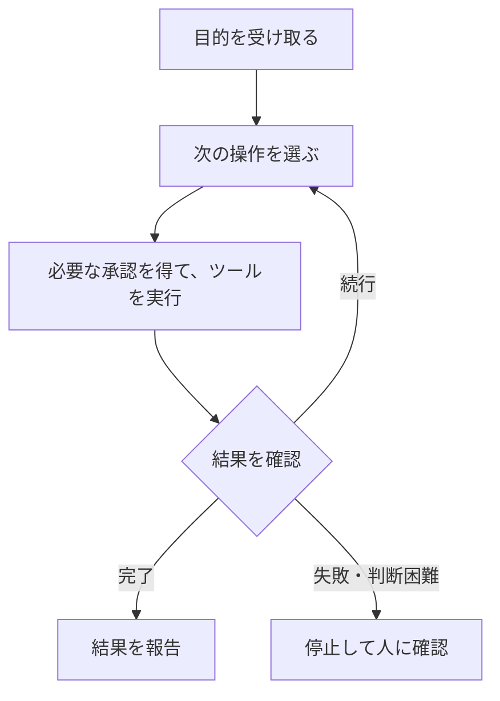
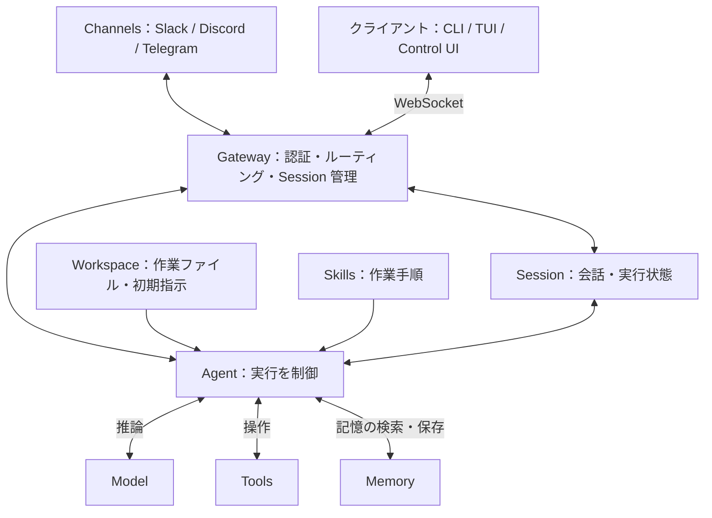

# OpenClaw 概要

OpenClaw は、**自分の PC やサーバーで動く、オープンソースの常駐型 AI エージェント**です。チャットアプリから自然言語で依頼すると、許可された範囲でブラウザー・ファイル・シェルを操作します。

たとえば「このテーマを調べてファイルにまとめて」と頼めば、情報収集から要約・保存までを進めます。特徴は、**回答するだけでなく、実際の作業を実行できること**です。

## ローカル PC で 24 時間・365 日待機

中心となる **Gateway** をバックグラウンドサービスとして動かすと、チャット画面を開いていなくても依頼を受け付けられます。自宅の PC を稼働させ、外出先のスマートフォンから作業を頼むことも可能です。

:::message
常時稼働には、PC の電源・スリープ無効化・Gateway の継続稼働が必要です。外部サービスとの通信にはネットワーク接続も必要です。無停止を保証するものではないため、再起動後の自動起動や障害時の復旧も設定します。
:::

## チャット・モデル・ツールをつなぐ

チャットとの接続口を **Channels**、判断を担う AI モデルを **Models** と呼びます。Telegram、Slack、Discord、WhatsApp、Microsoft Teams などと、必要な設定やプラグインを通じて連携できます。



OpenClaw 自体は AI モデルではありません。OpenAI、Anthropic、ローカル LLM などを選べますが、ツール対応や推論能力によって作業の品質は変わります。

| 機能 | 役割 |
| --- | --- |
| Skills | ツールの使い方や作業手順を教える。独自の手順も追加できる |
| メモリー | 保存した情報を次の作業に活かす。無制限に記憶するわけではない |
| マルチエージェント | 用途ごとにエージェントや作業領域を分ける |
| Control UI | ブラウザーからチャットや設定を操作する |

チャット連携のために、Control UI をインターネットへ公開する必要はありません。

## 注目される背景

OpenClaw は MIT ライセンスで公開され、コミュニティとともに開発されています。注目の背景は、次の 3 点で捉えられます。

| 観点 | 特徴 |
| --- | --- |
| 技術 | 使い慣れたチャットから、PC 上の作業を指示できる |
| タイミング | AI の用途が文章生成からツールを使った作業へ広がっている |
| OSS | GitHub 上のコードを確認し、試したり拡張したりできる |

## 定期実行と活用例

依頼への応答だけでなく、**Cron** で決まった時刻に作業し、**Heartbeat** で定期的に状況を確認できます。たとえば、朝のニュース要約や、注意が必要な変化の通知に使えます。

以下は、必要なツール・接続先・権限を設定した場合の例です。**導入直後からすべて使えるわけではありません。**

| 分野 | 活用例 |
| --- | --- |
| メール・予定 | 優先順位付け、返信の下書き、空き時間の確認、予定調整 |
| 調べもの | 情報収集、要約、レポート作成、飲食店の検索・予約補助 |
| ファイル整理 | フォルダー整理、分類、一括リネーム |
| 設計・実装 | 要件整理、設計案・コード・設定ファイルの作成、リファクタリング |
| Git・テスト | PR 作成、レビュー補助、テスト生成・実行、失敗ログの解析 |
| 運用・サポート | アラート解析、障害切り分け、回答案・チケット・対応記録の作成 |
| 定常作業 | バックアップ実行、検証環境へのパッチ適用、定期レポート |

メール送信、予約確定、ファイル削除、本番変更などは、人の承認を挟む設計にします。

## 「回答」から「実行」へ

文章生成中心の使い方では、回答を読んだ人が操作します。AI エージェントは、ツールの実行結果をもとに次の行動を選びます。



これは運用上の基本フローです。承認や停止の条件は、設定と運用で定めます。**自律実行は、正確な完了を保証するものではありません。**

決まった処理はスクリプトや RPA、情報の解釈や手順の選択は AI、と使い分けると効果的です。AI も画面変更への対応や判断を誤るため、完了条件と確認方法を決めておきます。

## データの送信先と費用

**ローカルで動くことと、データが外部に出ないことは別です。** クラウドモデルには推論に使う情報が送られ、チャットサービス上でもメッセージが扱われます。

OpenClaw のソースコードは無償で公開されていますが、モデルの API 利用料、サーバー代、電気代は別途かかり得ます。定期実行では、頻度に応じた費用にも注意します。

## 主なリスク

実操作できる分、誤操作や侵害の影響は与えた権限に及びます。主なリスクは、**本体の脆弱性・外部 Skill・実行権限・認証情報**の 4 つです。

### 本体の脆弱性

過去に報告・修正された例を示します。スコアと修正バージョンの出典は、末尾の GitHub Advisory Database です。

| 脆弱性 | CVSS v3.1 | 概要 | 修正バージョン |
| --- | --- | --- | --- |
| CVE-2026-25253 | 8.8（High） | 不正な `gatewayUrl` への接続で認証トークンが漏洩し、Gateway の乗っ取りやコード実行につながる | 2026.1.29 |
| CVE-2026-24763 | 8.8（High） | 環境変数を指定できる認証済みユーザーが、`PATH` を通じて Docker サンドボックス内にコマンドを注入できる | 2026.1.29 |

前者はブラウザーを経由するため、ローカル接続だけでも影響を受け得る問題でした。表の修正バージョンにとどまらず、継続的に脆弱性情報を確認して更新します。

### 外部 Skill

Skill は `SKILL.md` に記載する手順ですが、スクリプトを含んだり、外部コマンドの実行を指示したりする場合があります。

ClawHub では、偽の事前準備を通じてマルウェアを導入させ、API キー・ウォレットの秘密鍵・SSH 認証情報・ブラウザーのパスワードを狙う事例が報告されています。

**配布元だけでなく、指示・コード・依存関係・通信先も確認します。** 署名やスキャン結果は判断材料であり、安全の保証ではありません。自作 Skill も確認は必要です。

### 実行権限

`exec`、ファイル編集、ブラウザー操作、メッセージ送信などを許可すると、誤操作時の影響も広がります。

また、Web ページやメール中の悪意ある指示で AI を誘導する **プロンプトインジェクション**にも注意が必要です。依頼者を限定しても、AI が読む外部コンテンツまで安全とは限りません。

権限は次の 3 軸で絞ります。

```text
実行権限
|-- 強さ：読むだけか、変更・実行も許可するか
|-- 範囲：どのファイル・ツール・接続先を許可するか
`-- 時間：いつまで許可するか
```

文章で禁止するだけでなく、ツール設定・OS の権限・サンドボックス・実行承認で制御します。

### 認証情報

メールやソース管理などの認証情報が漏れると、接続先にも被害が広がります。**専用アカウントと権限を限定したトークンを使い、評価時は本番の認証情報を渡しません。**

普段のファイルやブラウザーにも秘密情報があるため、作業環境を分けます。

## 安全に使うための基本

まずは **隔離環境・最小権限・専用認証情報**で試し、必要な機能だけを追加します。

| 対策 | 実施すること |
| --- | --- |
| 更新 | 本体・プラグイン・依存関係の修正版を適用する |
| Skill 管理 | 導入時と更新時に、内容と依存関係を確認する |
| 隔離 | 専用端末や仮想環境を使い、機密データ・ネットワーク・ブラウザーを分離する |
| 最小権限 | ファイル・ツール・通信先・依頼者を限定し、不要な権限を外す |
| 認証情報 | 専用のアカウントやトークンを使い、失効・更新できるようにする |
| 承認 | 送信・予約確定・削除・本番変更の前に人が確認する |
| 監査 | ツール・OS・接続先のログを確認する。秘密情報の記録は避ける |

サンドボックスも、重要なフォルダーの共有や強い権限の付与で隔離が弱まります。実際のアクセス範囲を確認しましょう。

リスクは、守る情報資産・脅威・脆弱性を整理し、発生の可能性と影響から評価します。「危険」「ローカルだから安全」と一括りにせず、**確認された事実と、自分の構成で残るリスクを分けて判断する**ことが大切です。

# OpenClaw アーキテクチャ

OpenClaw は、**Gateway が入力を受け付け、Agent が Model・Tools・Memory を使って作業する実行基盤**です。ここでは、通信・作業領域・状態管理・拡張機能・実行フローに分けて整理します。

:::message
設定・保存形式・コマンドはバージョンによって変わります。以下は参照した公式ドキュメントに基づく説明です。JSON は設定項目ごとの抜粋であり、完全な設定ファイルではありません。既存の `openclaw.json` に必要な項目を統合して使います。
:::

## 全体構成

Gateway は通信と制御の中心です。チャットサービスに加え、CLI / TUI や Control UI も Gateway に接続します。



| 構成要素 | 役割 |
| --- | --- |
| Channel | チャットサービスとの入出力 |
| Gateway | 接続・認証・配送先・Session・実行要求を管理 |
| Agent | Model の応答に応じて Tools を呼び、作業を進める |
| Model | 入力を解釈し、回答や次の操作を提案 |
| Tools | ファイル・シェル・ブラウザーなどを操作 |
| Workspace | 作業ファイルと Agent 向けの指示を配置 |
| Session | 会話履歴や Tool の実行結果を保持 |
| Memory | 後の会話でも使う情報を保存・検索 |
| Skills | 既存の Tools を使う手順を教える |
| Plugins | Channel・Model Provider・Tool などの機能を追加 |

## Channel と Gateway

**Channel はチャットの接続口、Gateway は通信の制御役**です。Gateway は接続を維持し、受信した入力を適切な Agent と Session に振り分けます。

CLI / TUI や Control UI は、Slack などの Channel とは別のクライアントです。Gateway の WebSocket API を通じて、依頼の送信や状態の取得を行います。標準の待ち受け先は `127.0.0.1:18789` です。

```text
入力を受信
  |
  v
接続元・権限を確認
  |
  v
Agent と Session を決定
  |
  v
実行を制御し、結果を元の接続先へ返す
```

## Agent・Model・Tools の役割分担

```text
Model = 考える
Tool  = 実行する
Agent = 推論と実行をつなぐ
```

Model が Tool 呼び出しを提案しても、実際に実行するのは Agent Runtime です。Runtime は、許可設定・引数・実行結果を扱いながら処理を進めます。**Model に渡す指示と、実行を許可する設定は別物**です。

1 つの Gateway で複数の Agent を扱えます。Agent ごとに Workspace や Session を分け、用途に応じて Model や Tools を設定できます。

Model の接続先には OpenAI、Anthropic、Ollama などがあり、対応する Provider や接続方式を設定します。DB や業務 API の操作には、別途 Tool や Plugin などの連携が必要です。

| Tool の例 | 用途 |
| --- | --- |
| `exec` / `process` | コマンド実行・バックグラウンド処理の管理 |
| `read` / `write` / `edit` / `apply_patch` | ファイルの読み書き・編集 |
| `web_search` / `web_fetch` | Web 検索・ページ取得 |
| `browser` | ブラウザー操作 |
| `message` | メッセージ送信 |
| `memory_search` / `memory_get` | 保存した記憶の検索・取得 |
| `view_image` / `image_generate` | 画像の確認・生成 |
| `music_generate` / `video_generate` | 音楽・動画の生成 |

Tool が用意されていても、Provider の認証、追加設定、実行環境、権限が必要な場合があります。すべてが無設定で利用できるわけではありません。

## Workspace とファイル構成

Workspace は Agent の作業ディレクトリーです。作業ファイル、初期指示、Skills、Markdown の記憶を置きます。設定や認証情報、実行状態とは役割が異なります。

以下は既定の状態ディレクトリーの例です。`~` はホームディレクトリーを表し、配置は設定で変更できます。

```text
~\.openclaw\                           ... OpenClaw の設定・状態を保存するルート
|-- openclaw.json                      ... メイン設定
|-- credentials\                      ... 接続先の認証関連情報
|-- state\                            ... Gateway 全体の共有状態
|   `-- openclaw.sqlite                ... 共有状態を保存するデータベース
|-- agents\                           ... Agent ごとの状態を格納
|   `-- <AGENT_ID>\                    ... 指定した Agent の専用領域
|       |-- agent\                     ... 認証・Session などの実行時データ
|       |   `-- openclaw-agent.sqlite   ... Agent ごとの実行状態を保存するデータベース
|       `-- sessions\                  ... 旧形式の Session・アーカイブ関連
|-- skills\                           ... Agent 間で共有する Skills
`-- workspace\                        ... Agent の作業ファイル・指示・記憶
    |-- AGENTS.md                     ... 作業ルール・安全方針・Memory の扱い
    |-- IDENTITY.md                   ... Agent の名前・雰囲気・絵文字
    |-- SOUL.md                       ... Agent の人格・口調・価値観
    |-- USER.md                       ... ユーザー情報・呼び方・好み
    |-- MEMORY.md                     ... 長く使う事実・判断・要約
    |-- memory\                       ... 日々の作業記録・メモ
    |   `-- YYYY-MM-DD.md              ... 指定した日付の記録
    `-- skills\                       ... この Workspace 専用の Skills
```

:::message alert
Workspace は作業場所であり、サンドボックスではありません。権限があれば外部のパスにもアクセスできます。隔離にはサンドボックスや OS のアクセス制御を使います。
:::

### Bootstrap Files：Agent に渡す初期指示

Agent の役割・口調・作業ルールを Markdown で定義します。実行時に必要な内容が Context に取り込まれます。

| ファイル | 記載する内容 |
| --- | --- |
| `AGENTS.md` | 作業ルール、安全方針、Session 開始時の手順、Memory の扱い |
| `IDENTITY.md` | 名前、雰囲気、絵文字、アバターなど |
| `SOUL.md` | 人格、口調、価値観、振る舞いの境界 |
| `USER.md` | ユーザー情報、呼び方、好み、コミュニケーション方針 |
| `BOOTSTRAP.md` | 新規 Workspace の初回セットアップ手順 |
| `MEMORY.md` | 継続して使う事実や判断の要約 |

`TOOLS.md` を使う旧構成もあります。現在の公式ドキュメントでは、環境固有の Tool 利用メモは `AGENTS.md` の `## Tools` に記載します。SSH 接続先の別名やデバイス名などを整理する場所です。

**これらは Agent への指示であり、アクセス制御ではありません。** Tool の利用可否は設定で制限します。また、ファイル全体が無制限に Context へ入るわけではなく、サイズ上限や Session の種類による制約があります。

## Session：今の会話・実行状態

Session は、会話履歴・Tool 呼び出し・実行結果などをまとめる単位です。Gateway が入力元に応じて Session を選び、同じ会話を継続できるようにします。

| 入力元 | 基本的な分離方法 |
| --- | --- |
| DM | `session.dmScope` に従う |
| グループ・ルーム・チャンネル | グループやルームごと。設定で変更可能 |
| 定期実行・Webhook | ジョブや Hook の実行方式・Session 指定に従う |

### DM の分離

DM の既定値は `main` で、同じ Agent に届く DM が会話を共有します。複数人から依頼を受ける場合は、送信者ごとに分離します。

| `session.dmScope` | 分離単位 |
| --- | --- |
| `main` | 全 DM で共有 |
| `per-peer` | 送信者 |
| `per-channel-peer` | Channel と送信者 |
| `per-account-channel-peer` | 接続アカウント・Channel・送信者 |

```json
{
  "session": {
    "dmScope": "per-channel-peer"
  }
}
```

この設定は会話履歴の混在を防ぐためのものです。共有 Workspace や認証情報まで隔離するわけではありません。互いに信頼しない利用者を扱う場合は、Gateway や OS ユーザーなどの境界も分けます。

### リセットと保存

```text
Session の切り替え
|-- 手動：/new または /reset
|-- 日次：設定した時刻を境に切り替え
`-- 無操作：設定した時間の経過で切り替え
```

現在の公式ドキュメントでは、自動リセットは既定で無効です。毎日 4 時に切り替えるには、明示的に設定します。無操作による切り替えには `session.reset.idleMinutes` を使います。

```json
{
  "session": {
    "reset": {
      "mode": "daily",
      "atHour": 4
    }
  }
}
```

実行中の Session 情報と会話履歴は、Agent ごとの `openclaw-agent.sqlite` に保存されます。旧構成の `sessions.json` は Session の索引、`<SESSION_ID>.jsonl` は会話・Tool 呼び出しなどの記録です。現在は移行元やアーカイブとして扱われるため、バックアップ時は利用バージョンの保存方式を確認します。

## Memory：後から使う記憶

```text
Session = 今の会話を続けるための状態
Memory  = 次の会話でも再利用する情報
```

Memory の基本は Workspace 内の Markdown です。検索用の索引とは分けて考えます。

| 保存先 | 用途 |
| --- | --- |
| `memory\YYYY-MM-DD.md` | 日々の作業記録・観察・メモ |
| `MEMORY.md` | 長く使う事実・判断・要約 |
| Agent ごとの SQLite | 組み込み Memory エンジンの検索用索引 |

`memory_search` で関連する記憶を探し、`memory_get` で内容を取得します。埋め込みモデルを設定すると、キーワード検索とベクトル検索を組み合わせられます。埋め込みの接続先には、OpenAI・Gemini・Mistral・Ollama などがあります。

クラウドの埋め込みモデルを使う場合は、索引作成のために記憶の内容が外部へ送られます。ローカル保存だけで送信がなくなるわけではありません。

旧構成では `~\.openclaw\memory\<AGENT_ID>.sqlite` が使われていました。現在の保存方式や検索エンジンは、利用バージョン・Plugin によって確認が必要です。

## Tool・Skill・Plugin の違い

```text
Tool   = 実行機能          例：ファイルを読む
Skill  = 作業手順          例：調査結果を整理する
Plugin = 基盤の機能拡張    例：新しい Channel や Tool を追加する
```

### Skills：仕事の進め方を教える

Skills は、Agent Skills 形式の `SKILL.md` を中心に手順をまとめます。必要に応じて補助スクリプトや参考資料も同梱します。

```text
skills\
`-- webapp-testing\
    |-- SKILL.md       名前・説明・実行手順
    |-- scripts\      補助スクリプト
    |-- references\   参考資料
    `-- assets\       テンプレートなど
```

主な配置先は次のとおりです。同名の Skill がある場合、Workspace 側の定義が優先されます。

| 配置先 | 主な用途 |
| --- | --- |
| `<workspace>\skills` | Workspace 専用 |
| `<workspace>\.agents\skills` | プロジェクト用 |
| `~\.agents\skills` | 個人用。既定の状態ディレクトリーで利用 |
| `~\.openclaw\skills` | 同じ状態ディレクトリーを使う Agent 間で共有 |

Agent に公開する Skill を限定する例です。空配列 `[]` なら、その Agent に Skills を公開しません。

```json
{
  "agents": {
    "defaults": {
      "skills": ["github", "weather"]
    }
  }
}
```

Skill ごとの有効化や認証情報は `skills.entries` に設定します。次は、導入済みの `image-lab` が環境変数の API キーを参照する例です。

```json
{
  "skills": {
    "entries": {
      "image-lab": {
        "enabled": true,
        "apiKey": {
          "source": "env",
          "provider": "default",
          "id": "GEMINI_API_KEY"
        }
      }
    }
  }
}
```

Skill によっては `gh` CLI などが必要です。**Skill を配置しただけでは、必要な実行環境や権限は揃いません。** Skill の公開制限と、シェルなどの実行制限も別々に設定します。

### Tool Profile と Allow / Deny

`tools.profile` で基本の Tool 範囲を選び、`tools.allow` / `tools.deny` などで調整します。

| Profile | 主な範囲 |
| --- | --- |
| `minimal` | Session 状態などの最小構成。更新用の制限付き Gateway 操作も含む |
| `coding` | ファイル・実行・Web・Session・Memory など |
| `messaging` | メッセージ・Session 関連など |
| `full` | Profile による制限なし。他の権限制御は有効 |

たとえば、調査・文書編集向けの Tool に絞る設定は次のようになります。

```json
{
  "tools": {
    "profile": "coding",
    "allow": ["read", "write", "edit", "web_search"],
    "deny": ["exec"]
  }
}
```

**同じ Tool に許可と拒否が指定された場合は、拒否が優先**されます。Tool の許可だけでは、Plugin の無効化やサンドボックス側の制限を解除できません。また、`exec` の拒否だけで、あらゆるコード実行経路を遮断できるわけではありません。

Tool は `group:*` でまとめて指定できます。

| Group | 含まれる Tool の例 |
| --- | --- |
| `group:runtime` | `exec`、`process`、`code_execution` |
| `group:fs` | `read`、`write`、`edit`、`apply_patch` |
| `group:sessions` | `sessions_list`、`sessions_history`、`sessions_send` など |
| `group:memory` | `memory_search`、`memory_get` |
| `group:web` | `web_search`、`x_search`、`web_fetch` |

### Plugins：OpenClaw の機能を増やす

Plugin は Channel・Model Provider・Tool・Skill・Hook などを追加します。組み込みのものと外部から導入するものがあり、ネイティブ Plugin は実行コードを Gateway に読み込みます。

`plugins.entries` に個別設定、`plugins.allow` / `plugins.deny` に許可・拒否、`plugins.load.paths` に追加の読み込み先を指定します。拒否は許可より優先されます。

次は `voice-call` Plugin の個別設定の抜粋です。Plugin の導入と、接続先の認証設定は別途必要です。

```json
{
  "plugins": {
    "enabled": true,
    "entries": {
      "voice-call": {
        "enabled": true,
        "config": {
          "provider": "twilio"
        }
      }
    }
  }
}
```

`plugins.allow` は Plugin 全体に対する許可リストです。新しい Plugin だけを書くと、必要な既存 Plugin まで使えなくなる可能性があるため、一覧を確認して設定します。

### ClawHub：Skills / Plugins の配布先

ClawHub では Skills や Plugins を検索・導入できます。公開・レジストリ管理には ClawHub CLI、利用側の管理には OpenClaw CLI を使えます。

検索や導入状態の確認に使うコマンドです。

```shell
openclaw skills search "calendar"
openclaw skills list
openclaw skills check
openclaw plugins search "calendar"
openclaw plugins list
```

以下の `<...>` は実際の識別子に置き換えます。導入・更新・削除を行うため、対象と配布元を確認して実行します。

```shell
openclaw skills install @owner/<slug>
openclaw plugins install clawhub:<package>
openclaw plugins enable <id>
openclaw plugins disable <id>
openclaw plugins update --all
openclaw plugins uninstall <id>
```

Skills は手動で配置することもできます。`openclaw skills install` は通常 Workspace の `skills` を対象にし、`--global` を付けると共有ディレクトリーを対象にします。

**Plugin の導入はコードの実行と同等に扱います。** Skill も指示や同梱コードを確認し、検索結果にあるだけで信頼しないことが重要です。

## Agent Loop：入力から応答・保存まで

Agent Runtime / Harness は、Context の組み立て、Model 呼び出し、Tool 実行、応答、保存をつなぐ実行部分です。組み込み Runtime のほか、外部 Harness へ委譲する構成もあります。

### 入力と Context の構築

入力は Session を解決した後、Session ごとのキューで制御されます。同じ Session の実行を直列化し、履歴や Tool 操作の競合を避けます。

```text
入力
  |
  v
Agent・Session を決定
  |
  v
Session ごとのキュー
  |
  v
Workspace・Model・Skills を解決
  |
  v
Context を組み立てて実行
```

Context は、Model が判断に使う情報です。

```text
Context
|-- システム指示・Bootstrap Files
|-- 会話履歴・Tool の実行結果
|-- 添付ファイル
|-- 利用可能な Tool の定義
|-- Skills の情報・必要な手順
`-- 必要に応じて取得した Memory
```

Plugin のコード自体を Model に渡すのではなく、Plugin が追加した Tool の定義や指示などを利用します。Context には上限があり、長い履歴は要約・圧縮などで調整されます。

### 推論・実行・結果確認

Agent Loop は、**推論 → 操作 → 結果の確認**を繰り返す流れとして理解できます。すべての依頼で Tool を呼ぶわけではなく、回答だけで完了する場合もあります。

```text
Channel / Client
  | メッセージ
  v
Gateway
  | Agent・Session を指定
  v
Agent Runtime
  |
  |-- 準備
  |   |-- Session Store から会話履歴を取得
  |   `-- Workspace・Skills などから Context を構築
  |
  |-- Model に入力・Context・Tool 定義を渡す
  |   |
  |   |-- Tool が必要：以下を繰り返す
  |   |   |-- Model が Tool 呼び出しを提案
  |   |   |-- Runtime が権限・承認を確認して Tools を実行
  |   |   |-- 呼び出し・結果を Session Store に保存
  |   |   `-- 結果を Model に渡し、次の操作を判断
  |   |
  |   `-- Model が最終応答を返す
  |
  |-- 必要な情報を Memory に保存
  `-- 応答・実行状態を Session Store に保存
  |
  v
Gateway
  | 応答
  v
Channel / Client
```

これは処理の関係を示す概念図です。Memory の読み書きも Tool 経由で行われ、保存は実行途中にも発生します。エラー・タイムアウト・承認拒否などでは、完了せず停止する場合があります。

### 応答と永続化

対応する Channel と設定では、応答をブロック単位で順次配信できます。配信方法と、状態の保存は別の処理です。

```text
実行結果
|-- 応答：元の Channel / Client へ返す
|-- Session：会話・Tool 呼び出し・結果を記録する
`-- Memory：再利用する情報を選んで記録する
```

**会話履歴の保存と、長期記憶への保存は同じではありません。** すべての応答がそのまま `MEMORY.md` に追加されるわけではなく、必要な情報を記録・整理して次の作業に活かします。

# OpenClawを使ってスマホからアプリを作る
筆者は最近アプリを開発していて、ほぼコードを書いておらず、仕様書もChatGPTを使ってmarkdownで作成していたりします。
それであれば、もう机の前に座ってキーボードを打つ必要もないのではないか？と思い始めるほどにです。

今回は私のMAC Book にOpenClawの環境を構築して、スマホからどの程度開発出来るのか検証してみたいと思います。
作りたい構成は以下です。

## Slack のチャンネルごとにアプリを分ける

目指すのは、Mac 上で動く **Slack 駆動の AI 開発基盤**です。設計の基本は、次の対応関係です。

```text
1 Slack Channel = 1 Project = 1 GitHub Repository = 1 Application
```

許可したチャンネルで Bot の利用を開始すると、GitHub リポジトリーとローカル Workspace を自動作成します。以降は同じチャンネルから依頼するだけで、対応するプロジェクトの開発を継続します。

:::message
ここからは、この PoC で実装する設計・方針です。リポジトリーの自動作成や Project Router が、OpenClaw の導入だけで使えるわけではありません。
:::

```text
Slack Workspace
|-- #app-crm
|   `-- crm-app repository --> CRM App
|
|-- #app-learning
|   `-- learning-app repository --> Learning App
|
`-- #app-meeting
    `-- meeting-app repository --> Meeting Notes App
```

## Channel ID を Project ID として扱う

この PoC では、**Slack の Channel ID を Project ID として使います。** チャンネル名ではなく ID を基準にすることで、名前を変更しても同じプロジェクトを参照できます。

| 管理する項目 | 用途 |
| --- | --- |
| Project ID（Channel ID） | 入力元のチャンネルからプロジェクトを特定 |
| Repository | 変更を保存する Git リポジトリー |
| Workspace | Mac 上に用意した、そのプロジェクト専用の作業ディレクトリー |
| Project Manager Agent | 要件を整理し、作業を分解して開発を指示 |
| Development Agent | 対象プロジェクトの実装と検証を担当 |

対象は 1 つの Slack Workspace とします。複数の Slack Workspace に拡張する場合は、Workspace ID と Channel ID の組み合わせで管理します。

### Project Router の役割

Gateway が受け取ったメッセージを、**Project Router** で開発先に振り分けます。登録済みなら既存の Workspace を使い、未登録ならプロジェクトを作成します。Project Router はこの PoC 独自の処理で、OpenClaw の標準コンポーネント名ではありません。

```text
Slack Channel
  |
  v
OpenClaw Gateway
  | 接続元・依頼者の権限を確認
  v
Project Router
  |
  |-- Slack から受け取った Channel ID を確認
  |-- Project Registry で登録状況を確認
  |-- 未登録なら Repository・Workspace を作成
  |-- 対応する Repository・Workspace を解決
  `-- プロジェクト専用の実行先を選択
  |
  v
Project Manager Agent
  | 要件整理・作業分解・仕様書更新
  |
  v
Development Agent
  | 実装・検証・差分整理
  v
結果を元の Slack Channel へ返す
```

Channel ID はメッセージ本文ではなく、Slack のイベント情報から取得します。自動作成を許可する Workspace・チャンネル・依頼者は事前に限定し、Bot の招待だけで誰でもリポジトリーを増やせる構成にはしません。

登録があるのに Repository や Workspace が見つからない場合は、新規作成や別プロジェクトへの切り替えを行わず、停止して復旧を求めます。

## 目指す全体アーキテクチャ

各プロジェクトで **仕様書・Terraform・Next.js** をまとめて管理します。Agent の推論には Azure OpenAI を使い、GitHub CLI・Git・Terraform・Node.js・pnpm・ブラウザー・シェルで作業します。

```text
                        Slack Workspace
                               |
          +--------------------+--------------------+
          |                    |                    |
      #app-crm          #app-learning           #app-meeting
          |                    |                    |
          +--------------------+--------------------+
                               |
                               v
                       OpenClaw Gateway
                               |
                               v
                        Project Router
                               |
                               v
                     Project Manager Agent
                               |
                               v
                      Development Agent
                               |
          +--------------------+--------------------+
          |                    |                    |
          v                    v                    v
      Project A            Project B            Project C
          |                    |                    |
          v                    v                    v
      crm-app            learning-app          meeting-app
       |-- docs             |-- docs             |-- docs
       |-- infra            |-- infra            |-- infra
       `-- web              `-- web              `-- web
```

図の Agent は論理的な役割です。実行時はプロジェクトごとに Workspace と会話状態を分け、1 回の依頼で操作できる Repository を 1 つに固定します。PM Agent は作業計画と仕様、Development Agent は実装と検証を担当します。

**チャンネルの分離だけでは、ファイルや認証情報は隔離されません。** Agent のアクセス先・実行権限・認証情報もプロジェクト単位で制限し、他のリポジトリーへの誤操作を防ぐ設計にします。

## プロジェクトの作成と更新

### 初回の依頼

許可した未登録チャンネルから最初の依頼を受けたときに、次の処理を行います。

1. Channel ID と依頼者を確認する。
2. チャンネル名と会話からプロジェクト名を決め、命名規則と重複を確認する。
3. GitHub に非公開リポジトリーを作成する。
4. 専用のローカルディレクトリーへ Clone する。
5. 標準テンプレートを配置する。
6. Channel ID・Repository・Workspace の対応を登録する。
7. PM Agent に依頼を渡し、仕様書から作業を始める。

作成には GitHub CLI を使います。以下はコマンドの例で、`owner` とプロジェクト名は設定から組み立てます。

```bash
gh repo create "owner/crm-app" --private
gh repo clone "owner/crm-app" "$HOME/openclaw-projects/crm-app"
```

公開範囲は設定可能にしますが、既定値は `private` とします。同名の Repository やディレクトリーが存在しても、自動で上書き・流用しません。

### 同じチャンネルからの追加依頼

```text
Slack のメッセージ
  |
  v
Channel ID で Registry を参照
  |
  +-- 登録済み --> Repository・Workspace を確認
  |
  `-- 未登録 ----> 新規作成・テンプレート配置・登録
                        |
                        v
              Project Manager Agent
                        |
                        v
                仕様書・作業計画を更新
                        |
                        v
                Development Agent
                        |
                        +-- 必要なら Terraform を変更
                        +-- Next.js を変更
                        `-- 検証・差分を整理
                        |
                        v
                    Slack に報告
```

登録済み・新規作成のどちらも、解決したプロジェクトを PM Agent に渡します。仕様変更は `docs` に先に反映し、インフラ・アプリコードを追従させます。

### 重複作成・同時実行への対策

Slack のイベント再送や同時投稿を前提に、**イベントの重複排除と、プロジェクト単位の排他制御**を実装します。同じチャンネルの作業は順番に処理し、別スレッドから同じファイルを同時に書き換えないようにします。

作成処理は「作成中・利用可能・失敗」の状態を記録し、途中で失敗しても再実行で Repository を増やさない設計にします。既存リソースとの対応が確認できなければ、停止して復旧を求めます。

## ローカル配置と Project Registry

プロジェクト群とテンプレートは、ホームディレクトリー内の `openclaw-projects` に配置します。以下のツリーでは、末尾の `\` はディレクトリーを表します。

```text
~\openclaw-projects\
|-- registry.json      ... Channel ID と開発先の対応
|-- app-template\      ... 新規プロジェクトの標準テンプレート
|-- crm-app\           ... CRM のローカル Repository
|-- learning-app\      ... 学習アプリのローカル Repository
`-- meeting-app\       ... 議事録アプリのローカル Repository
```

`registry.json` の例です。`workspace` には Mac 上の絶対パスを保存し、`<USER>` は実際のユーザー名に置き換えます。

```json
{
  "C0123456789": {
    "projectName": "crm-app",
    "repo": "owner/crm-app",
    "workspace": "/Users/<USER>/openclaw-projects/crm-app",
    "status": "ready"
  },
  "C0987654321": {
    "projectName": "learning-app",
    "repo": "owner/learning-app",
    "workspace": "/Users/<USER>/openclaw-projects/learning-app",
    "status": "ready"
  }
}
```

Registry は Router 側の専用モジュールで管理し、開発 Agent に直接書き換えさせません。更新は排他制御と一時ファイルからの置換で行い、不完全な JSON が残らないようにします。

実行前に、Workspace がプロジェクト用ルート配下にあること、シンボリックリンクで外部へ出ていないこと、Git の接続先が登録した Repository と一致することを確認します。

## 標準アプリテンプレート

新規プロジェクトは次の構成で初期化します。

```text
<project>\
|-- docs\                          ... 仕様・設計・運用手順
|   |-- requirements.md            ... 要件・受け入れ条件
|   |-- architecture.md            ... 構成とコンポーネントの役割
|   |-- api-design.md              ... API の仕様
|   |-- deployment.md              ... 配備・更新・復旧の手順
|   `-- adr\                       ... 設計判断と採用理由
|-- infra\
|   `-- terraform\                 ... Azure のインフラ定義
|       |-- main.tf                ... リソース構成
|       |-- providers.tf           ... Provider・バージョン制約
|       |-- variables.tf           ... 入力変数
|       |-- outputs.tf             ... 出力値
|       `-- modules\               ... 再利用する構成
|-- web\                           ... Next.js アプリ
|   |-- app\                       ... App Router の画面・API
|   |-- components\                ... UI コンポーネント
|   |-- lib\                       ... 共通処理
|   |-- public\                    ... 静的ファイル
|   |-- package.json               ... 依存関係・実行スクリプト
|   |-- pnpm-lock.yaml             ... 依存バージョンの固定
|   `-- next.config.ts             ... Next.js の設定
|-- .github\
|   `-- workflows\
|       |-- ci.yml                 ... アプリの検証
|       `-- terraform-plan.yml     ... Terraform の検証・Plan
|-- AGENTS.md                      ... Agent の作業ルール
|-- README.md                      ... プロジェクトの説明
`-- .gitignore                     ... 秘密情報・生成物の除外
```

テンプレートは最小の起動可能なアプリにし、DB や Azure OpenAI 連携は要件に応じて追加します。`.env`、認証情報、Terraform の State・Plan ファイルなどはコミット対象から除きます。

## 用意する Skills

制御用 Workspace に 4 つの Skill を用意します。

```text
~\.openclaw\workspace\skills\
|-- project-factory\
|   `-- SKILL.md          ... プロジェクトの作成・対応確認
|-- product-spec\
|   `-- SKILL.md          ... 会話から仕様書を整備
|-- terraform-azure\
|   `-- SKILL.md          ... Azure インフラの定義・検証
`-- nextjs-development\
    `-- SKILL.md          ... Next.js アプリの開発・検証
```

これは制御用 Workspace の配置例です。各プロジェクトの Agent には、必要な Skills だけを共有ディレクトリーや追加の読み込み設定で公開します。別 Workspace の Skills が自動で共有されるわけではありません。

| Skill | 主な責務 |
| --- | --- |
| `project-factory` | Registry を照会し、専用の作成処理を呼ぶ。Repository 作成・Clone・テンプレート配置・登録を管理 |
| `product-spec` | Slack の会話を要件へ変換し、`requirements.md`・`architecture.md`・`api-design.md`・`deployment.md` を更新 |
| `terraform-azure` | `infra\terraform` のみを担当し、Terraform の整形・検証・Plan を実行 |
| `nextjs-development` | `web` 配下を担当し、TypeScript・App Router・pnpm で実装・検証 |

`project-factory` には、通常の開発 Agent と分離した権限を与えます。Repository の作成や Registry の変更は、Skill の文章だけに任せず、入力を検証する専用モジュールを通します。

### Terraform の実行方針

Azure の構成は、次を起点に要件に合わせて選びます。

| リソース | 用途 |
| --- | --- |
| Resource Group | プロジェクトのリソース管理 |
| Azure Container Apps | Next.js アプリの実行 |
| Azure Container Registry | コンテナーイメージの保管 |
| Log Analytics / Application Insights | ログ・監視 |
| Key Vault | アプリの秘密情報管理 |
| PostgreSQL / Cosmos DB | DB が必要な場合に追加 |
| Azure OpenAI | 生成するアプリ自体に AI 機能が必要な場合に追加 |

OpenClaw が推論に使う Azure OpenAI と、生成アプリが使う Azure OpenAI は別の設定・権限として扱います。

Terraform を変更したら、対象プロジェクトの `infra\terraform` で以下を実行します。

```bash
terraform init
terraform fmt -recursive
terraform validate
terraform plan
```

Provider・Backend を初期化してから検証します。`plan` は Azure の状態を読み取るため、接続先と権限が必要です。Provider や外部プログラムも動くので、未知のコードを無条件に実行しません。

**`terraform apply` は明示的な承認なしに実行しません。** 承認時には、対象環境・Plan の内容・破壊的変更・費用への影響を提示します。

### Next.js の実行方針

`web` 配下で TypeScript と App Router を使います。テンプレートには `lint`・`build` のスクリプトと設定を用意し、次を実行できる状態にします。

```bash
pnpm install
pnpm lint
pnpm build
```

依存関係のインストールは初回や依存変更時に行います。テストがあれば実行し、画面を変更した場合は可能な範囲でブラウザーでも確認します。失敗した検証や、環境不足で実行できなかった項目は、成功扱いにせず Slack に報告します。

## プロジェクト共通の AGENTS.md

生成する各プロジェクトに、次のルールを持つ `AGENTS.md` を配置します。

| 分類 | ルール |
| --- | --- |
| 調査 | 変更前に既存のファイル・仕様・作業差分を読む |
| 仕様 | 要件変更は `docs\requirements.md` に先に反映し、構成変更は `docs\architecture.md` と同期する |
| 配置 | インフラは `infra\terraform`、アプリは `web` に置く |
| 技術 | TypeScript・App Router・pnpm を使う |
| 検証 | アプリ変更は Lint・Build・既存テスト、Terraform 変更は Fmt・Validate・Plan を行う |
| Git | Feature Branch で作業し、コミット前に `git diff` を提示する。`main` へ直接 Push しない |
| 隔離 | 対応する Slack チャンネル以外の Repository を変更しない |
| 秘密情報 | キーやトークンをリポジトリー・プロンプト・ログ・Slack に出さない |
| 承認 | 破壊的操作や本番変更は、対象と変更内容を示して承認を得る |

空の Repository の初期化も、テンプレートの初回コミットを Feature Branch に作る方針とします。デフォルトブランチの確立と保護は初期化フローで別途扱い、通常の開発経路から `main` への Push を許可しません。

`AGENTS.md` は指示であり、強制的な制御ではありません。Branch Protection、Tool の許可設定、OS の権限、サンドボックスを併用します。

## 自動化と承認の境界

| 区分 | 操作 |
| --- | --- |
| 許可範囲で自動実行 | プロジェクト内の読み書き、Branch 作成、Fmt・Validate・Plan、Lint・Build・テスト、`git diff` |
| 初期設定で許可して自動実行 | 未登録チャンネル用の非公開 Repository・Workspace の作成 |
| 明示的な承認が必要 | `terraform apply` / `destroy`、Azure リソース削除、Repository 削除、プロジェクトディレクトリー削除、本番 DB 変更 |
| この基盤では禁止 | `git push --force`、`main` への直接 Push、別プロジェクトの変更、秘密情報の公開 |

承認は「この Agent に一度許可したから今後も可」ではなく、**対象プロジェクト・操作・変更内容**に結び付けます。未承認なら停止して Slack に確認事項を返します。

## Slack への報告

作業結果は、依頼元のチャンネル・スレッドへ返します。

| タイミング | 報告する内容 |
| --- | --- |
| 新規作成 | プロジェクト名、GitHub Repository、Workspace、生成ファイル、次に決めること |
| 追加変更 | 変更ファイル、検証結果、差分の要約、現在の Branch、承認待ち事項 |
| 失敗・中断 | 失敗した段階、完了済みの処理、未実行の処理、復旧に必要な情報 |

Workspace のパスは、そのチャンネルで共有してよい範囲に限ります。ログ全文や環境変数を、そのまま Slack に貼り付けないようにします。

## Azure OpenAI・Slack・GitHub の接続方針

### Azure OpenAI

OpenClaw の推論には、対応する **Azure OpenAI Responses Provider**（`azure-openai-responses`）を使う方針です。画像生成用の `openai.baseUrl` 上書きとは区別し、利用バージョンのオンボーディングまたは専用 Provider 設定に従います。

接続情報は運用者が設定し、`docs\setup-guide.md` に設定場所と確認方法を記載します。

| 項目 | 設定方針 |
| --- | --- |
| Endpoint | 対象の Azure OpenAI リソースのエンドポイント |
| 認証 | Azure OpenAI API キー、または Provider が対応する ID ベース認証 |
| Deployment name | Azure 側のデプロイ名。公開モデル名と同じとは限らない |
| API version | 接続方式で必要な場合に指定 |

秘密情報は環境変数や OpenClaw の安全な認証設定から参照し、コードやテンプレートに埋め込みません。Mac のターミナルと常駐 Gateway で環境変数の参照先が異なる点にも注意します。ID ベース認証も、Mac で利用できる認証フローと Provider の対応確認が必要です。

### Slack

Mac から接続しやすい Socket Mode を起点にします。Slack App の権限・Bot の参加チャンネル・受付対象の依頼者を設定し、Channel ID を Router に渡します。

標準の Agent Bindings は既存 Agent への振り分けに利用できますが、**新規 Repository の作成や Registry 更新は独自実装**です。Slack の受付処理とプロジェクト作成処理をつなぐ Plugin / Tool を用意し、Skills を置くだけで自動化が完成するとは扱いません。

### GitHub

GitHub CLI の認証先、Repository の作成先 Owner、既定の公開範囲を設定します。Repository 作成用の権限と、各プロジェクトのコード更新用の権限は分けます。

Feature Branch で変更を作り、差分の提示・検証後にコミットや PR 作成へ進みます。GitHub Actions でも検証を行い、Terraform の Workflow は Plan までとし、無承認の Apply は組み込みません。

## 段階的な実装計画

最初に、開発基盤自身の Repository に次の日本語ドキュメントを作ります。生成アプリの `docs` とは別です。

```text
docs\
|-- system-architecture.md  ... コンポーネント・権限境界・接続方式
|-- setup-guide.md          ... Mac・OpenClaw・Slack・Azure・GitHub の設定
`-- project-lifecycle.md    ... 新規作成・追加変更・失敗時の復旧
```

その後、小さなモジュールに分けて実装します。

| 段階 | 成果物・到達点 |
| --- | --- |
| 設計 | 上記 3 文書、ディレクトリー構成、承認ルール |
| Registry | 読み書き、入力・パスの検証、排他制御、作成状態管理 |
| Project Factory | `project-factory` Skill と専用処理、GitHub 作成・Clone・登録 |
| Template | 起動可能な Next.js、仕様書のひな形、Terraform、CI |
| 開発 Skills | `product-spec`・`terraform-azure`・`nextjs-development` |
| 接続 | Slack → Router → PM Agent → Development Agent の連携と設定手順 |
| 結合確認 | 新規チャンネル、継続依頼、イベント再送、同時投稿、作成失敗からの復旧、承認拒否 |

Router・Registry・GitHub 操作・テンプレート初期化・Agent 呼び出しを 1 つの巨大なファイルにまとめず、責務ごとに分離します。最初の到達点は、**1 つのチャンネルでプロジェクトを作り、次の依頼が同じ Repository だけを更新すること**です。

# OpenClaw 環境構築

Mac の「ターミナル」で、以下を順番に実行します。

```bash
# OpenClaw をインストール（初回設定は次のコマンドで実施）
curl -fsSL https://openclaw.ai/install.sh | bash -s -- --no-onboard

# インストールを確認
openclaw --version

# 初回設定：モデル・認証情報・作業環境を対話形式で設定
openclaw onboard
```

初回設定では **Custom setup** を選び、利用するモデルと権限を設定します。Gateway がターミナル上で起動したら、`Control + C` で停止してから次へ進みます。

```bash
# Gateway をバックグラウンドサービスとして登録・起動
openclaw gateway install

# 起動状態を確認
openclaw gateway status

# ブラウザーで管理画面を開く
openclaw dashboard
```

設定変更や確認に使うコマンドです。

| 用途 | コマンド |
| --- | --- |
| モデル・認証情報の設定 | `openclaw configure --section model` |
| Slack などの接続設定 | `openclaw configure --section channels` |
| モデルの状態確認 | `openclaw models status` |
| チャット連携の接続確認 | `openclaw channels status --probe` |
| Gateway の再起動 | `openclaw gateway restart` |
| 設定の診断 | `openclaw doctor` |
| セキュリティ設定の確認 | `openclaw security audit` |

:::message
API キーや Bot トークンは設定画面で入力し、記事や GitHub に記載しないでください。Mac がスリープ・ログアウトすると常駐処理が止まるため、継続利用時は電源・スリープ設定も確認します。
:::

# スマホからアプリを作ってみる

# 最後に


# 参考文献

https://docs.openclaw.ai/

https://agentskills.io/

https://clawhub.ai/

https://github.com/advisories/GHSA-g8p2-7wf7-98mq

https://github.com/advisories/GHSA-mc68-q9jw-2h3v

https://thehackernews.com/2026/02/researchers-find-341-malicious-clawhub.html
