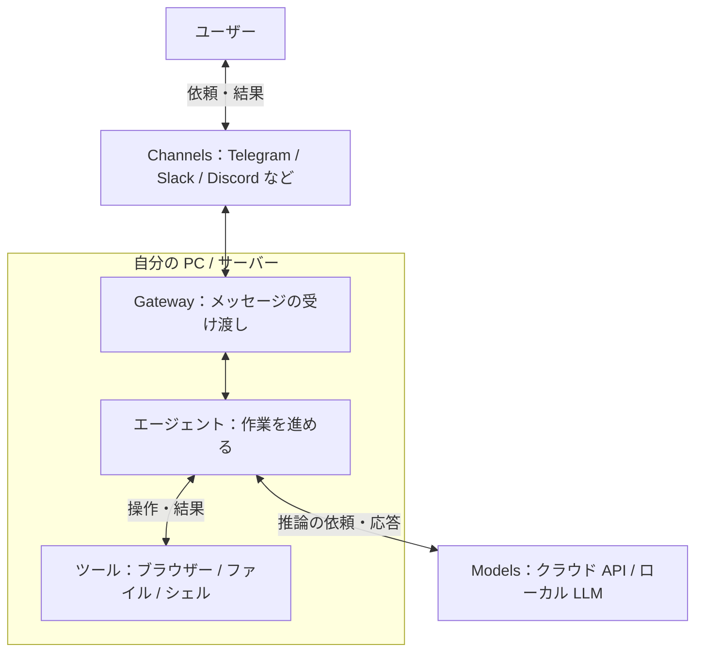
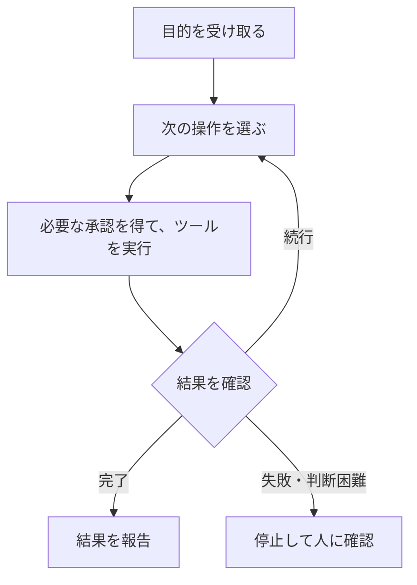
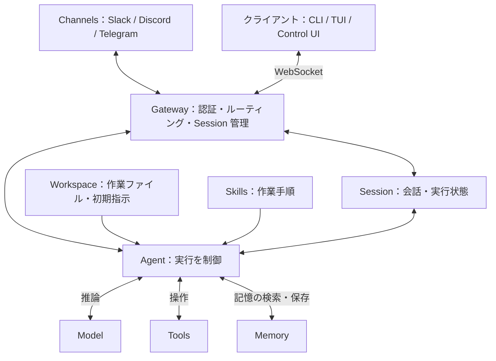
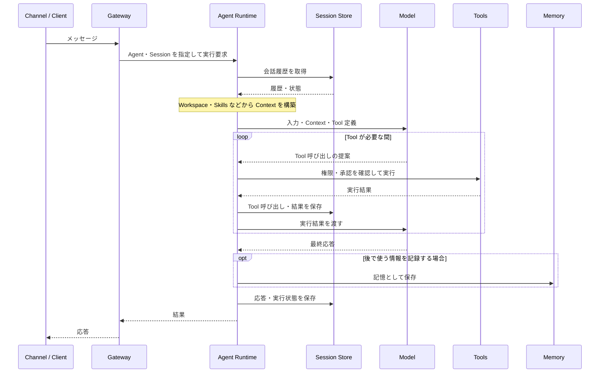

# OpenClaw 概要

OpenClaw は、**自分の PC やサーバーで動く、オープンソースの常駐型 AI エージェント**です。チャットアプリから自然言語で依頼すると、許可された範囲でブラウザー・ファイル・シェルを操作します。

たとえば「このテーマを調べてファイルにまとめて」と頼めば、情報収集から要約・保存までを進めます。特徴は、**回答するだけでなく、実際の作業を実行できること**です。

## ローカル PC で 24 時間・365 日待機

中心となる **Gateway** をバックグラウンドサービスとして動かすと、チャット画面を開いていなくても依頼を受け付けられます。自宅の PC を稼働させ、外出先のスマートフォンから作業を頼むことも可能です。

:::message
常時稼働には、PC の電源・スリープ無効化・Gateway の継続稼働が必要です。外部サービスとの通信にはネットワーク接続も必要です。無停止を保証するものではないため、再起動後の自動起動や障害時の復旧も設定します。
:::

## チャット・モデル・ツールをつなぐ

チャットとの接続口を **Channels**、判断を担う AI モデルを **Models** と呼びます。Telegram、Slack、Discord、WhatsApp、Microsoft Teams などと、必要な設定やプラグインを通じて連携できます。



OpenClaw 自体は AI モデルではありません。OpenAI、Anthropic、ローカル LLM などを選べますが、ツール対応や推論能力によって作業の品質は変わります。

| 機能 | 役割 |
| --- | --- |
| Skills | ツールの使い方や作業手順を教える。独自の手順も追加できる |
| メモリー | 保存した情報を次の作業に活かす。無制限に記憶するわけではない |
| マルチエージェント | 用途ごとにエージェントや作業領域を分ける |
| Control UI | ブラウザーからチャットや設定を操作する |

チャット連携のために、Control UI をインターネットへ公開する必要はありません。

## 注目される背景

OpenClaw は MIT ライセンスで公開され、コミュニティとともに開発されています。注目の背景は、次の 3 点で捉えられます。

| 観点 | 特徴 |
| --- | --- |
| 技術 | 使い慣れたチャットから、PC 上の作業を指示できる |
| タイミング | AI の用途が文章生成からツールを使った作業へ広がっている |
| OSS | GitHub 上のコードを確認し、試したり拡張したりできる |

## 定期実行と活用例

依頼への応答だけでなく、**Cron** で決まった時刻に作業し、**Heartbeat** で定期的に状況を確認できます。たとえば、朝のニュース要約や、注意が必要な変化の通知に使えます。

以下は、必要なツール・接続先・権限を設定した場合の例です。**導入直後からすべて使えるわけではありません。**

| 分野 | 活用例 |
| --- | --- |
| メール・予定 | 優先順位付け、返信の下書き、空き時間の確認、予定調整 |
| 調べもの | 情報収集、要約、レポート作成、飲食店の検索・予約補助 |
| ファイル整理 | フォルダー整理、分類、一括リネーム |
| 設計・実装 | 要件整理、設計案・コード・設定ファイルの作成、リファクタリング |
| Git・テスト | PR 作成、レビュー補助、テスト生成・実行、失敗ログの解析 |
| 運用・サポート | アラート解析、障害切り分け、回答案・チケット・対応記録の作成 |
| 定常作業 | バックアップ実行、検証環境へのパッチ適用、定期レポート |

メール送信、予約確定、ファイル削除、本番変更などは、人の承認を挟む設計にします。

## 「回答」から「実行」へ

文章生成中心の使い方では、回答を読んだ人が操作します。AI エージェントは、ツールの実行結果をもとに次の行動を選びます。



これは運用上の基本フローです。承認や停止の条件は、設定と運用で定めます。**自律実行は、正確な完了を保証するものではありません。**

決まった処理はスクリプトや RPA、情報の解釈や手順の選択は AI、と使い分けると効果的です。AI も画面変更への対応や判断を誤るため、完了条件と確認方法を決めておきます。

## データの送信先と費用

**ローカルで動くことと、データが外部に出ないことは別です。** クラウドモデルには推論に使う情報が送られ、チャットサービス上でもメッセージが扱われます。

OpenClaw のソースコードは無償で公開されていますが、モデルの API 利用料、サーバー代、電気代は別途かかり得ます。定期実行では、頻度に応じた費用にも注意します。

## 主なリスク

実操作できる分、誤操作や侵害の影響は与えた権限に及びます。主なリスクは、**本体の脆弱性・外部 Skill・実行権限・認証情報**の 4 つです。

### 本体の脆弱性

過去に報告・修正された例を示します。スコアと修正バージョンの出典は、末尾の GitHub Advisory Database です。

| 脆弱性 | CVSS v3.1 | 概要 | 修正バージョン |
| --- | --- | --- | --- |
| CVE-2026-25253 | 8.8（High） | 不正な `gatewayUrl` への接続で認証トークンが漏洩し、Gateway の乗っ取りやコード実行につながる | 2026.1.29 |
| CVE-2026-24763 | 8.8（High） | 環境変数を指定できる認証済みユーザーが、`PATH` を通じて Docker サンドボックス内にコマンドを注入できる | 2026.1.29 |

前者はブラウザーを経由するため、ローカル接続だけでも影響を受け得る問題でした。表の修正バージョンにとどまらず、継続的に脆弱性情報を確認して更新します。

### 外部 Skill

Skill は `SKILL.md` に記載する手順ですが、スクリプトを含んだり、外部コマンドの実行を指示したりする場合があります。

ClawHub では、偽の事前準備を通じてマルウェアを導入させ、API キー・ウォレットの秘密鍵・SSH 認証情報・ブラウザーのパスワードを狙う事例が報告されています。

**配布元だけでなく、指示・コード・依存関係・通信先も確認します。** 署名やスキャン結果は判断材料であり、安全の保証ではありません。自作 Skill も確認は必要です。

### 実行権限

`exec`、ファイル編集、ブラウザー操作、メッセージ送信などを許可すると、誤操作時の影響も広がります。

また、Web ページやメール中の悪意ある指示で AI を誘導する **プロンプトインジェクション**にも注意が必要です。依頼者を限定しても、AI が読む外部コンテンツまで安全とは限りません。

権限は次の 3 軸で絞ります。

```text
実行権限
|-- 強さ：読むだけか、変更・実行も許可するか
|-- 範囲：どのファイル・ツール・接続先を許可するか
`-- 時間：いつまで許可するか
```

文章で禁止するだけでなく、ツール設定・OS の権限・サンドボックス・実行承認で制御します。

### 認証情報

メールやソース管理などの認証情報が漏れると、接続先にも被害が広がります。**専用アカウントと権限を限定したトークンを使い、評価時は本番の認証情報を渡しません。**

普段のファイルやブラウザーにも秘密情報があるため、作業環境を分けます。

## 安全に使うための基本

まずは **隔離環境・最小権限・専用認証情報**で試し、必要な機能だけを追加します。

| 対策 | 実施すること |
| --- | --- |
| 更新 | 本体・プラグイン・依存関係の修正版を適用する |
| Skill 管理 | 導入時と更新時に、内容と依存関係を確認する |
| 隔離 | 専用端末や仮想環境を使い、機密データ・ネットワーク・ブラウザーを分離する |
| 最小権限 | ファイル・ツール・通信先・依頼者を限定し、不要な権限を外す |
| 認証情報 | 専用のアカウントやトークンを使い、失効・更新できるようにする |
| 承認 | 送信・予約確定・削除・本番変更の前に人が確認する |
| 監査 | ツール・OS・接続先のログを確認する。秘密情報の記録は避ける |

サンドボックスも、重要なフォルダーの共有や強い権限の付与で隔離が弱まります。実際のアクセス範囲を確認しましょう。

リスクは、守る情報資産・脅威・脆弱性を整理し、発生の可能性と影響から評価します。「危険」「ローカルだから安全」と一括りにせず、**確認された事実と、自分の構成で残るリスクを分けて判断する**ことが大切です。

# OpenClaw アーキテクチャ

OpenClaw は、**Gateway が入力を受け付け、Agent が Model・Tools・Memory を使って作業する実行基盤**です。ここでは、通信・作業領域・状態管理・拡張機能・実行フローに分けて整理します。

:::message
設定・保存形式・コマンドはバージョンによって変わります。以下は参照した公式ドキュメントに基づく説明です。JSON は設定項目ごとの抜粋であり、完全な設定ファイルではありません。既存の `openclaw.json` に必要な項目を統合して使います。
:::

## 全体構成

Gateway は通信と制御の中心です。チャットサービスに加え、CLI / TUI や Control UI も Gateway に接続します。



| 構成要素 | 役割 |
| --- | --- |
| Channel | チャットサービスとの入出力 |
| Gateway | 接続・認証・配送先・Session・実行要求を管理 |
| Agent | Model の応答に応じて Tools を呼び、作業を進める |
| Model | 入力を解釈し、回答や次の操作を提案 |
| Tools | ファイル・シェル・ブラウザーなどを操作 |
| Workspace | 作業ファイルと Agent 向けの指示を配置 |
| Session | 会話履歴や Tool の実行結果を保持 |
| Memory | 後の会話でも使う情報を保存・検索 |
| Skills | 既存の Tools を使う手順を教える |
| Plugins | Channel・Model Provider・Tool などの機能を追加 |

## Channel と Gateway

**Channel はチャットの接続口、Gateway は通信の制御役**です。Gateway は接続を維持し、受信した入力を適切な Agent と Session に振り分けます。

CLI / TUI や Control UI は、Slack などの Channel とは別のクライアントです。Gateway の WebSocket API を通じて、依頼の送信や状態の取得を行います。標準の待ち受け先は `127.0.0.1:18789` です。

```text
入力を受信
  |
  v
接続元・権限を確認
  |
  v
Agent と Session を決定
  |
  v
実行を制御し、結果を元の接続先へ返す
```

## Agent・Model・Tools の役割分担

```text
Model = 考える
Tool  = 実行する
Agent = 推論と実行をつなぐ
```

Model が Tool 呼び出しを提案しても、実際に実行するのは Agent Runtime です。Runtime は、許可設定・引数・実行結果を扱いながら処理を進めます。**Model に渡す指示と、実行を許可する設定は別物**です。

1 つの Gateway で複数の Agent を扱えます。Agent ごとに Workspace や Session を分け、用途に応じて Model や Tools を設定できます。

Model の接続先には OpenAI、Anthropic、Ollama などがあり、対応する Provider や接続方式を設定します。DB や業務 API の操作には、別途 Tool や Plugin などの連携が必要です。

| Tool の例 | 用途 |
| --- | --- |
| `exec` / `process` | コマンド実行・バックグラウンド処理の管理 |
| `read` / `write` / `edit` / `apply_patch` | ファイルの読み書き・編集 |
| `web_search` / `web_fetch` | Web 検索・ページ取得 |
| `browser` | ブラウザー操作 |
| `message` | メッセージ送信 |
| `memory_search` / `memory_get` | 保存した記憶の検索・取得 |
| `view_image` / `image_generate` | 画像の確認・生成 |
| `music_generate` / `video_generate` | 音楽・動画の生成 |

Tool が用意されていても、Provider の認証、追加設定、実行環境、権限が必要な場合があります。すべてが無設定で利用できるわけではありません。

## Workspace とファイル構成

Workspace は Agent の作業ディレクトリーです。作業ファイル、初期指示、Skills、Markdown の記憶を置きます。設定や認証情報、実行状態とは役割が異なります。

以下は既定の状態ディレクトリーの例です。`~` はホームディレクトリーを表し、配置は設定で変更できます。

```text
~\.openclaw\
|-- openclaw.json                  メイン設定
|-- credentials\                  接続先の認証関連情報
|-- state\
|   `-- openclaw.sqlite            共有状態
|-- agents\
|   `-- <AGENT_ID>\
|       |-- agent\
|       |   `-- openclaw-agent.sqlite   Agent ごとの実行状態
|       `-- sessions\              旧形式・アーカイブ関連
|-- skills\                       共有する Skills
`-- workspace\
    |-- AGENTS.md
    |-- IDENTITY.md
    |-- SOUL.md
    |-- USER.md
    |-- MEMORY.md
    |-- memory\
    |   `-- YYYY-MM-DD.md
    `-- skills\
```

:::message alert
Workspace は作業場所であり、サンドボックスではありません。権限があれば外部のパスにもアクセスできます。隔離にはサンドボックスや OS のアクセス制御を使います。
:::

### Bootstrap Files：Agent に渡す初期指示

Agent の役割・口調・作業ルールを Markdown で定義します。実行時に必要な内容が Context に取り込まれます。

| ファイル | 記載する内容 |
| --- | --- |
| `AGENTS.md` | 作業ルール、安全方針、Session 開始時の手順、Memory の扱い |
| `IDENTITY.md` | 名前、雰囲気、絵文字、アバターなど |
| `SOUL.md` | 人格、口調、価値観、振る舞いの境界 |
| `USER.md` | ユーザー情報、呼び方、好み、コミュニケーション方針 |
| `BOOTSTRAP.md` | 新規 Workspace の初回セットアップ手順 |
| `MEMORY.md` | 継続して使う事実や判断の要約 |

`TOOLS.md` を使う旧構成もあります。現在の公式ドキュメントでは、環境固有の Tool 利用メモは `AGENTS.md` の `## Tools` に記載します。SSH 接続先の別名やデバイス名などを整理する場所です。

**これらは Agent への指示であり、アクセス制御ではありません。** Tool の利用可否は設定で制限します。また、ファイル全体が無制限に Context へ入るわけではなく、サイズ上限や Session の種類による制約があります。

## Session：今の会話・実行状態

Session は、会話履歴・Tool 呼び出し・実行結果などをまとめる単位です。Gateway が入力元に応じて Session を選び、同じ会話を継続できるようにします。

| 入力元 | 基本的な分離方法 |
| --- | --- |
| DM | `session.dmScope` に従う |
| グループ・ルーム・チャンネル | グループやルームごと。設定で変更可能 |
| 定期実行・Webhook | ジョブや Hook の実行方式・Session 指定に従う |

### DM の分離

DM の既定値は `main` で、同じ Agent に届く DM が会話を共有します。複数人から依頼を受ける場合は、送信者ごとに分離します。

| `session.dmScope` | 分離単位 |
| --- | --- |
| `main` | 全 DM で共有 |
| `per-peer` | 送信者 |
| `per-channel-peer` | Channel と送信者 |
| `per-account-channel-peer` | 接続アカウント・Channel・送信者 |

```json
{
  "session": {
    "dmScope": "per-channel-peer"
  }
}
```

この設定は会話履歴の混在を防ぐためのものです。共有 Workspace や認証情報まで隔離するわけではありません。互いに信頼しない利用者を扱う場合は、Gateway や OS ユーザーなどの境界も分けます。

### リセットと保存

```text
Session の切り替え
|-- 手動：/new または /reset
|-- 日次：設定した時刻を境に切り替え
`-- 無操作：設定した時間の経過で切り替え
```

現在の公式ドキュメントでは、自動リセットは既定で無効です。毎日 4 時に切り替えるには、明示的に設定します。無操作による切り替えには `session.reset.idleMinutes` を使います。

```json
{
  "session": {
    "reset": {
      "mode": "daily",
      "atHour": 4
    }
  }
}
```

実行中の Session 情報と会話履歴は、Agent ごとの `openclaw-agent.sqlite` に保存されます。旧構成の `sessions.json` は Session の索引、`<SESSION_ID>.jsonl` は会話・Tool 呼び出しなどの記録です。現在は移行元やアーカイブとして扱われるため、バックアップ時は利用バージョンの保存方式を確認します。

## Memory：後から使う記憶

```text
Session = 今の会話を続けるための状態
Memory  = 次の会話でも再利用する情報
```

Memory の基本は Workspace 内の Markdown です。検索用の索引とは分けて考えます。

| 保存先 | 用途 |
| --- | --- |
| `memory\YYYY-MM-DD.md` | 日々の作業記録・観察・メモ |
| `MEMORY.md` | 長く使う事実・判断・要約 |
| Agent ごとの SQLite | 組み込み Memory エンジンの検索用索引 |

`memory_search` で関連する記憶を探し、`memory_get` で内容を取得します。埋め込みモデルを設定すると、キーワード検索とベクトル検索を組み合わせられます。埋め込みの接続先には、OpenAI・Gemini・Mistral・Ollama などがあります。

クラウドの埋め込みモデルを使う場合は、索引作成のために記憶の内容が外部へ送られます。ローカル保存だけで送信がなくなるわけではありません。

旧構成では `~\.openclaw\memory\<AGENT_ID>.sqlite` が使われていました。現在の保存方式や検索エンジンは、利用バージョン・Plugin によって確認が必要です。

## Tool・Skill・Plugin の違い

```text
Tool   = 実行機能          例：ファイルを読む
Skill  = 作業手順          例：調査結果を整理する
Plugin = 基盤の機能拡張    例：新しい Channel や Tool を追加する
```

### Skills：仕事の進め方を教える

Skills は、Agent Skills 形式の `SKILL.md` を中心に手順をまとめます。必要に応じて補助スクリプトや参考資料も同梱します。

```text
skills\
`-- webapp-testing\
    |-- SKILL.md       名前・説明・実行手順
    |-- scripts\      補助スクリプト
    |-- references\   参考資料
    `-- assets\       テンプレートなど
```

主な配置先は次のとおりです。同名の Skill がある場合、Workspace 側の定義が優先されます。

| 配置先 | 主な用途 |
| --- | --- |
| `<workspace>\skills` | Workspace 専用 |
| `<workspace>\.agents\skills` | プロジェクト用 |
| `~\.agents\skills` | 個人用。既定の状態ディレクトリーで利用 |
| `~\.openclaw\skills` | 同じ状態ディレクトリーを使う Agent 間で共有 |

Agent に公開する Skill を限定する例です。空配列 `[]` なら、その Agent に Skills を公開しません。

```json
{
  "agents": {
    "defaults": {
      "skills": ["github", "weather"]
    }
  }
}
```

Skill ごとの有効化や認証情報は `skills.entries` に設定します。次は、導入済みの `image-lab` が環境変数の API キーを参照する例です。

```json
{
  "skills": {
    "entries": {
      "image-lab": {
        "enabled": true,
        "apiKey": {
          "source": "env",
          "provider": "default",
          "id": "GEMINI_API_KEY"
        }
      }
    }
  }
}
```

Skill によっては `gh` CLI などが必要です。**Skill を配置しただけでは、必要な実行環境や権限は揃いません。** Skill の公開制限と、シェルなどの実行制限も別々に設定します。

### Tool Profile と Allow / Deny

`tools.profile` で基本の Tool 範囲を選び、`tools.allow` / `tools.deny` などで調整します。

| Profile | 主な範囲 |
| --- | --- |
| `minimal` | Session 状態などの最小構成。更新用の制限付き Gateway 操作も含む |
| `coding` | ファイル・実行・Web・Session・Memory など |
| `messaging` | メッセージ・Session 関連など |
| `full` | Profile による制限なし。他の権限制御は有効 |

たとえば、調査・文書編集向けの Tool に絞る設定は次のようになります。

```json
{
  "tools": {
    "profile": "coding",
    "allow": ["read", "write", "edit", "web_search"],
    "deny": ["exec"]
  }
}
```

**同じ Tool に許可と拒否が指定された場合は、拒否が優先**されます。Tool の許可だけでは、Plugin の無効化やサンドボックス側の制限を解除できません。また、`exec` の拒否だけで、あらゆるコード実行経路を遮断できるわけではありません。

Tool は `group:*` でまとめて指定できます。

| Group | 含まれる Tool の例 |
| --- | --- |
| `group:runtime` | `exec`、`process`、`code_execution` |
| `group:fs` | `read`、`write`、`edit`、`apply_patch` |
| `group:sessions` | `sessions_list`、`sessions_history`、`sessions_send` など |
| `group:memory` | `memory_search`、`memory_get` |
| `group:web` | `web_search`、`x_search`、`web_fetch` |

### Plugins：OpenClaw の機能を増やす

Plugin は Channel・Model Provider・Tool・Skill・Hook などを追加します。組み込みのものと外部から導入するものがあり、ネイティブ Plugin は実行コードを Gateway に読み込みます。

`plugins.entries` に個別設定、`plugins.allow` / `plugins.deny` に許可・拒否、`plugins.load.paths` に追加の読み込み先を指定します。拒否は許可より優先されます。

次は `voice-call` Plugin の個別設定の抜粋です。Plugin の導入と、接続先の認証設定は別途必要です。

```json
{
  "plugins": {
    "enabled": true,
    "entries": {
      "voice-call": {
        "enabled": true,
        "config": {
          "provider": "twilio"
        }
      }
    }
  }
}
```

`plugins.allow` は Plugin 全体に対する許可リストです。新しい Plugin だけを書くと、必要な既存 Plugin まで使えなくなる可能性があるため、一覧を確認して設定します。

### ClawHub：Skills / Plugins の配布先

ClawHub では Skills や Plugins を検索・導入できます。公開・レジストリ管理には ClawHub CLI、利用側の管理には OpenClaw CLI を使えます。

検索や導入状態の確認に使うコマンドです。

```shell
openclaw skills search "calendar"
openclaw skills list
openclaw skills check
openclaw plugins search "calendar"
openclaw plugins list
```

以下の `<...>` は実際の識別子に置き換えます。導入・更新・削除を行うため、対象と配布元を確認して実行します。

```shell
openclaw skills install @owner/<slug>
openclaw plugins install clawhub:<package>
openclaw plugins enable <id>
openclaw plugins disable <id>
openclaw plugins update --all
openclaw plugins uninstall <id>
```

Skills は手動で配置することもできます。`openclaw skills install` は通常 Workspace の `skills` を対象にし、`--global` を付けると共有ディレクトリーを対象にします。

**Plugin の導入はコードの実行と同等に扱います。** Skill も指示や同梱コードを確認し、検索結果にあるだけで信頼しないことが重要です。

## Agent Loop：入力から応答・保存まで

Agent Runtime / Harness は、Context の組み立て、Model 呼び出し、Tool 実行、応答、保存をつなぐ実行部分です。組み込み Runtime のほか、外部 Harness へ委譲する構成もあります。

### 入力と Context の構築

入力は Session を解決した後、Session ごとのキューで制御されます。同じ Session の実行を直列化し、履歴や Tool 操作の競合を避けます。

```text
入力
  |
  v
Agent・Session を決定
  |
  v
Session ごとのキュー
  |
  v
Workspace・Model・Skills を解決
  |
  v
Context を組み立てて実行
```

Context は、Model が判断に使う情報です。

```text
Context
|-- システム指示・Bootstrap Files
|-- 会話履歴・Tool の実行結果
|-- 添付ファイル
|-- 利用可能な Tool の定義
|-- Skills の情報・必要な手順
`-- 必要に応じて取得した Memory
```

Plugin のコード自体を Model に渡すのではなく、Plugin が追加した Tool の定義や指示などを利用します。Context には上限があり、長い履歴は要約・圧縮などで調整されます。

### 推論・実行・結果確認

Agent Loop は、**推論 → 操作 → 結果の確認**を繰り返す流れとして理解できます。すべての依頼で Tool を呼ぶわけではなく、回答だけで完了する場合もあります。



これは処理の関係を示す概念図です。Memory の読み書きも Tool 経由で行われ、保存は実行途中にも発生します。エラー・タイムアウト・承認拒否などでは、完了せず停止する場合があります。

### 応答と永続化

対応する Channel と設定では、応答をブロック単位で順次配信できます。配信方法と、状態の保存は別の処理です。

```text
実行結果
|-- 応答：元の Channel / Client へ返す
|-- Session：会話・Tool 呼び出し・結果を記録する
`-- Memory：再利用する情報を選んで記録する
```

**会話履歴の保存と、長期記憶への保存は同じではありません。** すべての応答がそのまま `MEMORY.md` に追加されるわけではなく、必要な情報を記録・整理して次の作業に活かします。

# OpenClaw 構築

## Gateway

## Models

## Channels

# OpenClaw 運用管理

# 参考文献

https://docs.openclaw.ai/

https://docs.openclaw.ai/start/getting-started

https://docs.openclaw.ai/tools/skills

https://docs.openclaw.ai/gateway/heartbeat

https://docs.openclaw.ai/gateway/security

https://docs.openclaw.ai/concepts/architecture

https://docs.openclaw.ai/concepts/agent

https://docs.openclaw.ai/concepts/agent-workspace

https://docs.openclaw.ai/concepts/session

https://docs.openclaw.ai/concepts/memory

https://docs.openclaw.ai/concepts/memory-builtin

https://docs.openclaw.ai/concepts/agent-loop

https://docs.openclaw.ai/tools

https://docs.openclaw.ai/gateway/config-tools/tool-policy

https://docs.openclaw.ai/tools/skills-config

https://docs.openclaw.ai/tools/plugin

https://docs.openclaw.ai/cli/skills

https://docs.openclaw.ai/cli/plugins

https://agentskills.io/

https://clawhub.ai/

https://github.com/advisories/GHSA-g8p2-7wf7-98mq

https://github.com/advisories/GHSA-mc68-q9jw-2h3v

https://thehackernews.com/2026/02/researchers-find-341-malicious-clawhub.html
