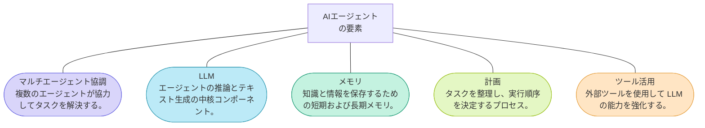
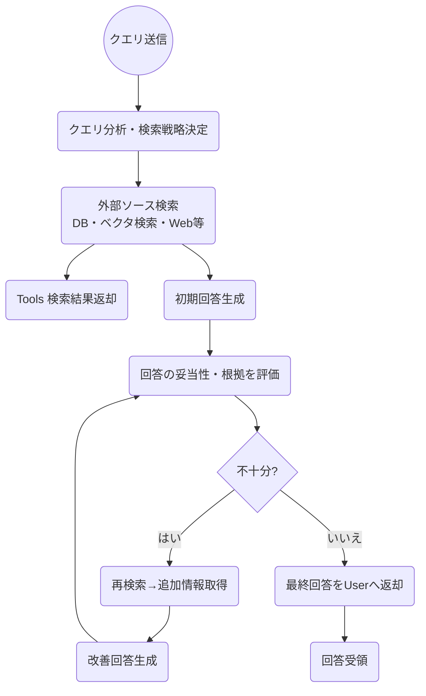

# 目次

- [はじめに](#はじめに)
- [RAG の概要](#rag-の概要)
  - [RAG のアプローチ](#rag-のアプローチ)
  - [Agent 時代の RAG](#agent-時代の-rag)
- [RAG の精度改善の進め方](#rag-の精度改善の進め方)
  - [Store の精度向上 (データ準備)](#store-の精度向上-データ準備)
  - [Retrieve の精度向上 (検索)](#retrieve-の精度向上-検索)
  - [Augment の精度向上 (拡張)](#augment-の精度向上-拡張)
  - [Generation の精度向上 (生成)](#generation-の精度向上-生成)
- [Evaluate (評価)](#evaluate-評価)
- [RAG とファインチューニング](#rag-とファインチューニング)
- [RAG と CAG](#rag-と-cag)
- [その他](#その他)
- [参考文献](#参考文献)

# はじめに

昨今、AI の進化により、様々な分野での応用が進んでいます。特に、自然言語処理(NLP)の分野では、RAG( Retrieval-Augmented Generation)が注目されています。RAG は、情報検索と生成を組み合わせた手法であり、特に大規模言語モデル(LLM)と組み合わせることで、その性能を大幅に向上させることができます。

また、NativeRAG や GraphRAG, AgentRAG などさまざまな RAG のバリエーションが登場しており、これらは特定のユースケースやデータセットに対して最適化されています。

今回は、RAG の基本的な概念から、RAG のプロジェクトの進め方、精度向上の方法に至るまで詳しく解説します。

みなさんの GenAI Application の開発に役立てていただければ幸いです。

それでは行きましょう 🚀

# RAG の概要

RAG とは`Retrieval-Augmented Generation`の略で、情報検索と生成を組み合わせた手法です。
RAG は特に大規模言語モデル(LLM)と組み合わせることで、その性能を大幅に向上させることができます。

歴史的には**Meta の研究者が提案**した、LLM のハルシネーション（誤情報生成）を低減する手法で、LLM だけの思考ではなく、外部リソースに検索をかけながら正しい答えを生成する言わば **「ナレッジベースの外部化」** が実現出来る手法です。

ユーザーからの問いに対し、バックエンドのナレッジベース（例: Azure AI Search）で検索し、その結果をプロンプトに追加して回答を生成するような流れが一般的な流れになります。

RAG の概要のフローは以下のようになっています。

1. Store で各種データをチャンク分割し、ベクトル化してデータストア(Azure AI Search 等)に格納します。
2. ユーザーからの質問を Application 側で受け取ります。
3. Retrieve と記載されている場所で、キーワード検索やベクトル検索を実施します。
4. 関連する情報をデータストアから取得します。
5. ユーザーからの質問とデータストアから取得した関連情報を、Augment の箇所でビルドします。
6. 生成 AI の API(Azure OpenAI Service 等)に、ユーザーからの質問とデータストアから取得した関連情報をプロンプトとして渡します。
7. 質問と関連情報を元に回答を生成します。
8. 生成された回答をユーザーに返します。

このように RAG は以下 4 つの箇所に分割することが出来ます。

- **Store** : データの格納
- **Retrieve** : データの検索
- **Augment** : プロンプトのビルド
- **Generation** : 回答の生成

## RAG のアプローチ

RAG の精度をあげるための手法の研究は進んでおり、キーワード/ベクトル検索に基づく **NativeRAG**、KG（ナレッジグラフ）を活用する **GraphRAG**、そして両者を組み合わせる **HybridRAG** が主要な選択肢として挙げられます。

また、昨今注目されているのは**AgenticRAG**と呼ばれる手法で、従来の RAG が抱える「静的なワークフロー」「単一ステップ推論」等の限界を乗り越えるべく、LLM をエージェント化（計画・再試行・ツール活用・他エージェントとの協調など）。クエリごとに動的に検索戦略を変えたり、回答途中に不足情報を再検索したり、複数のエージェント間でタスクを分担して協調する。

RAG の比較をまとめてみました。

| アプローチ        | ユースケース                                                                                                                                                                                                                                   | 検索手法                                                                                                                                                                                                                             | 強み                                                                                                                                                                                                                 | 弱み                                                                                                                                                                                                               |
| ----------------- | ---------------------------------------------------------------------------------------------------------------------------------------------------------------------------------------------------------------------------------------------- | ------------------------------------------------------------------------------------------------------------------------------------------------------------------------------------------------------------------------------------ | -------------------------------------------------------------------------------------------------------------------------------------------------------------------------------------------------------------------- | ------------------------------------------------------------------------------------------------------------------------------------------------------------------------------------------------------------------ |
| 🧠 **NativeRAG**  | ・幅広いドキュメント検索 ・FAQ やカスタマーサポート ・表現のゆらぎへの対応                                                                                                                                                               | ・キーワード検索 ・ベクトル検索 ・セマンティックリランキング                                                                                                                                                                   | ・スキーマ不要で実装が容易 ・大規模非構造テキストを取り込みやすい ・柔軟性が高い                                                                                                                               | ・関係性の厳密な推論には弱い ・ノイズが多い場合、回答の正確性が下がる                                                                                                                                           |
| 📈 **GraphRAG**   | ・エンティティの厳密な関係性の追跡 ・因果関係の分析 ・説明責任が求められる場面                                                                                                                                                           | ・ナレッジグラフを用いた構造的な検索 ・エンティティ・リレーションに基づく問い合わせ                                                                                                                                               | ・一貫性・説明可能性が高い ・ドメイン知識の活用に強み                                                                                                                                                             | ・ナレッジグラフ構築コストが高い ・エンティティが直接登場しない抽象質問に弱い                                                                                                                                   |
| 🔗 **HybridRAG**  | ・抽象的な質問にも対応しつつ関係性も正確に捉えたいケース ・非構造化データと構造化データが混在する複雑ドメイン                                                                                                                               | ・NativeRAG と GraphRAG の両方を実施 ・ベクトル検索の文脈 & ナレッジグラフのサブグラフ情報を併用                                                                                                                                  | ・NativeRAG と GraphRAG の長所を活かし精度と柔軟性を両立 ・抽象的質問 & エンティティ重視の質問両方に強い                                                                                                          | ・両方の結果をマージする分コンテキストが増大しがち ・実装・運用が複雑化しやすい                                                                                                                                 |
| 🤖 **AgenticRAG** | ・マルチソース横断のリアルタイム Q&A／データ統合チャットボット ・ステップ分解が必要な複雑タスク（法務調査・コーディング支援等） ・カスタマーサポート一次対応自動化とエスカレーション判定 ・部門横断のナレッジ発見・データマネジメント | ・ルーティング／プランニングエージェントでツール選択（ベクトル検索・キーワード検索・Web 検索・API 呼び出し等） ・ReAct／Plan-and-Execute などのマルチステップ推論ループ ・専用リトリーバーを複数連携するマルチエージェント構成 | ・柔軟性・適応性が高く、動的にデータソース／ツールを切替可能 ・自己検証ループでノイズを低減し精度向上 ・マルチエージェント拡張で異種データ・マルチモーダル対応が容易 ・単一ベクトル DB 依存より網羅性が高い | ・複数エージェントによる追加推論でコスト・レイテンシ増大 ・エージェント行き詰まり／ハルシネーション対策が必須 ・オーケストレーションや権限制御など実装・運用が複雑 ・協調失敗時に処理が非効率になるリスク |

## Agent 時代の RAG

特に最近注目されている AgenticRAG について深掘りしていきたいと思います。

以下に AgenticRAG の調査もまとめられています。
https://arxiv.org/abs/2501.09136

> エージェント検索拡張生成 (AgenticRAG) は、自律型 AI エージェントを RAG パイプラインに組み込み、エージェント設計パターンの反映、計画、ツールの使用、およびマルチエージェント コラボレーションを活用して、検索戦略を動的に管理し、コンテキスト理解を反復的に改善し、複雑なタスク要件を満たすようにワークフローを適応させます。
> この統合により、AgenticRAG システムは、多様なアプリケーションにおいて比類のない柔軟性、拡張性、そしてコンテキスト認識を実現します。

AI Agent の要素は以下のものが挙げられます。

マルチエージェントで強調することや、LLM、メモリ、計画、ツール活用などの要素を組み合わせて、より高度なタスク解決を目指します。

実際に、AgenticRAG の処理プロセスの例は以下のようになります。

クエリ送信後、クエリの分析・検索戦略の決定を行い、外部ソース（データベース、ベクトル検索、Web など）から情報を取得します。その後、初期回答を生成し、その妥当性や根拠を評価します。
もし回答が不十分であれば、再度検索を行い追加情報を取得し、改善された回答を生成します。最終的に、ユーザーに最終回答を返却します。

今までの RAG では、Retrieve の結果をそのままプロンプトに追加して回答を生成していましたが、AgenticRAG では、クエリの分析や検索戦略の決定、回答の妥当性評価などのステップが追加され、より動的で柔軟な対応が可能になります。

:::message

Agentic RAG Core Loop と呼ばれますが、以下のトレーニングが非常に参考になります。
https://github.com/microsoft/ai-agents-for-beginners/blob/main/05-agentic-rag/README.md

:::

そして、一口に AgenticRAG と言っても、様々なアプローチが存在します。
今回は以下の 6 つのアプローチを紹介・比較します。

- シングルエージェント RAG
- マルチエージェント RAG
- 階層型エージェント RAG
- Corrective RAG
- Adaptive RAG
- Graph ベース RAG
- Agentic Document Workflows (ADW)

| 分類                                 | 概要                                                                                                         | 利点                                                                                                       | 注意点・課題                                                                                   | 主な用途・事例                                                                 |
| ------------------------------------ | ------------------------------------------------------------------------------------------------------------ | ---------------------------------------------------------------------------------------------------------- | ---------------------------------------------------------------------------------------------- | ------------------------------------------------------------------------------ |
| **シングルエージェント RAG**         | RAG の一連のタスクを、単一のエージェントがまとめて管理                                                       | すべて 1 エージェントで完結するため、エージェント間の連携不要                                              | ・高度な並列処理・専門化には限界 ・大規模・複雑な処理には不向き                             | カスタマーサポートなど比較的単純な問い合わせ対応                               |
| **マルチエージェント RAG**           | コーディネーター役のエージェントがクエリを受け取り、複数の専門エージェントにサブタスクを振り分け、結果を統合 | 機能を専門化できるため、高度・複雑なタスクに対応しやすい。並列処理で高速化が可能                           | エージェント間連携の設計が複雑化                                                               | 大規模システムでの高度な情報検索・集約                                         |
| **階層型エージェント RAG**           | 上位エージェントが戦略レベルの判断を行い、下位エージェントが実務的な検索や解析を担う                         | 大規模・複雑な意思決定を効果的に管理                                                                       | 階層設計が不十分だとボトルネックを起こしやすい                                                 | 分析チーム・検索チームなど、複数部門をまたぐワークフロー制御                   |
| **CorrectiveRAG**                    | 検索結果が不正確・不足がある場合に自動で修正検索やクエリ再生成を行う仕組み                                   | ハルシネーションや検索ミスを低減                                                                           | エージェントの評価・修正プロセスを設計する必要。再検索や情報取得の手数が増え、処理コストが増大 | FAQ システムの回答精度向上、ファクトベースのレポーティングやカスタマーサポート |
| **AdaptiveRAG**                      | クエリの難易度（簡易・中程度・複雑など）に応じて検索・推論の手順を切り替える                                 | 不要な大規模処理を行わずに済むため効率が良い。シンプルな問題は高速に処理し、複雑な問題には多段階処理を適用 | クエリ分類の精度がシステム全体の性能に影響。過小評価・過大評価による処理パスのミスマッチ       | ユーザーからの多様な質問に対し最適な処理を選択するチャットボット               |
| **Graph ベース RAG**                 | ナレッジグラフとテキスト検索を組み合わせ、結果をクリティックモジュールなどで評価しながら精緻化               | リレーショナルな知識構造を活かした多段階推論が可能                                                         | グラフ DB の構築や更新が必要                                                                   | 医療や学術分野など、複雑なエンティティ関係を扱うシステム                       |
| **Agentic Document Workflows (ADW)** | 文書処理（インボイス、契約書、レポートなど）に特化したワークフロー                                           | 複数ステップの文書処理を一元化できる                                                                       | 文書形式ごとの細かな設定やテンプレート設計                                                     | 契約書の審査、自動請求処理、保険金請求管理など                                 |

AI Agent の Application の開発においては、開発するプロダクトが達成したい目標や、解決したい課題に応じて、適切なアプローチを選択することが重要です。

それぞれの利点や課題を正確に抑えながら、Agent の設計を行うことで、より効果的な AI Agent の開発が可能になります。

# RAG の精度改善の進め方

ここからは NativeRAG をベースに RAG を構築する上でのプロジェクトの進め方について紹介します。

### RAG アプリ全体プロセス

大まかな進め方は以下になります。
**要件整理 → POC／改善 → 本番構築 → 継続的改善**

個人的に最も大事だと思うポイントは要件定義から PoC に入るスピードとクオリティです。
決して高いクオリティを求めるのではなく、とりあえずやってみる精神で作っていくことが重要と感じています。

| フェーズ       | 概要                                                                                                                                                         | 準備物                                                             | 想定期間           |
| -------------- | ------------------------------------------------------------------------------------------------------------------------------------------------------------ | ------------------------------------------------------------------ | ------------------ |
| **要件整理**   | RAG における要件整理。**例**・想定ユーザ／使用方法・データ整理、データの持ち方・開発スケジュール・コスト／評価基準（本番化への）など                         | ・ヒアリング／要件整理シート ※1                                    | **1〜2 週間**      |
| **POC／改善**  | 一定の RAG 手法を含むベースラインアプリを利用したクイック POC。・検証／評価（質問・回答のセットを事前に準備）・課題把握（×× サイクル）・本番構築への意思決定 | ・RAG サンプルアプリ ※1・評価機能 ※1・課題–ソリューションマップ ※1 | **1 か月〜2 か月** |
| **本番構築**   | 本番運用向けアーキテクチャ設計と構築。・リファレンスアーキテクチャ × 顧客環境ポリシーに基づく最終アーキテクチャ整理・構築／責任ある AI                       | ・リファレンスアーキテクチャ・構築パートナー選定                   | **2 か月〜3 か月** |
| **継続的改善** | 本番展開時に発生した課題／要望への対応。・新たなデータ、質問等の新規要望に対する継続的な改善・継続的な会話ログ分析                                           | ・LLMOps／精度モニタリング・課題–ソリューションマップ              | **継続**           |

継続的な改善を進め、3 度目のリリースぐらいでいい形のプロダクトになることが多いです。
前述しましたが、初めから完璧を求めるのではなく、まずはやってみることが重要です。

PoC としては以下機能ぐらいあれば効果測定には十分です。

■ サンプルアプリ主要機能

- 【フロント UI】
  - ファイルアップロード機能
  - 検索パラメータ変更
  - ハイブリッドセマンティック検索等の複数検索手法
  - システムロール変更機能
  - プロンプト表示機能(with 検索結果)
  - 検索パラメータ / GPT パラメータ
  - AI 回答内での参照ファイル表示
- 【バックエンド】
  - AI-OCR (表対応)
  - セマンティックチャンキング
  - チャンクエンリッチメント(タイトル、要約、キーワード抽出)
  - 評価機能

Azure において図示すると以下のようなイメージになります。

データ準備・ナレッジ活用・評価のサイクルをぐるぐる回すことで、RAG の精度を向上させていきます。

RAG の精度改善箇所は大きく分けて４項目に分かれます。

- Store : データの格納
- Retrieve : 検索
- Augment : プロンプトのビルド
- Generate : 生成

上記４項目からさらに細分化して、精度改善の方法を考えていきます。

それぞれの箇所で精度改善を行えそうなポイントをざっくりと挙げてみました。

1. 非構造化データのテキスト抽出精度の向上 など
2. チャンク分割の最適化 (分割戦略, 分割サイズ, オーバラップサイズ) など
3. 検索ドキュメントのエンリッチメント など
4. ドキュメント検索精度のチューニング など
5. Prompt Engineering, クエリ拡張, 最適モデルの使用 など
6. RAG アプリ利用の UI の改善 など

Store、Retrieve、Augment、Generate の各ステップでの精度向上の方法は以下になります。

| Store                                | Retrieve                             | Augment                | Generate                     |
| ------------------------------------ | ------------------------------------ | ---------------------- | ---------------------------- |
| PDF ファイルのテキスト化             | 検索アルゴリズム                     | システムメッセージ定義 | モデル選択（回答生成）       |
| Office ファイルのテキスト化          | アルゴリズムのパラメータチューニング | ユーザメッセージ定義   | モデル選択（埋め込みモデル） |
| 音声データのテキスト化               | スコアリングプロファイル             | 検索クエリ生成         | マルチモーダル               |
| 動画データのテキスト化               | カスタムアナライザ                   | ユーザへの聞き返し     | ファインチューニング         |
| 画像データのテキスト化               | 類似度チューニング                   | 仮説的文書埋め込み     | —                            |
| チャンク分割（チャンクチューニング） | —                                    | Function Calling       | —                            |
| オーバラップ                         | —                                    | —                      | —                            |
| テーブル構造抽出                     | —                                    | —                      | —                            |
| エンリッチメント                     | —                                    | —                      | —                            |
| カテゴリ付け                         | —                                    | —                      | —                            |

上記に加え、４項目すべてで評価していきながら進めていくことが重要です。
では、それぞれの項目について詳しく見ていきましょう。

# Store の精度向上 (データ準備)

## 非構造化データのテキスト化

Store に格納する際、やはりテキスト化すると精度が向上します。
理想を言うと、すべての非構造化データ(PDF, Office, 音声, 動画, 画像)をテキスト化して、RAG の Store に格納することが望ましいです。

よくあるパターンのとしては、以下のようなデータとテキスト化の手法が考えられます。

| データ種別                      | 主なサービス / ライブラリ                                                                                                                                 |
| ------------------------------- | --------------------------------------------------------------------------------------------------------------------------------------------------------- |
| **PDF ファイルのテキスト化**    | - Azure AI Vision – OCR - Azure AI Document Intelligence（+ Azure OpenAI Service – GPT-4o） - その他のライブラリ（PyMuPDF, PDFMiner など）          |
| **Office ファイルのテキスト化** | - Azure AI Search – ドキュメント抽出スキル - Microsoft Office SDK（Microsoft.Office.Interop） - その他のライブラリ（python-docx, python-pptx など） |
| **音声データのテキスト化**      | - Azure AI Speech – Recognition API - Azure OpenAI Service – Whisper API                                                                               |
| **動画データのテキスト化**      | - Azure Video Indexer                                                                                                                                     |
| **画像データのテキスト化**      | - Azure AI Vision – Image Descriptions API - Azure OpenAI Service – GPT-4o                                                                             |

PDF/Office などのドキュメント分析によく使われるサービスとしては、Azure AI Document Intelligence がよく使われます。
Azure AI Document Intelligence は、ドキュメントのテキスト抽出や構造化、分類、エンリッチメントなどを行うことができるサービスです。

また、Azure AI Vision の OCR 機能を使うことで、画像や PDF からのテキスト抽出も行うことができます。こちらは比較的安価に利用出来る為、手軽に試すことができます。

## チャンク戦略

まずはチャンク分割について前提知識を押さえておきましょう。

ドキュメントをそのまま LLM（GPT など）に渡すと **トークン上限** にすぐ達してしまい、  
_「ピンポイントに役立つ情報」_ を抽出できません。  
そのため検索エンジンやベクトルストアに格納する前処理として **チャンク分割 (chunking)** が不可欠になります。

なぜドキュメントは「チャンク化」が必須なのかまとめると以下になります。

| チャンク化で解決する 3 つの課題 | 説明                                                                                     |
| ------------------------------- | ---------------------------------------------------------------------------------------- |
| **① LLM のコンテキスト制限**    | 取得した複数文書を **トークン上限内** で渡せるようになる                                 |
| **② 検索ランキングの精度**      | 文書内で **最も関連性の高い部分** を優先的にヒットさせられる                             |
| **③ 埋め込みモデルの制限**      | 1 ベクトルに入れられるトークン数が限られている（多くのモデルで 512、Ada-002 でも 8,192） |

ポイントとしては、以下になります。

- 中規模 PDF でも数万トークンに達する。後半に答えがあると “切り捨て” でロストする
- 長い文書ほど **チャンク化の効果** が大きい

### チャンク化の効果を検証 (Recall@50)

#### 文書を「ベクトル」で扱う vs. チャンク化

| クエリ種別               | 単一ベクトル (最初の 4,096 トークンのみ) | チャンク化 512 トークン (+25% 重複) | 改善幅    |
| ------------------------ | ------------------------------------------- | ----------------------------------- | --------- |
| 回答が長い文書にある     | **28.2**                                    | **45.7**                            | **+17.5** |
| 回答が文書の奥深くにある | **28.7**                                    | **51.4**                            | **+22.7** |

#### チャンクサイズを大きくするとどうなる？

| チャンクサイズ (トークン) | Recall@50 |
| ------------------------- | --------- |
| **512**                   | **42.4**  |
| 1,024                     | 37.5      |
| 4,096                     | 36.4      |
| 8,191                     | 34.9      |

**結論:** **大き過ぎるチャンクは検索性能を劣化** させる。  
512〜1,000 トークン程度がバランス良。

#### 境界戦略とオーバーラップの効果

| 境界戦略 (512 トークン) | Recall@50 |
| ----------------------- | --------- |
| トークン境界で単純切断  | 40.9      |
| **文の境界を保持**      | **42.4**  |
| +10% 重複               | 43.1      |
| **+25% 重複**           | **43.9**  |

- **文や段落単位で切る** → 文脈保持に有効
- **10〜25% のオーバーラップ** でさらにリコール向上
- 重複率を上げるとストレージ・トークンコストも増えるので、**Evaluation フェーズで最適化** する

#### 実装で使える Tips

1. **チャンクサイズ**は 512〜1,024 トークンから試し、メトリクスで調整
2. **境界は文／段落ベース**、必要なら表やコードブロックも考慮
3. **オーバーラップ**は 10〜20% をデフォルトに、リコール不足で増やす
4. **メタ情報付与**（タイトル・キーワード）で検索精度をさらに改善
5. 必ず **Evaluation**（Precision / Recall / コスト）を回して継続チューニング

チャンク戦略のポイントは、**適切な粒度・境界・オーバーラップ設定** です。
以下にまとめを示します。

- **チャンク分割戦略は RAG 成功のカギ**
- 適切な粒度・境界・オーバーラップ設定で **検索リコールが 1.5〜2 倍** 向上
- 大きすぎるチャンクや無秩序な境界は **性能低下 & コスト増大** の元
- **小さく始めて、計測 → 改善** がベストプラクティス

## フィルタリング

### カテゴリ＋フィルタリングとは？

RAG でベクトル検索を行う前に **メタデータ (category, tag, language, date etc.)** で **検索空間を先に絞り込む** テクニックです。  
Azure AI Search や Elasticsearch などは **構造化フィールドでのフィルタ** をサポートしているため、

1. **LLM でクエリをカテゴリ分類**
2. **該当カテゴリに限定してベクトル検索**

という 2 段階にすることで **高速化・コスト削減・精度向上** を実現できます。

### ざっくり説明すると...

| ステップ                   | 処理内容                                   | 目的                 |
| -------------------------- | ------------------------------------------ | -------------------- |
| **① ユーザクエリ受信**     | 例：「MLB の歴史を知りたい」               | —                    |
| **② クエリを分類**         | LLM / ルールベースで **「野球」** と判定   | **検索空間を縮小**   |
| **③ メタデータでフィルタ** | `category eq '野球'` などを検索 API に付与 | 無関係な文書を除外   |
| **④ ベクトル検索**         | 残った数千〜数万件を ANN 検索              | リコール・速度を両立 |
| **⑤ RAG パイプラインへ**   | 関連チャンクを LLM に渡す                  | コンテキスト最適化   |

---

### フィルタリングの効果

| 指標                                    | フィルタなし | フィルタあり | 改善理由                           |
| --------------------------------------- | ------------ | ------------ | ---------------------------------- |
| **検索速度**                            | 100 ms       | **30 ms**    | 文書候補数を先に削減               |
| **コスト (Azure AI Search 呼び出し数)** | 1.0×         | **0.3×**     | トークン＆ I/O が減る              |
| **回答精度 (Precision@10)**             | 0.65         | **0.83**     | 無関係カテゴリが除外されハルシネ減 |

### フォールバック戦略 と メタフィールド設計

#### フォールバック戦略 (Fallback Strategy)

**「検索が“当たらない”ときに、どう段階的に広げるか？」** を決めておく手順

| レイヤー                          | 条件                       | 具体例                                | 目的                     |
| --------------------------------- | -------------------------- | ------------------------------------- | ------------------------ |
| **Level 0** Strict Filter      | フィルタ適用＋ベクトル検索 | `category eq '野球' and year gt 2020` | 最速・最安でヒットを狙う |
| **Level 1** Relax Filter       | フィルタを 1 つ緩める      | `category eq '野球'` のみ             | リコールを少し回復       |
| **Level 2** No Filter + Vector | フィルタ解除しベクトルのみ | 全文書ベクトル検索                    | 見落とし防止             |
| **Level 3** Lexical Search     | キーワード or BM25 に切替  | `"MLB 歴史"` キーワード検索           | ロングテール対策         |
| **Level 4** LLM Q&A            | 外部検索 → 検索なしで生成  | 「答えなし」or Web 検索で生成         | フルバックアップ         |

#### 実装ポイント

1. **閾値設定**
   - `top_k` が 0 件、または上位スコア < _threshold_ なら次レベルへ
2. **タイムアウト／コスト管理**
   - レベルが上がるほどコスト・遅延が増えるので上限設定
3. **ユーザ通知**
   - 最終レベルでも答えが出ない場合は _「該当記事が見つかりませんでした」_ を返す

#### メタフィールド設計 (Metadata Field Design)

> **「どんなメタデータを、どの型で、どうインデックスに持たせるか？」** の設計指針

| チェック項目       | ベストプラクティス                                                         | 例                                                         |
| ------------------ | -------------------------------------------------------------------------- | ---------------------------------------------------------- |
| **フィールド選定** | 検索軸になる属性を洗い出す                                                 | `category`, `language`, `year`, `owner`, `securityLevel`   |
| **データ型**       | 文字列 / 数値 / 日付 を正しく設定                                          | `year` → `Edm.Int32`、`publishDate` → `Edm.DateTimeOffset` |
| **属性設定**       | `filterable`, `sortable`, `facetable` を必要最小限                         | `category` = filterable+facetable / `title` = searchable   |
| **正規化**         | ケバブケース or snake_case で統一しスペル揺れ防止                          | `security_level` など                                      |
| **階層タグ**       | `"sports > baseball > MLB"` のように階層構造で保存し、クエリで prefix 検索 | `startswith(category,'sports/baseball')`                   |
| **セキュリティ**   | ACL / テナント ID もメタフィールドに持ち検索時に必ずフィルタ               | `tenantId eq 'xyz'`                                        |
| **計算フィールド** | 事前集計（トークン数、チャンク ID など）はインデックス時に追加             | `tokenLength` で長文除外                                   |
| **多値フィールド** | タグはコレクション型 (`Collection(Edm.String)`) にして OR 検索を高速化     | `tags` = ["MLB","history","US"]                            |

#### 設計フロー

1. **ユースケース → クエリパターン** を列挙
2. パターンに必要な **フィルタ条件** を抽出
3. **検索エンジンの制約**（1 インデックスあたりのフィールド数、型サポート）を確認
4. `filterable` を付けすぎるとインデックスが大きくなる → 必要最小限に
5. 実データで **スキーマ・クエリを負荷テスト** → 字段調整

ざっくりまとめると以下になります。

- **フォールバック戦略**
  - “ヒットなし” を防ぐ保険階層
  - レベルごとに **速度 ⇔ 精度 ⇔ コスト** を段階的にトレードオフ
- **メタフィールド設計**
  - フィルタ性能の根幹。**検索軸・データ型・属性設定** を丁寧に設計
  - 過剰な `filterable` はインデックス肥大化を招くので **最小限 + 拡張性** が鍵

両者をセットで考えることで、**高速・高精度かつ堅牢** な RAG 検索基盤を構築できます。

### 使いどころ & ベストプラクティス

使い所やベストプラクティスは以下になります。

- ドメインが多岐にわたるナレッジベース
- スポーツ情報、技術製品カタログ、社内ナレッジなど
- 時系列・国別など複数軸フィルタ
- category eq 'finance' and year gt 2020
- 分類信頼度が低い場合はフォールバック
- フィルタ検索でヒット 0 件 → 全体検索へ切替
- 適切なインデックス設計
- filterable, facetable フィールドを事前設定しておく
- テストは Precision / Recall の両面で評価
- 絞り込み過ぎてリコールが落ちないか確認

フィルタリングすることで、RAG の精度と速度を大幅に向上させることが出来、メタデータで前段フィルタリングをかけることが出来ます。
実運用ではフォールバック戦略 と メタフィールド設計が成功のカギになります。

# Retrieve の精度向上 (検索)

# Augment の精度向上 (拡張)

# Generation の精度向上 (生成)

# Evaluate (評価)

# RAG とファインチューニング

# RAG と CAG

# その他

# 参考文献

https://github.com/microsoft/RAG-Knowledge
https://ai.meta.com/blog/retrieval-augmented-generation-streamlining-the-creation-of-intelligent-natural-language-processing-models/
https://www.promptingguide.ai/jp/techniques/rag
https://ja.wikipedia.org/wiki/%E3%83%8F%E3%83%AB%E3%82%B7%E3%83%8D%E3%83%BC%E3%82%B7%E3%83%A7%E3%83%B3_(%E4%BA%BA%E5%B7%A5%E7%9F%A5%E8%83%BD)
https://arxiv.org/abs/2501.09136
https://github.com/microsoft/ai-agents-for-beginners/tree/main
https://speakerdeck.com/hirosatogamo/chatgpt-azure-openai-da-quan
https://techcommunity.microsoft.com/blog/azure-ai-services-blog/azure-ai-search-outperforming-vector-search-with-hybrid-retrieval-and-reranking/3929167
