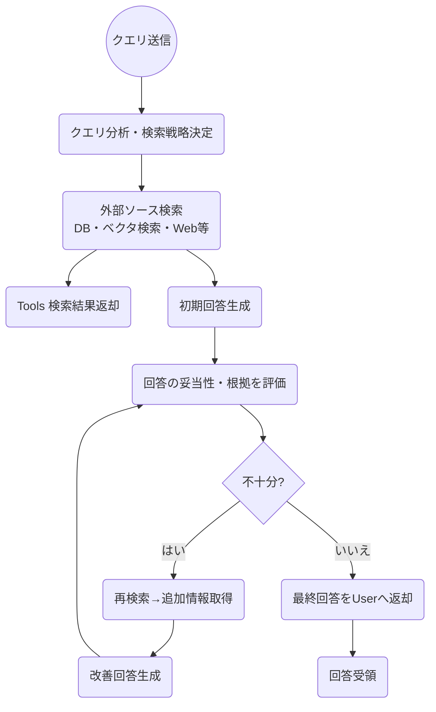

# 目次

- はじめに
- RAG の概要
- RAG の精度改善の進め方
  - Store の精度向上 (データ準備)
  - Retrieve の精度向上 (検索)
  - Augment の精度向上 (拡張)
  - Generation の精度向上 (生成)
- Evaluate (評価)
- RAG とファインチューニング
- RAG と CAG
- その他
- 参考文献

# はじめに

昨今、AI の進化により、様々な分野での応用が進んでいます。特に、自然言語処理(NLP)の分野では、RAG( Retrieval-Augmented Generation)が注目されています。RAG は、情報検索と生成を組み合わせた手法であり、特に大規模言語モデル(LLM)と組み合わせることで、その性能を大幅に向上させることができます。

また、NativeRAG や GraphRAG, AgentRAG などさまざまな RAG のバリエーションが登場しており、これらは特定のユースケースやデータセットに対して最適化されています。

今回は、RAG の基本的な概念から、RAG のプロジェクトの進め方、精度向上の方法に至るまで詳しく解説します。

みなさんの GenAI Application の開発に役立てていただければ幸いです。

それでは行きましょう 🚀

# RAG の概要

RAG とは`Retrieval-Augmented Generation`の略で、情報検索と生成を組み合わせた手法です。
RAG は特に大規模言語モデル(LLM)と組み合わせることで、その性能を大幅に向上させることができます。

歴史的には**Meta の研究者が提案**した、LLM のハルシネーション（誤情報生成）を低減する手法で、LLM だけの思考ではなく、外部リソースに検索をかけながら正しい答えを生成する言わば **「ナレッジベースの外部化」** が実現出来る手法です。

ユーザーからの問いに対し、バックエンドのナレッジベース（例: Azure AI Search）で検索し、その結果をプロンプトに追加して回答を生成するような流れが一般的な流れになります。

RAG の概要のフローは以下のようになっています。

1. Store で各種データをチャンク分割し、ベクトル化してデータストア(Azure AI Search 等)に格納します。
2. ユーザーからの質問を Application 側で受け取ります。
3. Retrieve と記載されている場所で、キーワード検索やベクトル検索を実施します。
4. 関連する情報をデータストアから取得します。
5. ユーザーからの質問とデータストアから取得した関連情報を、Augment の箇所でビルドします。
6. 生成 AI の API(Azure OpenAI Service 等)に、ユーザーからの質問とデータストアから取得した関連情報をプロンプトとして渡します。
7. 質問と関連情報を元に回答を生成します。
8. 生成された回答をユーザーに返します。

このように RAG は以下 4 つの箇所に分割することが出来ます。

- **Store** : データの格納
- **Retrieve** : データの検索
- **Augment** : プロンプトのビルド
- **Generation** : 回答の生成

## RAG のアプローチ

RAG の精度をあげるための手法の研究は進んでおり、キーワード/ベクトル検索に基づく **NativeRAG**、KG（ナレッジグラフ）を活用する **GraphRAG**、そして両者を組み合わせる **HybridRAG** が主要な選択肢として挙げられます。

また、昨今注目されているのは**AgenticRAG**と呼ばれる手法で、従来の RAG が抱える「静的なワークフロー」「単一ステップ推論」等の限界を乗り越えるべく、LLM をエージェント化（計画・再試行・ツール活用・他エージェントとの協調など）。クエリごとに動的に検索戦略を変えたり、回答途中に不足情報を再検索したり、複数のエージェント間でタスクを分担して協調する。

### 🧠 NativeRAG

- ユースケース
  - 幅広いドキュメント検索
  - FAQ やカスタマーサポート
  - 表現のゆらぎへの対応
- 検索手法
  - キーワード検索
  - ベクトル検索
  - セマンティックリランキング
- 強み
  - スキーマ不要で実装が容易
  - 大規模非構造テキストを取り込みやすい
  - 柔軟性が高い
- 弱み
  - 関係性の厳密な推論には弱い
  - ノイズが多い場合、回答の正確性が下がる

### 📈 GraphRAG

- ユースケース
  - エンティティの厳密な関係性の追跡
  - 因果関係の分析
  - 説明責任が求められる場面
- 検索手法
  - ナレッジグラフを用いた構造的な検索
  - エンティティ・リレーションに基づく問い合わせ
- 強み
  - 一貫性・説明可能性が高い
  - ドメイン知識の活用に強み
- 弱み
  - ナレッジグラフ構築コストが高い
  - エンティティが直接登場しない抽象質問に弱い

### 🔗 HybridRAG

- ユースケース
  - 抽象的な質問にも対応しつつ、関係性も正確に捉えたいケース
  - 非構造化データと構造化データが混在する複雑ドメイン
- 検索手法
  - NativeRAG と GraphRAG の両方を実施
  - ベクトル検索の文脈&ナレッジグラフのサブグラフ情報を併用
- 強み
  - NativeRAG と GraphRAG 両方のアプローチの長所を活かし合い、精度柔軟性とも向上
  - 抽象的質問&エンティティ重視の質問両方に強い
- 弱み
  - 両方の結果をマージする分、コンテキストが増大しがち
  - 実装・運用が複雑化しやすい

### 🤖 AgenticRAG

- ユースケース

  - マルチソースにまたがるリアルタイム Q&A／社内・社外データ統合チャットボット
  - ステップ分解が必要な複雑タスク（法務調査、コーディング支援、データ統合レポート生成など）
  - カスタマーサポートの一次対応自動化とエスカレーション判定
  - 部門横断のナレッジ発見・データマネジメント（例：メール + DB + Web 検索の横串検索）

- 検索手法

  - ルーティング／プランニングエージェントによる ツール選択（ベクトル検索、キーワード検索、Web 検索、API 呼び出しなど）
  - ReAct・Plan-and-Execute などの マルチステップ推論で「検索 → 評価 → 再検索」をループ
  - エージェント間コラボレーション（専用リトリーバーを複数連携させるマルチエージェント構成）

- 強み

  - 柔軟性・適応性：クエリ内容に応じてデータソースやツールを動的に切り替え可能
  - 精度向上：取得コンテキストをエージェントが自己検証・再取得し、ノイズを低減
  - スケーラビリティ：マルチエージェント拡張により異種データ・マルチモーダル対応が容易
  - マルチソース活用による網羅性（単一ベクトル DB だけの RAG に比べ情報欠落が少ない）

- 弱み
  - コストとレイテンシ増大：複数エージェントによる追加推論／トークン消費
  - 信頼性課題：エージェントが行き詰まる・ハルシネーションする可能性が増え、監視設計が必須
  - 実装・運用の複雑化：オーケストレーション、失敗時フォールバック、権限制御などの設計負荷
  - リソース競合：マルチエージェント協調がうまく働かず、処理が非効率になるケースもあり得る

## Agent 時代の RAG

特に最近注目されている AgenticRAG について深掘りしていきたいと思います。

以下に AgenticRAG の調査もまとめられています。
https://arxiv.org/abs/2501.09136

> エージェント検索拡張生成 (AgenticRAG) は、自律型 AI エージェントを RAG パイプラインに組み込み、エージェント設計パターンの反映、計画、ツールの使用、およびマルチエージェント コラボレーションを活用して、検索戦略を動的に管理し、コンテキスト理解を反復的に改善し、複雑なタスク要件を満たすようにワークフローを適応させます。
> この統合により、AgenticRAG システムは、多様なアプリケーションにおいて比類のない柔軟性、拡張性、そしてコンテキスト認識を実現します。

AgenticRAG の処理プロセスの例は以下のようになります。

# RAG の精度改善の進め方

## Store の精度向上 (データ準備)

## Retrieve の精度向上 (検索)

## Augment の精度向上 (拡張)

## Generation の精度向上 (生成)

# Evaluate (評価)

# RAG とファインチューニング

# RAG と CAG

# その他

# 参考文献

https://github.com/microsoft/RAG-Knowledge
https://ai.meta.com/blog/retrieval-augmented-generation-streamlining-the-creation-of-intelligent-natural-language-processing-models/
https://www.promptingguide.ai/jp/techniques/rag
https://ja.wikipedia.org/wiki/%E3%83%8F%E3%83%AB%E3%82%B7%E3%83%8D%E3%83%BC%E3%82%B7%E3%83%A7%E3%83%B3_(%E4%BA%BA%E5%B7%A5%E7%9F%A5%E8%83%BD)
