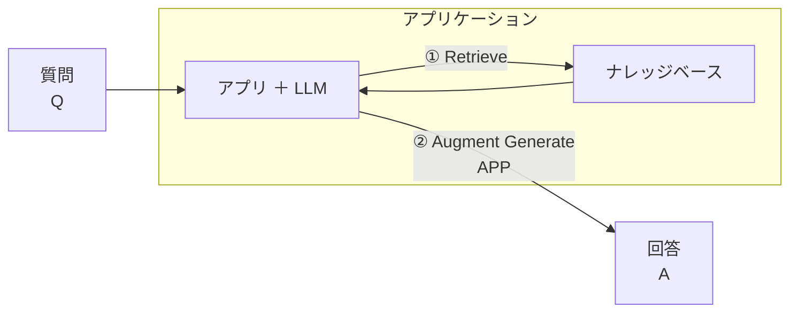

# 目次

- はじめに
- RAG の概要
- RAG の精度改善の進め方
  - Store の精度向上 (データ準備)
  - Retrieve の精度向上 (検索)
  - Augment の精度向上 (拡張)
  - Generation の精度向上 (生成)
- Evaluate (評価)
- RAG とファインチューニング
- RAG と CAG
- その他
- 参考文献

# はじめに

昨今、AI の進化により、様々な分野での応用が進んでいます。特に、自然言語処理(NLP)の分野では、RAG( Retrieval-Augmented Generation)が注目されています。RAG は、情報検索と生成を組み合わせた手法であり、特に大規模言語モデル(LLM)と組み合わせることで、その性能を大幅に向上させることができます。

また、NativeRAG や GraphRAG, AgentRAG などさまざまな RAG のバリエーションが登場しており、これらは特定のユースケースやデータセットに対して最適化されています。

今回は、RAG の基本的な概念から、RAG のプロジェクトの進め方、精度向上の方法に至るまで詳しく解説します。

みなさんの GenAI Application の開発に役立てていただければ幸いです。

それでは行きましょう 🚀

# RAG の概要

RAG とは`Retrieval-Augmented Generation`の略で、情報検索と生成を組み合わせた手法です。
RAG は特に大規模言語モデル(LLM)と組み合わせることで、その性能を大幅に向上させることができます。

歴史的には**Meta の研究者が提案**した、LLM のハルシネーション（誤情報生成）を低減する手法で、LLM だけの思考ではなく、外部リソースに検索をかけながら正しい答えを生成する言わば **「ナレッジベースの外部化」** が実現出来る手法です。

ユーザーからの問いに対し、バックエンドのナレッジベース（例: Azure AI Search）で検索し、その結果をプロンプトに追加して回答を生成するような流れが一般的な流れになります。

### 処理フロー

# RAG の精度改善の進め方

## Store の精度向上 (データ準備)

## Retrieve の精度向上 (検索)

## Augment の精度向上 (拡張)

## Generation の精度向上 (生成)

# Evaluate (評価)

# RAG とファインチューニング

# RAG と CAG

# その他

# 参考文献

https://ai.meta.com/blog/retrieval-augmented-generation-streamlining-the-creation-of-intelligent-natural-language-processing-models/
https://www.promptingguide.ai/jp/techniques/rag
https://ja.wikipedia.org/wiki/%E3%83%8F%E3%83%AB%E3%82%B7%E3%83%8D%E3%83%BC%E3%82%B7%E3%83%A7%E3%83%B3_(%E4%BA%BA%E5%B7%A5%E7%9F%A5%E8%83%BD)
